# Osionos - Project File

> [!note] Note to reader — before we begin
> Two names appear throughout this file, and it is important not to confuse them:
> - **Osionos** — this is the name of **the application**, the main platform (Notion-like equivalent, where we work with pages, blocks, databases, dashboards).
> - **Prismatica** — this is the name of **the public web page**: the marketing / showcase site that presents Osionos to the outside world. It's the envelope, not the engine.
>
> In summary: if we talk about the app, it's **Osionos**; if we talk about the site, it's **Prismatica**.
>
> **For the visuals**: the screenshots and diagrams integrated into this PDF are in reduced resolution for reasons of weight. The **high definition versions** as well as the source images are available in the GitHub repository: [`Univers42/ft_transcendence`](https://github.com/Univers42/ft_transcendence.git) under `wiki/assets/`. Clickable links in the PDF go directly to these files.

> Osionos was designed in the image of an anthill: organized, structured, and driven by a collective desire to achieve a common objective. When we watch a time-lapse video of an underground gallery, we see the ants moving quickly, transporting materials, communicating with each other. The architecture of these galleries is complex, with interconnected tunnels and chambers that allow for smooth movement and efficient storage of resources. One observation is clear: ants exploit the resources of their environment to build their habitat. The anthill is a living ecosystem that constantly adapts to its conditions. With my colleagues, we realized that creating an application today requires more and more resources and data — and that maintaining this ecosystem inevitably involves calling on more human resources or AI. Osionos is a platform that seeks to make this balance visible, in an accessible and user-friendly form.

> Linus Torvalds, creator of Linux, needed a version management tool to manage his own project — that's how Git was born. In the same way, we wanted to create a side project powerful enough to support our future projects.

## Overview

The Osionos project was born out of frustration: we were looking for a dashboarding tool that was truly complete, fast and pleasant to use — something like Notion, but better suited to our needs. Tool after tool, we encountered the same limitations: lack of customization, insufficient performance, too rigid integrations. We decided to create our own solution. We are fully aware that this is a long-term project.

## Use of AI

AI is an essential element in modern projects today, and Osionos is no exception. We have integrated it strategically to improve the developer experience and enrich our learning: code generation, debugging, understanding complex problems, standardized documentation, and critical analysis of project progress.

### The different usage profiles

Before going into detail, here are the different AI usage profiles that we have identified and tested.

| Profile | Origin | Description |
|---|---|---|
| Vibe coder | Andrej Karpathy, 2025 | Delegates entirely to AI, without reading the output — it “vibes” with the result |
| AI-augmented developer | GitHub / Stack Overflow surveys | Uses AI as a productivity layer while maintaining control and understanding of code |
| Prompt engineer | OpenAI ecosystem | Specialist in the formulation of precise prompts to obtain quality outputs — a discipline in its own right |
| Agentic developer / AI orchestrator | Emerging (2024-2025) | Designs and supervises multi-stage autonomous AI agent pipelines; think in workflows, not individual completions |
| LLM engineer | ML Community | Built on top of LLMs (fine-tuning, RAG, evals, inference) — distinct from using an LLM to write application code |
| No-code / AI-native builder | Product community | Assembles applications entirely in natural language and visual tools, without traditional code (Replit Agent, Lovable, etc.) |
| Reviewer / Human-in-the-loop | DevSecOps Community | Treats every AI suggestion as an unverified pull request — nothing is merged without a human audit |

Since we had no idea what we were doing at first — and this was the first time we had to do such a custom project — it was a challenging road. So we tested everything. Here are our conclusions.

#### Vibe coding

One of the traps that millions of junior developers have fallen into is what I would call “unintentional vibe coding.” The developer community takes a dim view of it, and rightly so: it's like owning a Tesla, activating autopilot and watching passively. Until something goes wrong — and then the reaction time is too slow.

Our team of five took part in the experiment to really understand its limits. Here is what we observed:

1. **Speed ​​without direction.** Vibe coding generates code quickly, but without real direction. Output is often of poor quality, refactoring is inevitable, and technical debt accumulates quickly. A project of this scale cannot stand on this basis.
2. **Valid use cases despite everything.** To sketch out architectural ideas or start thinking, it can be useful. We used it to explore several design avenues — the results weren't convincing, but it cleared the way quickly.
3. **Even great professionals use it occasionally.** Professor David J. Malan of Harvard mentioned it in an interview, especially for the generation of unit tests. Proof that this tool has its place, within a defined framework.

Vibe coding is a tool, not a permanent state of mind. Used correctly — on light, targeted tasks — it can save hours. The trap is to apply it where rigor is essential.

#### Prompt engineering

We also tested prompt engineering to generate better quality code. We followed the community's recommendations: few-shot learning, chains of reasoning, precise structuring of instructions. Result: it is a powerful tool, but it takes time to master. The quality of the output is directly correlated to the quality of the prompt.

Some resources that were useful to us:
- https://www.ibm.com/fr-fr/think/prompt-engineering
- https://www.ibm.com/fr-fr/think/topics/prompt-optimization
- https://www.promptingguide.ai/en

#### AI assisted / Copilot style

GitHub Copilot is the emblematic example of programming assistance: real-time suggestions, integration into the editor, useful for repetitive tasks. But it doesn't replace understanding the code — every suggestion should be read and validated.

We explored different models depending on the context. The [Artificial Analysis](https://artificialanalysis.ai/models) site publishes daily benchmarks on the main models — a useful reference for choosing the right tool according to the needs of the moment. In particular, we found significant differences between the models in terms of speed, cost and quality of the code produced. There is no perfect model — it’s context by context.

#### Developer agent

The developer agent — or AI orchestrator — is a profile that goes beyond traditional assistants. He designs and supervises pipelines of autonomous AI agents: one AI generates code, another verifies its quality, a third deploys it if the tests pass. We no longer think in individual completions, but in workflows.

It's a demanding profile, but we had to approach it when the team was reduced to two people. We put in place specialized agents — one to test, one to resolve the identified problems — under constant supervision.

Andrej Karpathy describes this paradigm shift well: *"we no longer write code directly 99% of the time. We orchestrate AI agents to do the work, and we focus on monitoring and optimizing these pipelines."*

Main limitation: the cost of AI credits is very high, which quickly slowed down our large-scale use.

#### No-code / AI-native builder

Tools like Lovable, Replit Agent or Figma AI allow you to build applications entirely in natural language, without traditional code. We tested them for several weeks. They are powerful for rapid prototyping, but their limitations are very real:

- Not very flexible on complex projects
- Code generated often not maintainable
- Very high long-term technical debt
- Slow on large projects
- Costly in AI credits

#### Reviewer / Human-in-the-loop

This profile treats each AI suggestion as an unverified pull request: nothing is integrated without human audit. It’s a careful and effective approach to maintaining code quality while taking advantage of AI assistance.

Experiments in communities like GitHub showed the limits of full automation: suggestions could be off-topic, too generic, or overwhelm PRs — generating friction and technical debt rather than profit.

---

## My philosophy: learn with AI without sacrificing understanding

This project was born in a particular context. I am part of a generation that had no choice but to confront AI — it has imposed itself in my practices, in my tools, in the job market. To ignore him would have been to be deliberately late.

But I wanted to be honest with myself on one essential point: **using AI does not mean understanding less**. This project is, I hope, the demonstration of this.

We deliberately tested all the usage profiles described above — not to find the easy solution, but to understand concretely what each one brings and what it costs. We touched the limits of vibe coding, measured the gains from prompt engineering, and experimented with agent orchestration. Each time, we read what the AI ​​produced, questioned its choices, corrected its errors, and learned from its approximations.

AI has often forced me to go further in my understanding than a simple course would have done. Understanding why an output is bad is understanding what the good one should have been.

I want to be honest about this because I know that the use of AI in school projects is a sensitive subject. My intention was never to circumvent learning — it was to approach it differently, in an era where these tools are already part of everyday professional life. For me, this project is as much about learning to code as it is about learning the posture to adopt when faced with AI: curiosity, critical thinking, responsibility.

---

## Acknowledgments

This project would not have existed without the people who supported it, in difficult times as well as in good ones.

A big thank you to my team for sticking it out over the long term, for agreeing to test uncertain approaches, and for continuing to learn even when the road was long. Everyone brought something essential — an idea, a solution, a presence in times of doubt.

Thanks to school 42, which taught us that autonomy and resourcefulness are skills in their own right. This project reflects that.

Thank you to the open source communities, the documentation authors, the developers who share their feedback online — you are an invisible but indispensable resource.

And finally, thank you to those who will read this document with open eyes and the curiosity to understand what we really tried to do here.

## CHAPTER 1: summary of the skills mobilized

Osionos is a Notion-type collaborative workspace (pages, blocks, databases, agents) which relies on an ecosystem of internal services assembled in parallel. The minimal view below is sufficient to situate the skills mobilized in this chapter; the complete diagram, plan by plan, is given in [chapter 2 “Overview of connections between services”](#overview-of-connections-between-services-current-state).
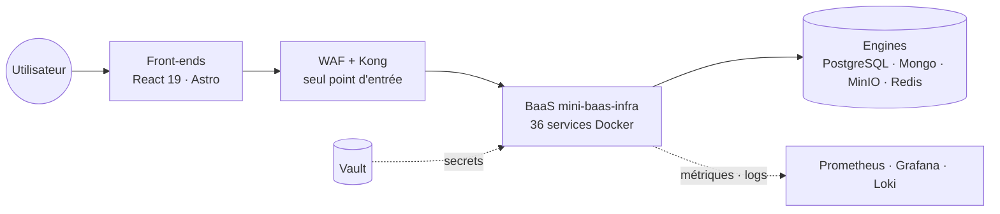
The skills mobilized are part of the CDA framework — *Application Developer Designer* — on the two front and back-end type activities. The “back” here is **not** a classic Express API: it is an infrastructure assembled from production-ready bricks, configured, hardened and orchestrated by Docker Compose. The detailed justification for each choice is in Chapter 2.

### Typical activity 1: develop the front-end part of a secure web application

On the front side, the challenge was not to write as many lines of React as possible, but to keep a simple promise: **a user opens Osionos, and everything responds instantly, even on a page that contains a thousand blocks**. It all starts from there — the choice of framework, the organization of the code, accessibility, even the SCSS tokens. What we did, and with what:

| CDA Competence | What that means to us | Tools/evidence in the repo |
|---|---|---|
| **Mock up an interface** | Think desktop first (Osionos is a dense work tool, not a mobile feed), treat accessibility as a design constraint and not a final audit | Wireframes Figma, design tokens SCSS [`_brand-tokens.scss`](../apps/opposite-osiris/src/styles/abstracts/_brand-tokens.scss), `<dialog>` native with focus trap, `aria-live` regions, contrast checked |
| **Integrate static interfaces** | Two frontends, two tools chosen for their real job: Astro for marketing (static HTML, SEO), React for the app (dense interactivity) | [`apps/opposite-osiris/`](../apps/opposite-osiris/) in Astro 6 + modular SCSS; [`apps/osionos/`](../apps/osionos/) in React 19 + Fast + organization Feature-Sliced ​​Design |
| **Expand the dynamic part** | Granular blinds without Redux ceremony, forms validated before any network round trip, virtualization of long lists | Zustand 5 (`usePageStore`, `useDatabaseStore`), `@tanstack/react-virtual`, SDK `@mini-baas/js`, GoTrue feed (email + magic link + WebAuthn via `@simplewebauthn/browser`) |
| **Secure the front** | HTML surfaces are processed according to their context: `sanitize-html` on the marketing site side, HTML escaping + `sanitizeUrl()` in the app's Markdown engine, dedicated scripts for SVG, media and CSP | `sanitize-html`, [`svg-security.mjs`](../apps/opposite-osiris/scripts/svg-security.mjs), [`media-security.mjs`](../apps/opposite-osiris/scripts/media-security.mjs), [`verify-csp.mjs`](../apps/opposite-osiris/scripts/verify-csp.mjs), `markengine` |

The common thread: **no client-side magic**. Each non-trivial behavior (validation, virtualization, SDK access) is traceable in a precise, testable and human-readable file.

### Typical activity 2: develop the back-end part of a secure web application

On the back side, the bet taken is to **not rewrite what already exists**: the open source community has produced bricks (PostgREST, GoTrue, Kong, Vault) that are more secure and faster than what we could have produced in a few months. Our job was to **assemble, harden, orchestrate** them, and fill the holes with a handful of custom NestJS microservices.

| CDA Competence | What that means to us | Tools/evidence in the repo |
|---|---|---|
| **Modeling and managing the database** | PostgreSQL schema with constraints + indexes + RLS to make security tamper-proof from the app; MongoDB for semi-structured with automatic `owner_id` | [`models/user.sql`](../models/user.sql), [`models/auth-security-migration.sql`](../models/auth-security-migration.sql), [`models/gdpr-migration.sql`](../models/gdpr-migration.sql), service `mongo-api` |
| **Develop data access components** | No ORM: PostgREST generates the REST API from the schema → zero glue, zero SQL injection; for Mongo, dedicated NestJS facade | `postgrest` 12.2.3, `mongo-api` (NestJS), `adaptor-registry` which encrypts external credentials in AES-256-GCM (scrypt) |
| **Develop business components** | The logic lives where it is safest: authorization/ownership in the database (RLS + PL/pgSQL), event coordination in dedicated services | RLS PG policies, `email-service` (templates `account-created`, `password-reset`…), `realtime-agnostic` (WebSocket Rust), `storage-router` (MinIO presigned URLs) |
| **Secure the stack** | Defense in depth: WAF upstream, secrets never in Git, local certificates close to prod, audit in progress | WAF nginx + ModSecurity + OWASP CRS, [HashiCorp Vault](https://www.vaultproject.io/) + [`vault-env.mjs`](../apps/baas/scripts/vault-env.mjs), `generate-localhost-cert.sh`, `trust-localhost-cert.sh` |
| **Deploy and document** | A `make` command should be enough to mount everything, whether you are a newcomer or the CI; every decision has a written note | Docker Compose + profiles (`extras`, `observability`, `track-binocle`), `docker-bake.hcl`, [`infrastructure/makes/`](../infrastructure/makes/), images on GHCR + Docker Hub, [`wiki/ARCHITECTURE.md`](ARCHITECTURE.md), [`wiki/vault-security-model.md`](vault-security-model.md) |

The common thread here: **least privilege is encoded at the lowest possible level**. When PostgreSQL can refuse a read thanks to RLS, we don't do `if (user.id === resource.owner)` in TypeScript — we let the database decide. It is this discipline that makes the stack defensible against an audit, not the accumulation of application layers.

### Transversal skills

Beyond the two standard activities, the project mobilized less visible but structuring skills:

| Domain | What we put in place | Why it was necessary |
|---|---|---|
| **Observability** | Prometheus (metrics), Grafana (dashboards), Loki + Promtail (logs) | Make the stack auditable rather than opaque — a silent service is a service that cannot be operated with confidence |
| **Tests** | Playwright (E2E osionos), Newman/Postman (API contracts), in-house CTF scripts ([`scripts/security/ctf/`](../apps/opposite-osiris/scripts/security/ctf/)), BaaS suite in 16 phases (15 shell scripts + 1 Python phase) | A safety net before each merge; without this, refactoring a stack with 36 services becomes suicidal |
| **Version and release management** | Monorepo, branch conventions, semantic image versioning (`mini-baas/*:0.0.1`), Git tags aligned with image releases | Being able to go back properly, and trace what is running in production at each moment |
| **Posture towards AI** | Assumed use and tracing of AI assistance, critical reading of product code as a rule | Learn quickly without delegating understanding — see the *Use of AI* section at the beginning of the file |

## CHAPTER 2: Presentation of the project
### Presentation of the company and service
I carried out my application project in the context of school 42, originally called "ft_transcendence". A project that evolved to become “Osionos”, a collaborative dashboarding platform. The objective was to create a tool that was complete, fast and pleasant to use, inspired by Notion but with greater customization, performance and scalability. Allowing you to work with real data.

It's group work, so I decided to train my team in February 2026. During this team training phase, we defined the roles and responsibilities of each person, as well as the objectives to achieve for the project. We also established regular communication using agile methods. We particularly used Scrumban being a hybrid concept between Scrum and Kanban, which allowed us to benefit from the structure of Scrum while retaining the flexibility of Kanban.
My experience took place in a demanding environment, marked by the need to strictly adhere to the development methodologies and security standards of a large group.

### Project specifications:
#### a. context and objectives
The Osionos project was initiated to overcome the cumbersomeness of a dashboard creation process. This frustration was the driving force behind our desire to create a platform that would make dashboard creation faster, more flexible and more pleasant to use. As we said before, this platform works like an anthill. In terms of pure vision, we saw this project more as a kind of giant social network made for work. Collaborative. We must imagine a workspace where users can work in a public space and a private space. The public space will allow more or less dense traffic to be accepted and left to the administrator to manage.

here are some examples of functionalities that we have imagined for Osionos:
- **Pages and blocks**: users can create pages and fill them with blocks of content (text, images, tables, etc.) to build their dashboard.
- **dashboarding**: using `/dashboard` or `/layout` or even directly from the `/database`, users can create personalized views of their data, with filters, sorting, and advanced visualization options. The idea here is that we want to be able to offer people pre-established forms over time but if they want they can add their own through code or even through plugins.
- **home**: this is the fully customizable home dashboard, where users can pin their favorite pages and databases for quick access. The idea is that this welcome dashboard can be shared between members of the same workspace, to create a sort of common rallying point. We will also draw inspiration from what Obsidian did with its “graph view” to offer a visualization of all the pages and their interconnections. To make the nodes and edges we will base it on the d3.js library, which is very powerful for this type of visualization. As in Linux everything is an archive... In our system everything is data. Each piece of data can take distinct forms (page, block, database, etc.) and be linked to other data. The idea is that the graph view can visually represent these connections, to help users navigate their workspace and discover relationships between their data.
- **databases**: users should be able to connect their databases (PostgreSQL, MongoDB, etc.) to Osionos to view and interact with their data in real time. The idea is that users can create personalized views of their data, with filters, sorting, and advanced visualization options. We also want to allow users to create dashboards from this data, to monitor key performance indicators (KPIs) and make informed decisions.
- **note**: of course this system is more or less easy to reproduce what notion does. The difficulty lies more in the infrastructure than in the functionality itself.
- **wiki**: here the observation is that notion is much too slow. Cannot load long page. Obsidian is faster but is only designed for making notes. The general appearance of Obsidian remains very austere, a very good tool for professional use but too specific. So we had the idea of ​​managing infrastructure in a way that we can have a static database and a dynamic database. Vscode is surely one of the fastest and most versatile graphics tools but not suitable for everyone. The advantage I see is that you can do everything with the keyboard and reduce the friction associated with using the mouse. So the wiki will be based on all this friction. The goal is for it to be much faster than Notion, more pleasant to use than Obsidian, and more accessible than Vscode. While using real data and letting users choose to write in raw or directly convert the values ​​in our own block or inline markdown.

##### Goals

The Osionos project pursued three major and distinct objectives, each linked to a specific user profile and a problem measured in existing tools (Notion, Obsidian, VS Code, Confluence).

1. **For the end user — unify the note, the database and the dashboard in a fast and keyboard-controllable workspace.** The same page had to be able to contain free text, a tabular view connected to a real database, a link graph, and a KPI dashboard, without changing tools or waiting for a page of a thousand blocks to load. The encrypted target: open any page in less than a second, regardless of its size.

2. **For the workspace administrator — have fine, auditable control over the shared space.** The Workspace Planner had to be able to define who sees what (public / private / shared), manage roles, connect *its own* external databases (PostgreSQL, MongoDB, later MySQL and HTTP), and find any critical operations in an audit log. No secrets in the open, no actions without a trace.

3. **For the project team — consolidate general reliability by centralizing authentication, permissions, auditing and observability of the entire platform.** Rather than re-writing ten layers of security, we relied on proven bricks (GoTrue for JWT, PostgREST for RLS, Vault for secrets, Kong for ingress) assembled and hardened. The application services we build run with a non-root user, and the public flow goes through a single gateway.

Each technical choice described in the following section has been validated not only for its ability to deliver these three objectives, but also for its **resilience** (ability to survive a neighbor's failure) and its **security by construction** (no application verification when the database can do it itself).

##### Solution architecture and technical choices

Before explaining what we built, we must say where we started from. At the start of the project, we had a blank sheet and an intuition: “we want to make a Notion, but one that knows how to talk to any database, without breaking anything when we change our mind about the infrastructure”. It is this intuition that drove each technical decision. At each crossroads, we chose the option that kept two doors open: that of rapid experimentation for the team, and that of a possible serious production launch.

The rest of this section describes, dimension by dimension, *what we chose* and above all *why we got here* — including the paths we abandoned along the way.

###### Back-end side

**has. Micro-services, all in Docker**

Our first reflex was the most classic: a Node/Express monolith with a PostgreSQL database. This is what we knew, this is what we see in 90% of the tutorials. We lasted two weeks. The problem appeared very quickly: as soon as we wanted to add MongoDB for Osionos' flexible blocks, then Redis for the cache, then MinIO for the files, the monolith started to look like a bag of nodes where each dependency pulled on the others. A bug in the file layer caused auth to fail. A restart to add an environment variable shut down the entire app.

We went back and set a simple rule: **each responsibility has its container, and the application services that we build have a Dockerfile reproducible with a non-root user**. From there, the stack began to take shape naturally — one brick for auth (GoTrue), one for the relational database (PostgreSQL), one for the documents (MongoDB), one for the cache (Redis), one for the files (MinIO), one for the gateway (Kong), and a series of NestJS micro-services for the logic that belongs to us (mongo-api, query-router, storage-router, permission-engine, gdpr-service, etc.). Each service is isolated and restartable independently. Images are versioned as much as possible; an identified floating tag (`realtime-agnostic:latest`) remains a release debt to be corrected before real production.

The trigger was to understand that **not rewriting what already exists** is in itself a skill. We are not going to redo a PostgREST or a GoTrue which are better than what we could have produced in two months. We assembled them and hardened them.

**b. Data federation**

The real ambition of Osionos is to let a user connect *their* database, whether PostgreSQL, MongoDB, MySQL or other, and navigate in it as if it were a Notion page. At the beginning we tried the naive approach: one connector per engine, hard-coded in the front. It worked for one, painful for two, unbearable for three.

We realized that we were reinventing a known problem: this is exactly what **SQL federation engines** solve. We evaluated Presto, Trino, Apache Drill, and even a few proprietary options. We chose **Trino** for two reasons: it is open source, and it can read PostgreSQL and MongoDB *with the same SQL syntax*, which opens the way to queries that join the two worlds — something that would have required weeks of glue code for us.

But Trino is an **analytical** engine, not transactional. For classic business operations (create a block, modify a page), we needed a short and secure path. We therefore built an in-house service, the **query-router**, which takes an abstract query description (`list`, `insert`, `update`, etc.) and translates it to the right engine via specialized adapters. The beauty of the approach is that **adding a new engine only requires a new adapter** — no redesign of the rest.

**c. Multi-engine consistency**

Very quickly, an annoying question arose: if the user writes in PostgreSQL and we want to reflect this writing in MongoDB (for example to update a denormalized view), how do we ensure that the two remain synchronized? The intuitive answer — “we do both entries in the same transaction” — is physically impossible as soon as we cross two different engines. It's a theorem, not a lack of effort.

We looked at how the big platforms solve this problem. **Supabase, Hasura, AWS** all apply the same recipe: the **outbox pattern**. Application writing is done in a single database (the “source of truth”), with an additional line in an events table. A relay service reads these events and replays them to other systems — Mongo, Elasticsearch, external webhook, etc. We lose immediate atomicity, but we gain **guaranteed eventual consistency**, plus free audit and replay.

This is what we selected for milestone M3 of the roadmap, relying on Redis (already present) as the future event bus via Redis Streams — no need to add Kafka as long as the scale of the project does not require it. Today, Redis is mainly used for the query-router application cache; the outbox and the relay remain to be delivered.

**d. Unified API and client SDK**

A platform that exposes ten different services with ten different conventions is unmanageable. We wanted the front-end developer (ourselves, in this case) to have only **one way** to talk to the back-end, no matter what was happening behind the scenes.

We looked at the APIs we liked to use: Supabase, Firebase, PocketBase. The common point is an SDK that looks like `client.from('table').select().eq(...)` — close to SQL, but portable, typed, and independent of the engine. We took this idea and wired it to our query-router. The result is our SDK `@mini-baas/js`, which is consumed by the two Osionos frontends without them having to worry about whether the data comes from PostgreSQL, Mongo or an external database saved by the user.

On the gateway side, we chose **Kong in YAML declarative mode**, without a database. It's more rigid than a classic Kong, but it means that the entire ingress configuration lives in Git, therefore reviewable and reproducible. A new route is not deployed by a click in a UI, it goes through a pull request — this is exactly the guarantee we were looking for.

**e. Built-in security and observability**

Two guiding principles emerged. On security, **least privilege is set at the lowest possible level**: it does not live in `if`s scattered throughout the code, it lives in the database via PostgreSQL RLS policies. Even if the entire application layer was bypassed, PostgreSQL would refuse the read. Regarding secrets, we quickly left versioned `.env` in favor of **HashiCorp Vault** as soon as we started handling external database credentials — a `.env` in git was an unacceptable risk.

On observability, the team spent enough nights debugging blindly to make it a priority. **Prometheus + Grafana + Loki + Promtail** are up today; distributed traces (OpenTelemetry + Tempo) are planned in M4 — the architecture is already wired to accommodate them.

The details of the defense layers and tools are consolidated below in the [Security strategy](#security-strategy) section.

**f. Development and deployment tooling**

A stack of 36 Docker services becomes incomprehensible without good tools. We deliberately invested in the tooling **from the start**, following three principles: **everything is in Docker Compose** (a new dev does `make baas-up` and finds the same topology), **everything is testable locally** (16 test phases, including 15 shell scripts and a Python phase, validating auth, RLS, isolation, storage, realtime, etc.), **everything is reproducible** (`docker-bake.hcl` multi-arch, idempotent migrations, images traced by version when published).

We deliberately resisted Kubernetes: as long as the stack fits on a Docker Compose machine, we keep the complexity minimal. The full list of tools is in the [Development tools](#development-tools) section.

**g. Auditability and traceability**

The last choice which structures the entire back is less glamorous but perhaps the most important: **everything that happens in the platform must be able to be explained after the fact**. Each HTTP request receives an `X-Request-ID` at the entrance to Kong, propagated to the base. Each migration is numbered and traced. The `audit_log` table (which keeps actor, action, resource, payload) is being generalized to all writes (milestone M1) — combined with Loki logs, it gives a platform where *“what happened at 2:32 p.m. yesterday for user X?” »* becomes a question of a minute, not a day.

This discipline of tracing is a discipline of **respect for the future of the team**: we know that we will forget, and we build the memory of the platform while we still have the context in mind.

###### Front-end side

The front was designed with a different logic from the back, because the constraint is not the same: on the front, the number one enemy is not data consistency, it is **user friction**. A page that takes a second too long to respond is a lost user. An interface that we don't understand is an abandoned project.

**Two frontends, two philosophies**

We found ourselves very early on needing two very different things: (1) a fast-loading, well-referenced, simple **marketing** site that presents Osionos to the world — it's `opposite-osiris`; (2) a dense, interactive, near real-time **product application**, which resembles an IDE more than a site — it's `osionos`. Wanting to solve both with the same stack would have been a mistake.

For marketing, we chose **Astro**. The reason is simple: Astro produces static HTML by default and only uses JavaScript when it is strictly necessary (the famous "islands architecture"). For a site whose objective is to load quickly and be well indexed by search engines, this is the most rational choice available today. We accepted not having the React ecosystem for this — and it was the right decision.

For the product application, we went with **React 19 + Vite**. React because it's what the team masters, the doc is easy to find and the ecosystem (tanstack, simplewebauthn, etc.) is without rival. Quickly because after having suffered with Webpack and Create-React-App in other projects, we no longer wanted to wait thirty seconds for each save. Vite starts in one second and recompiles in less than a hundred milliseconds — this is non-negotiable when developing a complex UI.

**Why not Next.js**

The question came up three times during the design: “what if we did everything in Next.js, marketing and app, in a single project?”. We dug, and we pushed aside. Three reasons:

1. Next.js forces a certain view of rendering (SSR / RSC) which complicates integration with our self-hosted BaaS. We wanted a client that speaks to *our* gateway, not a framework that presupposes Vercel.
2. The cost of learning React Server Components seemed disproportionate to the gain for a team of five that became two.
3. Separating marketing (static) and app (SPA) gives us two simpler build pipelines, two clear mental scopes, and the ability to iterate on one without breaking the other.

**State management: Zustand rather than Redux**

We tried Redux Toolkit at first. It's powerful, but it's also three files to touch to add a field to a store. On the scale of Osionos (dozens of states: current page, block in edit, filters, views, multiple selection, etc.), the friction became unbearable. We migrated to **Zustand**, which contains one function per store and which sticks to the mental model of React. We paid for this choice by the obligation to discipline our selectors (React 19 is strict on stable snapshots) — but it is a compromise that the team accepted.

**Architecture in Feature-Sliced ​​Design**

When we realized that we were going to exceed a hundred components, we established an explicit architecture: **Feature-Sliced ​​Design**. It's a public convention that arranges code into layers (`entities`, `features`, `widgets`, `pages`, `app`) with strict rules on who has the right to import who. The benefit was seen immediately: we no longer wonder *where* to put a new component, the convention answers. And a new team member knows how to read the structure without having to explain it to him.

**The SDK as a contract**

The front never talks directly to PostgreSQL or Mongo. It talks to our SDK `@mini-baas/js`, which talks to Kong, which dispatches to the right service. This is voluntary: it means that **changing the back does not break the front**, as long as the SDK contract remains stable. This indirection has a cost (an additional layer to maintain), but it has already saved us twice: once when we switched from hosted Supabase to our self-hosted BaaS, and once when we redesigned the session format.

**Accessibility and perceived performance**

Two things that we dealt with from the start and not at the end of the project: accessibility and perceived performance. We learned along the way that **adding accessibility at the end costs ten times more than thinking about it from the start** — and that the same goes for performance. The concrete techniques (virtualization, code splitting, suspense, ARIA tokens, focus trap) are described in the [Performance and code quality](#performance-and-code-quality) section.

---

In summary, Osionos' architecture was not designed in one go on a whiteboard. It was built by accumulation of decisions, each taken in reaction to a real wall that we encountered. This is probably what makes it coherent: there is almost no layer that we could not justify by a concrete problem that we experienced.

###### Summary of stack choices

Rather than rolling out a catalog, the simplest thing is to tell the stack by large families, because each family answers a specific question that we asked ourselves at the start.

On the **user interfaces** side, we separated the site which presents Osionos and the application we use. The marketing site is in **Astro**, because it must load quickly and be well referenced; the application is in **React 19 + Vite**, because this is what allows us to maintain a dense editor without becoming slow. Between the two, we share an **internal SDK `@mini-baas/js`**: it is he who speaks to the back, and it is he who guarantees that we can change a brick on the server side without breaking the front. Browser-side state is through **Zustand**, code organization is through **Feature-Sliced ​​Design**, and passwordless authentication is through **WebAuthn**.

On the **core of BaaS** side, we assumed not to rewrite what already exists: **Kong** as the only entry point, **GoTrue** for authentication, **PostgREST** to expose PostgreSQL in REST with the RLS as a final safeguard, and **PostgreSQL** as the source of truth. Next to it, **MongoDB** is used for semi-structured blocks, with a homemade `mongo-api` facade which automatically injects the owner from the JWT. **Redis** serves as a cache and future event bus. **MinIO** stores the files, and our `storage-router` generates presigned URLs so that uploads never pass through our services.

Around it, we wrote a **handful of NestJS services** which carry the logic that belongs to us: `query-router` to dispatch requests to the right engine, `permission-engine` to centralize the rules, `session-service` for the session life cycle, `schema-service` for multi-engine introspection, `gdpr-service` for export and anonymization, plus a few utility services (logs, email, newsletter, AI, analytics). **Trino** connects to PostgreSQL and MongoDB to enable cross-engine analytical queries without breaking the transactional path.

Finally, **security and operation** rely on an **nginx WAF + ModSecurity** upstream of Kong, **HashiCorp Vault** to retrieve or generate secrets outside Git, **AES-256-GCM encryption** for external database credentials, and **Prometheus, Grafana, Loki, Promtail** for observability. Everything is **orchestrated in Docker Compose**, built via `docker-bake.hcl`, published on GHCR and Docker Hub with version tags, and covered by a system test suite organized in phases 1 to 16 before major merges.

The tables below are mainly for quick reference; they are not meant to be read in full at once.

*Front-ends and SDK*

| Brick | Role |
|---|---|
| Astro 6 | Static marketing site, SEO |
| React 19 + Vite 6 | Interactive product app |
| Zustand 5 | Browser-side state, without boilerplate |
| Feature-Sliced ​​Design | Organizing code by layers |
| `@mini-baas/js` | Stable contract front ↔ back |
| `@simplewebauthn/browser` | FIDO2 Passkey Login |

*Heart of BaaS*

| Brick | Role |
|---|---|
| Kong 3.8 (DB-less) | Single entry point, routes, JWT, rate-limit, CORS |
| GoTrue 2.188 | Authentication, JWT, sessions |
| PostgREST 12 | Automatic REST on PostgreSQL with RLS |
| PostgreSQL 16 | Source of truth, RLS, migrations |
| MongoDB 7 + `mongo-api` | Semi-structured blocks, `owner_id` from the JWT |
| Redis 7 | `query-router` cache, pub/sub and future event bus |
| MinIO + `storage-router` | Files, presigned URLs, ACL |
| `realtime-agnostic` (Rust) | WebSocket, WAL PG + change streams Mongo |
| `query-router`, `permission-engine`, `session-service`, `schema-service`, `gdpr-service`, etc. | Internal NestJS Services |
| Trino 467 | Cross-engine analytical queries |

*Safety, operation, quality*

| Brick | Role |
|---|---|
| WAF nginx + ModSecurity + OWASP CRS | Kong Upstream HTTP Filtering |
| HashiCorp Vault | Encrypted storage of secrets |
| AES-256-GCM+scrypt | Encryption of external database credentials |
| Prometheus, Grafana, Loki, Promtail | Metrics, logs, dashboards |
| Docker Compose + `docker-bake.hcl` | Local orchestration, multi-arch build |
| GHCR + Docker Hub | Distribution of images with version tags; pinning by digest to be completed before strict production |
| Phased BaaS Suite | System testing: phases 1 to 16, with 15 shell scripts and a Python phase |

###### Connection scene: from click to session token

The diagram below follows *a* user who opens the marketing site `opposite-osiris`, clicks on "Connect", arrives on `osionos`, authenticates, and receives the session which opens his workspace. Each arrow is a real interaction; each service occurs at a specific time for a specific reason.
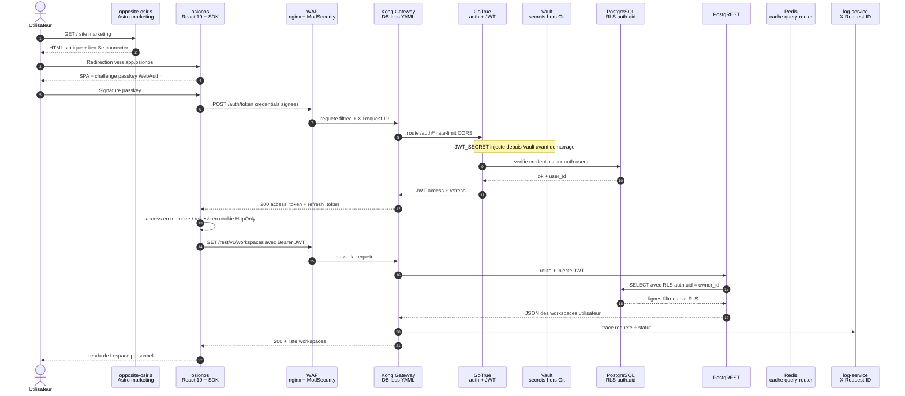
**Reading the diagram**: the user never speaks directly to a base. The public flow goes through **WAF → Kong**, which assigns an `X-Request-ID` and applies input controls. **GoTrue** validates the credentials and signs a JWT with a `JWT_SECRET` provided by the environment, itself generated or retrieved by Vault/Makefile scripts outside Git. The refresh token is protected on the application gateway side by an `HttpOnly; Secure; SameSite=Lax`. The `session-service` does exist, but it persists its sessions in PostgreSQL (`session.user_sessions`).

Redis is used for the `query-router` cache and as the basis for the future event bus. On the following business query, the JWT is replayed: **PostgREST** passes it to **PostgreSQL**, which automatically applies the **RLS** (`auth.uid() = owner_id`) — the final security is in the database, not in the application code.

###### Overview of connections between services (current state)

The diagram below reflects the actual state of the `docker-compose.yml` of [mini-baas-infra](../apps/baas/mini-baas-infra/docker-compose.yml) at the time of writing. Services are grouped by **execution plan** (Compose profiles): `control-plane`, `data-plane`, `adaptor-plane`, `background`, `storage`, `analytics`, `observability`.
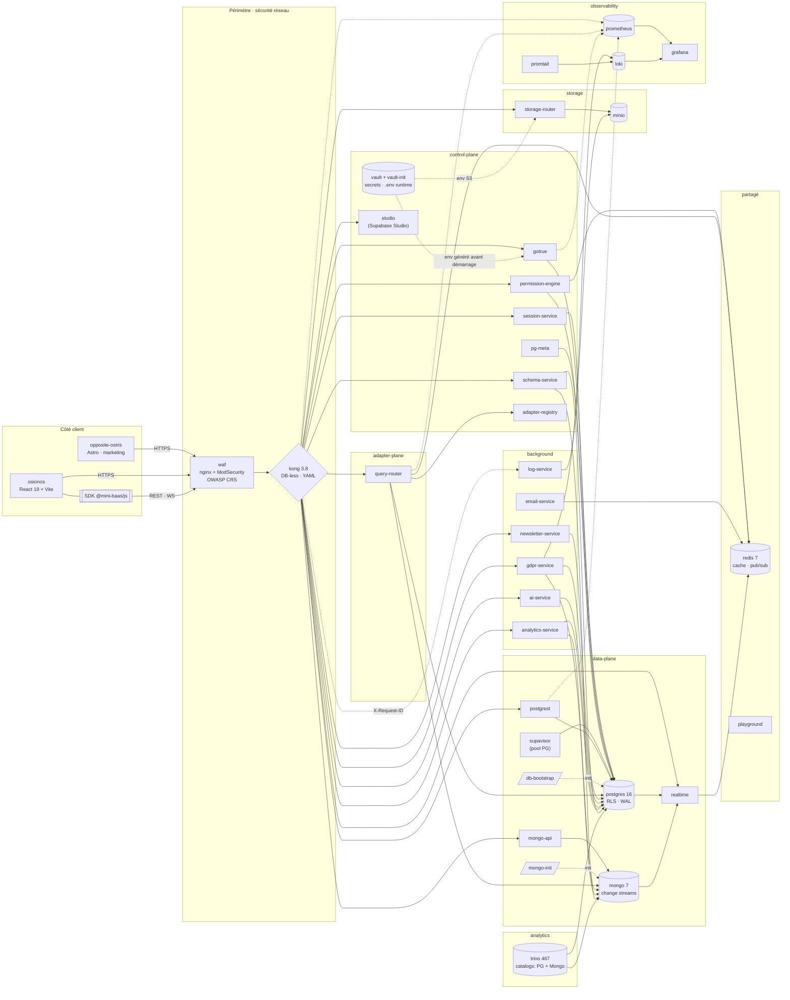
**How to read this diagram**:

1. **Client side** — two independent frontends share the `@mini-baas/js` SDK. No direct call to data from the browser.
2. **Network perimeter** — any request passes through `waf` (OWASP CRS filtering) then `kong` (routing, JWT, rate-limit, CORS). Only public entry point.
3. **`control-plane`** — governance: `gotrue`, `vault`, `session-service`, `permission-engine`, `schema-service`, `pg-meta`, `adaptor-registry`, `studio`.
4. **`data-plane`** — engines and their facades: `postgres` behind `postgrest`, `mongo` behind `mongo-api`, `realtime` which listens to WAL + change streams, `supavisor` which pools PG.
5. **`adaptor-plane`** — `query-router` consults `adapter-registry` to dispatch CRUD to the correct engine.
6. **`storage`** — `storage-router` talks to `minio` with environment-injected S3 credentials; the encryption of external database credentials is carried by `adaptor-registry`.
7. **`background`** — long-lived services: `email-service`, `newsletter-service`, `gdpr-service`, `ai-service`, `analytics-service`, `log-service`.
8. **`analytics`** — `trino` with PG + Mongo catalogs, for cross-engine analytical queries.
9. **`observability`** — `prometheus`, `grafana`, `loki`, `promtail`. **Distributed traces (Tempo/OTel) are not yet in place**, see target 10/10 below.

The traffic rule remains the same: **the arrows always go down from the least privileged to the most privileged**. The client only knows Kong, Kong only knows the application services, the application services only know their engine. A compromise of one stage does not propagate to the next without crossing a new barrier (JWT, RLS, ACL MinIO, secret injected from Vault or dedicated environment variable).

###### Target 10/10 — what the infrastructure will look like once milestones M1-M5 are delivered

The diagram below represents the **target state** once the five milestones described in [wiki/todo/README.md](todo/README.md) have been achieved. New features compared to the current state are grouped in subgraphs `M1` to `M5`. Everything that appears outside of these blocks already exists today.
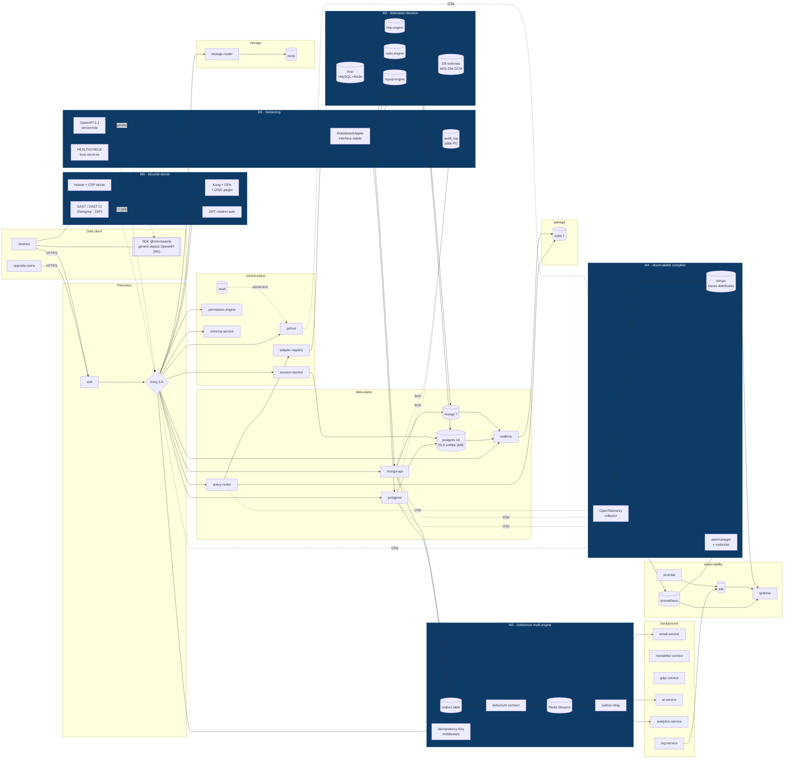
**What the milestones actually add**:

| Milestone | Contribution to the diagram | Why is it necessary to upgrade to 10/10 |
|---|---|---|
| **M1 · hardening** | `HEALTHCHECK` on all services, `IDatabaseAdapter` interface, versioned OpenAPI 3.1 spec, `audit_log` table PG | Make the stack self-described (Compose no longer tolerates silent service) and trace each write |
| **M2 · extended federation** | `mysql-engine`, `redis-engine`, `http-engine` + corresponding Trino catalogs, encrypted external DB register | Delivering on the “connects any database” promise, not just PG + Mongo |
| **M3 · multi-engine consistency** | `outbox` table, `debezium connect`, `Redis Streams` as bus, `outbox-relay`, `Idempotency-Key` middleware | Guarantee possible consistency between engines without running a distributed transaction |
| **M4 · full observability** | **OpenTelemetry** collector, **Tempo** for distributed traces, **Alertmanager** + runbooks | Being able to follow a request from end to end (Tempo absent today) and be alerted before the user |
| **M5 · toughened security** | Kong plugins **OPA** + **OIDC**, **helmet** + strict CSP on the front side, **automatic JWT rotation**, **SAST/DAST** in CI (Semgrep + ZAP) | Moving from acceptable security by default to security by audited construction |

The building blocks **already present** (gateway, auth, RLS, Vault, partial observability, PG/Mongo federation, Trino, GDPR, lightweight application audit) are not replaced: they are **completed and hardened**. No milestones require rewriting, only targeted additions — that's what makes the path to 10/10 realistic at constant headcount.

##### Development tooling

With a reduced workforce – five at the start, two at the end – we did not have the luxury of juggling ten different tool chains. We therefore made everything go through the same base, imposing a simple rule: if a command does not execute the same on my machine, on that of a teammate and in the CI, it is because it is not finished.

The common base is **Docker Compose**. The entire stack — front-end, BaaS, observability, tools — starts from the same `docker-compose.yml`, with multi-architecture builds orchestrated by `docker-bake.hcl` and published to GHCR and Docker Hub with version tags. Strict pinning by digest remains a hardening target: the stack still contains a floating `realtime-agnostic:latest` tag, identified as debt before production. On top of that, a **Makefile** serves as a single facade: `make baas-up`, `make baas-test`, `make osionos-dev`, `make certs-doctor`. A new member doesn't need to know every service to be productive, they need to know the `make` targets.

The application tools are deliberately homogeneous in **TypeScript**. The product front uses React 19 + Vite 6, because we wanted almost instantaneous HMR and reliable end-to-end testing with Playwright. The marketing site uses Astro 6, because it must load quickly and rank well. The business micro-services are in NestJS, because the module/controller/service format gave a clear framework without imposing too heavy an architecture. Dependencies are managed in `pnpm` with workspaces, which saves us from having to recompile the same thing ten times in CI.

Static quality goes through **ESLint** and **SonarQube/SonarCloud** depending on the packages, with Prettier configured at least on the NestJS BaaS workspace. **Dependabot** is configured on a weekly basis and **Renovate** maintains a dashboard of grouped and deferred updates. Dynamic quality goes through a **system test suite organized by phases 1 to 16** (under [apps/baas/mini-baas-infra/scripts/](../apps/baas/mini-baas-infra/scripts/)) which validates end-to-end authentication, RLS, per-user isolation, JWT lifecycle, storage, realtime, rate-limit and CORS. The project rule is to run `make baas-test` before major merges; BaaS CI today replays a critical subset of the phases.

##### Security strategy

Osionos' security was not added at the end like a veneer; it is laid in successive layers, with a constant rule: if one gives way, the next must still hold. This is what we call defense in depth, and in concrete terms it gives four levels.

The first level is **on the outskirts**. An nginx WAF equipped with ModSecurity and OWASP CRS rules examines each request before it even reaches our services: SQL injections, known XSS, aggressive scanners and protocol anomalies are filtered upstream. Just behind, Kong carries the rate-limit, CORS, JWT validation and the propagation of an `X-Request-ID` which can be found even in the database logs.

The second level concerns **identity**. It is GoTrue which issues the JWTs, with a signing key provided by the runtime environment and retrieved or generated by the Vault/Makefile workflow — never by a versioned `.env`. Passwords are hashed on the GoTrue side, and we also hardwire WebAuthn (passkeys) into the marketing site to provide a password-free path. When a user connects their own external database, their credentials are encrypted at rest in AES-256-GCM with scrypt derivation, because it is considered that a local leak should never be enough to compromise third-party access.

The third level lives **in the data itself**. On the PostgreSQL side, it is the RLS policies which have the last word: as long as `auth.uid() = owner_id` is not satisfied, the database refuses to serve a line, even if the entire application layer was bypassed. On the MongoDB side, it is the `mongo-api` service which automatically injects `owner_id` each time it is written from the JWT. And all SQL queries go through either PostgREST or parameterized queries, making SQL injection structurally impossible rather than just "unobserved".

The last level is **front side**. User inputs are not rendered raw: the marketing site uses `sanitize-html` where it accepts HTML, and the Osionos application escapes HTML in `markengine` with URL filtering (`sanitizeUrl`). The access token lives in memory for `Authorization: Bearer` calls, while the refresh token is stored in an `HttpOnly; Secure; SameSite=Lax` auth-gateway side. Accessibility (RGAA) is addressed in the design – HTML semantics, contrast, visible focus, full keyboard navigation – and GDPR compliance is supported by the `gdpr-service`, which actually exposes the export, anonymization and deletion endpoints, rather than being a simple sticker in the footer.

Everything is completed, quietly, by mandatory code reviews on GitHub, continuous dependency scanning via Renovate, and the isolation/auth portion of the system test suite which regularly replays the most common attack scenarios.

##### Performance and code quality

Osionos performance is not an abstract subject: a real workspace can contain thousands of blocks, and the page must remain fluid even in this case. The rule we gave ourselves is that no page should drag because it has become serious.

The first lever is **virtualization**. Long lists — blocks of a page, rows of a database view — pass through `@tanstack/react-virtual`, which only renders in the DOM what is actually visible. We can thus scroll through thousands of elements without loss of fluidity. On the server side, PostgREST carries pagination via `Range` headers, which avoids downloading everything to display only one window.

The second lever is **cache and latency**. Redis serves as a query-router cache and prepares the future event bus; application sessions that pass through `session-service` are persisted in PostgreSQL. File uploads never pass through our application services: MinIO generates presigned URLs and the client uploads directly, which removes a potential bottleneck.

The third lever is **delayed loading**. Quickly cuts the bundle by route, React 19 and Suspense report non-critical sections, and the marketing site in Astro loads zero JavaScript by default. A visitor who arrives at a product page does not have to pay the cost of the entire application before being able to read.

On the code quality side, we relied on **explicit conventions** rather than individual discipline. The front follows Feature-Sliced ​​Design with strict import rules between layers, the BaaS is split into NestJS micro-services per domain, and everything goes through the `@mini-baas/js` SDK which serves as a stable contract between the two worlds. The documentation remains alive - this wiki, the `README.md` per service, the Mermaid diagrams - and the comments are concentrated where the "why" is not readable in the code: RLS, encryption, dispatch of the `query-router`. The rest is meant to read on its own.

Finally, monitoring is not left to chance: Dependabot and Renovate make updates visible and reviewable, the CI replays critical checks, and Docker images are gradually stabilized by version tags then by digest when the release pipeline allows it. The remaining floating tag on `realtime-agnostic` is explicitly treated as a hardening debt.

#### b. Target audience and user profiles
Osionos can touch a lot of people, and that is precisely its strength as much as its risk. If we say that the tool is made for everyone, we are no longer targeting anyone. I therefore preferred to distinguish the audiences by **level of use**: those who consume the information, those who build the workspace, and those who administer the platform.

| Profile | Main need | Why Osionos concerns them |
|---|---|---|
| **End user** | Write, consult, organize and quickly find information | He wants a space that is faster than a heavy wiki, more structured than a file folder, and more pleasant than an overly technical tool |
| **Builder / power-user** | Create pages, databases, views, dashboards and automations | He wants to transform his data into a work tool without starting from scratch on each project |
| **Project / startup team** | Quickly build a common space to monitor a product, an MVP or an internal organization | It wants to move forward without wasting time on infrastructure, while maintaining an evolving base |
| **Analyst / data profile** | Connect multiple data sources and produce actionable views | He wants to stop copying and pasting exports between tools and work on real data |
| **Workspace administrator** | Manage members, roles, public/private spaces and permissions | He must maintain control without blocking collaboration |
| **Technical team** | Connect existing databases, monitor the stack, secure access | She wants a platform that is self-hosted, observable, and clear enough to be maintained over time |

The main target is therefore not "the whole Internet". The real target is a team or organization that already has too much scattered data, too many separate tools, and wants a common workstation to write, visualize, connect and control this data.

#### c. Expected features

The expected functionalities have been formulated in the form of use cases, because this requires us to remain concrete: *who wants to do what, and why?* Rather than an exhaustive list, here is how they are grouped by user profile.

**The end user** first wants to centralize his work instead of scattering it between five tools. He wants to create a page with text, blocks, images and tables, and above all he wants it to stay fluid when it gets long — a productivity tool loses all its point if it slows down as soon as the content gets serious. They also want to be able to navigate using the keyboard, quickly find old information, and regain their session without constantly reconnecting or risking exposing their data to another user. The real gain in productivity often comes from reducing small frictions repeated throughout the day.

**The builder and data analyst** have another expectation: to transform their data without having to write SQL or build a complete application. The builder wants to create a visual database from the interface, then expose the same source in the form of a table, dashboard, graph or filtered view — because data does not always have the same value depending on how you look at it. The analyst wants to plug in an existing PostgreSQL or MongoDB database and work with the *real* project data, not with hand-copied exports.

**The project team and its administrator** need a common rallying point. They want to share a home dashboard in a workspace to monitor progress, priorities and important documents. They also want to be able to separate public, private and shared spaces, and manage roles and access rights — because not all information has the same level of visibility, and a collaborative platform becomes dangerous if everyone can read or modify everything.

**The technical team and the compliance manager**, finally, expect the platform to be defensible. All requests must go through a single gateway, which serves as a clear control point for authentication, logs, CORS and rate-limit. Logs, metrics and error traces must be viewable, because a stack made up of many services becomes impossible to maintain if it remains opaque. And the compliance manager must be able to export, anonymize or delete a user's data — because GDPR compliance must be built into the product, not treated as a manual task after the fact.

These expectations may seem broad, but they all follow the same logic: **reduce the distance between raw data and a useful decision**. Osionos is not just looking to store information; it seeks to make them searchable, linkable, secure and actionable.

#### d. Minimum Viable Product (MVP)

For Osionos, the MVP should not be a miniature version of all the project's dreams. Rather, it should answer a simple question: **Can a team use Osionos as a real workspace to create pages, connect data, produce a useful view, and do it in a secure setting?**

Ideally, the Osionos MVP would therefore be a voluntarily reduced version, but complete on a main flow: **a user creates a workspace, writes a page, connects a data source, builds a view, shares it with his team, and everything remains protected by authentication and permissions**.

| MVP Block | Minimum expected features | Success criteria |
|---|---|---|
| **Authentication and session** | Registration, Login, Logout, Persistent Session, User Profile Recovery | A user can return to their space without losing their session, and can never access another user's data |
| **Collaborative workspace** | Creation of a workspace, invitation or addition of members, distinction between private space and shared space | A small team can create a common space and organize their work there |
| **Pages and Blocks** | Creation, editing, deletion and reorganization of simple blocks: text, title, list, image, light table | One page can replace a traditional tracking document without becoming slow or confusing |
| **Internal database** | Creation of a simple database from the interface: columns, rows, database types, filters and sorting | A non-technical user can structure data without directly writing SQL |
| **Connection to a real source** | Connection to PostgreSQL or MongoDB via BaaS, secure data reading, display in an Osionos view | The central promise is demonstrated: Osionos works with real data, not just internal fictitious data |
| **Home dashboard** | A customizable `home` page with links, pinned views and simple indicators | The team has a common rallying point to track what matters |
| **Search and navigation** | Page search, quick access to recent spaces, minimal keyboard navigation | The user quickly finds information without manually searching through the entire tree |
| **Serious minimum security** | JWT GoTrue, RLS PostgreSQL, `owner_id` on the Mongo side, mandatory passage through Kong, secrets in Vault | The MVP is not only functional: it is technically and legally defensible |
| **Minimum observability** | Application logs, Prometheus metrics, simple Grafana dashboard, visible errors | The team can understand why something breaks without blind guessing |
| **Reproducible deployment** | Docker Compose, Makefile, idempotent migrations, demo seed | Any team member can launch the MVP locally and return to the same starting state |

The ideal MVP would therefore not seek to immediately compete with Notion, Obsidian, Retool and Supabase at the same time. He would seek to prove only one thing, but really: **we can create a fast, collaborative and secure workspace, capable of transforming real data into usable pages, views and dashboards**.

What must remain **excluding MVP** so as not to lose the project: plugin marketplace, complete automation engine, advanced AI, support for all database engines, very advanced graph view, real-time collaborative editing like Google Docs, native mobile app, and complete 10/10 architecture (outbox, Debezium, OTel/Tempo, OPA, SAST/DAST). These elements are important, but they belong to evolutionary perspectives, not to the first provable version.

The correct definition of the MVP is therefore: **the smallest Osionos capable of being used by a real small team for a week without having to go back to five different tools**.

#### e. Development prospects

Once the MVP has been stabilized, Osionos' development prospects are divided into two main categories: **growing the product** (what users see directly) and **hardening the platform** (which makes the product reliable, secure and maintainable in the long term). The idea is not to add features for the sake of appearance, but to evolve Osionos without losing the initial promise: a fast workspace, connected to real data, and robust enough to be used as a team.

| Axis of evolution | What it would bring | Why it's not in the MVP |
|---|---|---|
| **Plugin Marketplace** | Allow users or developers to add their own blocks, views, connectors or automations | This requires a permissions model, a sandbox, security validation and community governance: too broad for a first version |
| **Complete Automation Engine** | Create rules like “when a line changes, send an email”, “when a page is published, notify a channel”, etc. | Automation requires a reliable event engine, retries, idempotence and a clear configuration interface |
| **Advanced AI** | Summarize a page, generate a view, suggest a dashboard, query data in natural language | AI is only valuable if the data, permissions and auditing are already clean; otherwise it amplifies the disorder |
| **Extended multi-engine support** | Add MySQL, Redis, HTTP APIs, then other engines via `query-router` and `adaptor-registry` | MVP must prove PostgreSQL + MongoDB before extending promise to "any base" |
| **Advanced graph view** | Visualize relationships between pages, blocks, databases, tags, members and data sources like a living map of the workspace | The simple version can wait; a really useful graph requires a clean link model and a very sophisticated UX |
| **Real-time collaborative editing** | Edit the same page with several people, Google Docs style, with cursors, presence and conflict resolution | It's a complex subject: CRDT/OT, network conflicts, history, performance. Not to be mixed with the first product proof |
| **Native mobile app** | More comfortable access by telephone, push notifications, out-of-office consultation | Osionos is first and foremost a dense, desktop-first tool; the mobile will come when the core product is stable |
| **Architecture 10/10** | Outbox, Debezium, OpenTelemetry/Tempo, OPA, SAST/DAST, JWT rotation, full hardening | These are essential robustness projects for real production, but they must come after the demonstrable MVP |

###### Proposed development roadmap

The logical next step would be to develop Osionos in stages, avoiding the trap of “all at the same time”.

1. **Level 1 — stabilize the base product.** Finalize the workspace → page → base → dashboard → sharing cycle. At this stage, the product must be usable by a small team without direct support from developers.
2. **Tier 2 — open the data.** Extend the connectors beyond PostgreSQL and MongoDB (MySQL, Redis, HTTP API), generate the SDK from an OpenAPI spec, and make the `query-router` truly extensible by adapters.
3. **Tier 3 — make events reliable.** Add the outbox pattern, Debezium and Redis Streams to synchronize writes between engines without distributed transactions. It is the basis of the future automation engine.
4. **Tier 4 — make the platform observable.** Add OpenTelemetry, Tempo, Alertmanager and runbooks. The objective: to follow a request from end to end and to be alerted before the user discovers the failure.
5. **Level 5 — tighten security.** Add OPA/OIDC on the Kong side, automatic rotation of JWTs, SAST/DAST in CI, strict CSP and reinforced dependency controls. At this point, the platform is starting to look like a seriously workable product.
6. **Level 6 — enrich the user experience.** Once the base is reliable, add advanced graph view, visual automations, assisted AI, plugins and possibly native mobile.

###### Long term vision

In the long term, Osionos could become a sort of **universal workstation for team data**: a place where we write, where we connect databases, where we visualize, where we automate, and where we can ask an AI for help without leaving our work context.

The vision is not just to remake Notion. Notion manages the page very well. Obsidian handles the local rating very well. Retool manages the business interface very well. Supabase manages the application backend very well. Osionos' ambition is to seek the intersection: **a human-readable work interface, connected to real data, with an infrastructure that the team can understand and own**.

The main risk of this development is obvious: wanting to do everything and ending up finishing nothing. This is why the roadmap must remain strict: each new capacity must either improve the real use of a team, or strengthen the reliability of the platform. If she doesn't do either, she has to wait.

### constraints

The development of Osionos was governed by strong constraints, both academic, technical, safety and quality. This was not a project that one could simply run with `npm install` on a personal machine and fix by feel. The working environment is directly inspired by the spirit of the **Born2beroot / Inception** projects of 42: a strict virtual machine, limited network exposure, isolated services, and a simple rule — **everything that runs must be reproducible**.

**Reproducibility** was not a "nice to have": it was the condition for the project to survive the transition from one machine to another, from one OS to another, and to the day of evaluation. This is why we pushed the idea to the end: the reference VM itself is versioned in a dedicated repo, **[`Univers42/born2root`](https://github.com/Univers42/born2root.git)**. This repo allows you to regenerate, from scratch, a modern and hardened VM (Debian + Docker + firewall + users + SSH) which then serves as a basis for cloning and launching `ft_transcendence` / Osionos. This is a real **inception**: a reproducible VM that hosts a reproducible Docker stack.

#### has. Environment constraints: strict VM, Docker everywhere, zero local dependencies

The most structuring constraint was the execution environment. The repo explicitly documents that the stack must go through **Docker Compose only**: you must not install application dependencies on the host, nor start the website or Osionos with local `npm`, `pnpm` or `node` scripts. The [README.md](../README.md) file indicates that the root `docker-compose.yml` is the source of truth for the backend, the marketing site, the Osionos application and the bridges.

In practice, development was done in a `b2b` VM under VirtualBox — the VM built from the [`Univers42/born2root`](https://github.com/Univers42/born2root.git) repo — with Docker inside the VM and sometimes the browser on the host machine. This created a real network constraint: the full path became `host browser -> localhost host -> NAT VirtualBox -> VM -> Docker ports -> HTTPS proxy -> container`. The document [wiki/host-browser-https-pipeline.md](host-browser-https-pipeline.md) explains this pipeline in detail. A green stack in Docker was not enough: the ports also had to be published on `0.0.0.0`, the local certificate was recognized by the browser, and the user did not open a randomly forwarded VS Code port instead of the canonical Compose port.

This constraint forced us to automate a lot of things: generation of local certificates, import of the CA into the system and browser stores, port checking, `make all` as the main pipeline, and `container-only.mjs` on the `opposite-osiris` side to prevent execution outside the container.

#### b. Security constraints: sensitive data, secrets, GDPR

Even if Osionos is not a field planning application like the GeoTask example, it still handles sensitive data: user accounts, sessions, private workspaces, roles, external databases connected by the user, connection strings, files, logs and activity traces. The constraint was therefore not only to protect a login form, but to protect a **data ecosystem**.

Concretely, several obligations were imposed. **Authentication** had to be strong: GoTrue supports registration, login, password hashing and JWT issuance, with a clear separation between `anon`, `authenticated` and `service_role` roles. **Data isolation** could not rely on the goodwill of the application code: it is PostgreSQL which decides, via the RLS (`auth.uid() = owner_id`), and it is MongoDB which systematically receives an `owner_id` injected by `mongo-api` from the JWT. **Secrets** never have their place in Git: they are generated or retrieved via HashiCorp Vault, then injected into services by the runtime environment; External database credentials that users plug in are encrypted at rest in AES-256-GCM with scrypt derivation. Finally, **input protection** combines WAF nginx, ModSecurity and OWASP CRS on the front end of Kong, with strict CORS, rate-limit and header control, while the **front** applies `sanitize-html` on the affected surfaces of the marketing site and HTML/URL escaping in the app's Markdown engine. **GDPR** is not treated as a post-project administrative task: the `gdpr-service` actually exposes the export, anonymization and deletion endpoints, with minimization and traceability logic.

A specific constraint concerned the **shared recovery of secrets**. At first, each machine generates its own local `.env`, and that's enough to work on its own. But as soon as we wanted to start the stack on a teammate's machine or in a fresh VM, we realized the problem: we were not allowed to send the real JWT keys, OAuth credentials or SMTP secrets by message, and we could not version them either. We needed a way to share the same sensitive values ​​without ever exposing them clearly.

The solution is based on two uses of **HashiCorp Vault**. Locally, Vault runs in the root `docker-compose.yml` via the `secrets` profile and remains accessible behind the local HTTPS proxy `https://localhost:18200`; the scripts and some bootstrap containers talk to it on the internal Docker network (`http://vault:8200`). For team sharing, we deployed a shared instance on **Fly.io**, exposed to the HTTPS address `https://track-binocle-vault.fly.dev` via `make vault-fly`. This instance is not used to host the application — it only serves as an **access point to shared secrets**.

The typical path looks like this: a maintainer generates a token with `make vault-fly-invite-token VAULT_TEAM_ROLE=reader`, optionally chooses a short lifetime, and transmits this token via a secure single-use channel (typically OneTimeSecret). The developer places the ignored file `.vault/track-binocle-reader.env` in his clone, passes it to `chmod 600`, runs `make vault-shared-doctor` to check the wiring without displaying any values, then simply `make all`: the Makefile contacts Vault over HTTPS, retrieves the variables authorized by the policy associated with the token, and generates the local `.env` in the correct subfolders. If someone tries to share a `localhost` token, the Makefile refuses (unless explicitly overridden for testing on the same machine), because such a token does not prove anything on another VM. On the CI side, GitHub Actions never stores a static Vault token: the pipeline is authenticated by OIDC and receives a temporary token only worth the time of a run.
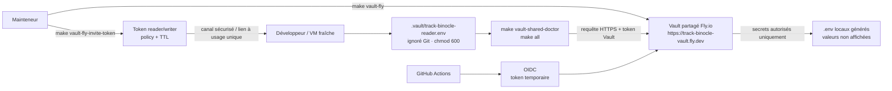
The overall philosophy remains the same: a secret can be recovered, but only with a valid, private token, limited by a policy, possibly expiring, and never versioned. It is in this logic that the broader rule fits: never rely on security on a single layer. If the front is wrong, the gateway must still filter. If an application service makes a mistake, PostgreSQL must still refuse. If a local file leaks, it must not contain a plaintext secret.
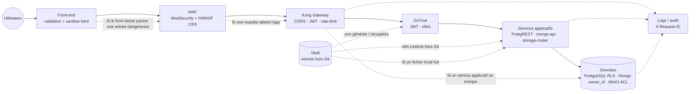
This diagram shows the logic of **defense in depth**: no layer is considered sufficient alone. The front reduces risk, the WAF filters, Kong controls the entry, GoTrue carries the identity, services enforce business rules, and the bottom has the final say on actual data access.

#### c. Architectural constraints: not a classic Express API

Another structuring constraint was not to reduce Osionos to a `React / Node.js / PostgreSQL` stack. The project does use React and PostgreSQL, but behind the front there is an assembly: Kong, GoTrue, PostgREST, PostgreSQL, MongoDB, Redis, MinIO, Vault, Trino, plus several NestJS micro-services which carry the business logic. This assembly imposes a fairly strict discipline.

The first rule is that **all public traffic goes through WAF then Kong**. No front speaks directly to a base; each data engine has its controlled facade (PostgREST, `mongo-api`, `storage-router`), and it is this facade that carries authentication and isolation. The second rule is that **each service must be able to live separately**: isolated in its container, configurable by environment variables, and restartable without interrupting the rest of the platform. The third rule is that **the gateway configuration must be readable in Git**: Kong runs in DB-less mode with its configuration in versioned YAML, so any modification of routes or plugins goes through a code review, not through a clickable UI. Finally, the stack must be able to **start locally without depending on an external cloud**: a developer on his VM must have exactly the same platform as in CI.

This constraint made the project more complex - it would have been quicker to stick everything in a monolithic Express - but it is also what gives it coherence. We didn't just build an application, we built a small platform, and each service can be justified by a concrete problem that we encountered.

#### d. Quality constraints on the front-end side

On the front side, the constraint was twofold: produce a truly rich interface, but without sacrificing maintainability. Osionos is a dense tool, with pages, blocks, drag and drop, context menus, dashboards and lots of keyboard interactions. The smallest broken UX detail can make the tool painful to use, and it quickly becomes impossible to repair if you haven't put safeguards in place from the start.

Our safeguard is therefore a chain of controls which runs before each merge, and which passes entirely into Docker via [apps/osionos/app/scripts/docker-run.sh](../apps/osionos/app/scripts/docker-run.sh). TypeScript blocks type errors with `tsc --noEmit`. ESLint is configured with `--max-warnings=0`, so no warnings are tolerated. Playwright plays end-to-end user scenarios, canvas tests check block behaviors and markdown analysis, bridge tests validate the connection between Osionos and BaaS, and a set of UX/browser tests cover focus management, drag and drop, inline toolbar, menus, indentation, paste, assets and context menu. Finally, a doctor verifies that the test environment is correct before trusting the results — because a test that passes in a broken environment proves nothing.

The rule that emerges from all this is constant: **front quality does not depend on the developer's machine**. If the pipeline does not work the same for me, for a teammate and in CI, we consider that the pipeline is not finalized.

#### e. Quality constraints on the back-end and infrastructure side

On the BaaS side, we couldn't just rely on classic unit tests, because most of the risk does not live in an isolated function — it lives in the **integration between services**. When Kong, GoTrue, PostgREST, PostgreSQL, MongoDB, Redis, Vault, MinIO and realtime have to work together for a user to simply read their own page, the risk is in the seams, not in the bricks.

We therefore set up a dedicated local CI, in [apps/baas/mini-baas-infra/scripts/run-ci-local.sh](../apps/baas/mini-baas-infra/scripts/run-ci-local.sh), which first checks the prerequisites (Docker, Docker Compose, Make, curl), validates the Bash syntax of all scripts and passes ShellCheck when it is available. It then completely cleans the Compose state so as not to inherit from an old volume, generates a deterministic `.env`, starts the stack, plays the `db-bootstrap`, checks the health of the gateway on `/auth/v1/health`, then executes `make tests`.

This `make tests` of the mini-BaaS chains the `phase*-*.sh` / `phase*-*.py` scripts in order, and each phase covers a specific risk: smoke tests, authentication, authenticated DB access, user isolation, HTTP methods, error codes, token life cycle, storage, complex mutations, realtime WebSocket, rate-limit, CORS, Mongo MVP, complete auth flow. Besides, SonarCloud is configured via [sonar-project.properties](../sonar-project.properties), and `vendor/QA` acts as a test registry: it catalogs existing scripts and stores their results.

The back quality constraint therefore did not boil down to “the roads respond”. It was more demanding: **the platform must be able to be destroyed, rebuilt, tested and explained**, without fragile manual intervention between the stages.

#### f. Method and planning constraints

The project started with a team of five people, then gradually grew in size. This imposed strong prioritization: everything could not be finished at the same time. We therefore worked with a Scrumban logic: enough structure to stay on course, enough flexibility to absorb unforeseen events.

This constraint explains the separation between:

- the **MVP**, which must prove the main flow;
- the **development prospects**, which contain strong ambitions but not essential to the first proof;
- the **roadmap 10/10**, which serves to harden the platform without pretending that everything is already finished.

The real risk was not only technical: it was wanting to do Notion, Supabase, Retool, Obsidian and Grafana at the same time. The quality constraint therefore forced us to reduce the scope, document the decisions and assume what remained outside of MVP.

#### g. Centralization constraint: a monorepo become a multi-app studio

A constraint that we had not anticipated at the start appeared very quickly: with reduced staff, we simply did not have the means to maintain five independent Git repositories, five distinct CI pipelines, five version systems, five separate backlogs. Each time we tried to divide it up neatly (one repository for the BaaS, one for `osionos`, one for `opposite-osiris`, one for the SDK, one for the internal tools), we lost more time synchronizing the versions and replaying the inter-service contracts than moving forward on the product.

We therefore made a pragmatic decision: **transform this depot into a single work studio**. Everything lives here — the BaaS, the two frontends, the SDK, the documentation, the tools, the infrastructure scripts — and each application gradually exits the monorepo when it becomes stable enough to live on its own. Concretely, the studio gives us a single `make` which knows how to build, test and publish each app, a single `pnpm-workspace.yaml` which shares dependencies, and a single Git history where we can follow a redesign from start to finish. The cost is a deposit that seems enormous at first glance; the benefit is that with two people we still have a platform with several services without exhausting ourselves on the plumbing.

The idea is not that everything stays in this monorepo forever. It's more of an **incubator**: an app grows here until releasing it becomes less risky than keeping it. `mini-baas-infra` is already well on its way to clean extraction (images published, Git tags aligned with releases), and the SDK `@mini-baas/js` is designed to be able to be published separately the day the contract is stable. In the meantime, the studio serves as a **shared workshop**.

### Human and technical environment
#### a. Human environment and methodology

The project was carried out within the framework of school 42, starting from the subject `ft_transcendence`, then gradually transformed into Osionos. The team was formed at the beginning of 2026 around five students of 42, with deliberately complementary profiles: product management, architecture, front-end development, back-end development, infrastructure, and QA. Everyone had a primary role and a secondary role, so that no critical function of the project depended on a single person in the absence.

| Login 42 | Name | Main role | Secondary role | GitHub | Specialization |
|---|---|---|---|---|---|
| `dlesieur` | Dylan Lesieur | ALL | ALL | [@LESdylan](https://github.com/LESdylan) | Auth, OAuth 2.0, product management, file |
| `danfern3` | Daniel Fernández | PO | PM | [@danielfdez17](https://github.com/danielfdez17) | Game engine, WebSockets |
| `serjimen` | Sergio Jiménez | PM | TL | [@DJSurgeon](https://github.com/DJSurgeon) | Back-end architecture, CI |
| `rstancu` | Roxana Stancu | TL | PM | [@esettes](https://github.com/esettes) | Front-end, design system SCSS |
| `vjan-nie` | Vadim Jan Nieto | TL | ALL | [@vjan-nie](https://github.com/vjan-nie) | Database, Prisma, Docker |

In fact, I carried a significant part of the role of **product owner / project manager** — framing the vision, prioritizing the MVP, arbitration between functionalities, writing the file and coordination with the technical constraints posed by the architecture profiles. **Vadim** and **Roxana** weighed heavily on architecture and quality requirements, including service separation, security, reproducibility and testing strategy. **Sergio** carried the back-end architecture and CI, and **Daniel** worked on the real-time foundations (WebSockets, game engine) which subsequently fed into the `realtime` brick of BaaS.

The working method is closer to a **Scrumban**: backlog and prioritization as in Scrum, more flexible execution as in Kanban. We kept short schedules at the start of each cycle, we monitored progress on a Kanban board, and we allowed ourselves to reorder without ceremony when technical reality demanded it. This choice was adapted to the context: many technical unknowns, a team that learns as it moves forward, and a scope that had to remain manageable despite the ambition of the product.

On the tools side, we deliberately separated real-time communication and project monitoring. For **communication**, we used **Discord** as the main base (voice + written chat rooms by subject), **WhatsApp** for quick, off-topic exchanges, and **Slack** for certain more formal channels. For **project monitoring**, we went directly through **GitHub Projects** on the [Univers42](https://github.com/orgs/Univers42/projects/6) organization: Kanban board, PR-related issues, milestones, all in the same place as the code.


*The detailed rendering of the board (columns, milestones, issues) is reproduced in large format in the section [Appendices — fig.9](#appendices) at the end of the file.*

We also tried **Notion** at startup for the documentation, and we finally abandoned it: it created two sources of truth (Notion on one side, the repo on the other), and at the slightest change in architecture the Notion doc silently became false. We therefore repatriated everything to this wiki, alongside the code, so that the PRs can correct the doc in the same gesture as the code they modify.

On the version control side, we worked in **Git + GitHub with a model close to Git Flow**: a protected `main` branch which represents the stable state, a `develop` integration branch, `feature/*` branches for new features, `fix/*` for fixes and `release/*` for version preparations. On GitHub, we had activated **branch protection rules** on `main` (and later on `develop`): no direct push, a **mandatory pull request** with at least one approved code review, and green CI as a merge condition. To keep a readable history, we also imposed **commits in Conventional Commits format**, controlled by **local Git hooks** (`commit-msg`, `pre-commit`) which refused non-compliant messages and launched a quick `lint` before the commit. This system ran for several months and it worked correctly — it ended up being **reduced** when the team was reduced to two people, not because it was inefficient, but because the two of us wasted more time waiting for the formal review than correcting a poorly formatted commit. We kept the hooks, we kept the PR on `main`, and we agreed to be more pragmatic on the other branches.

#### b. Technical environment

The technical environment can be summed up in one sentence: **a Linux station, Docker as the only runtime, VS Code as the editor, and Make as the control interface**. The detail matters, because it is this homogeneity that allows each member of the team to have exactly the same platform, regardless of their personal machine.

On the **workstation** side, we relied on the Linux ecosystem in all its diversity. The reference VM is a `b2b` VM under VirtualBox generated from [`Univers42/born2root`](https://github.com/Univers42/born2root.git) (in the Born2beroot spirit), but in practice the members of the team ran the stack on **Ubuntu, Debian, Kali Linux and Arch Linux** without encountering any blocking problems. This is precisely what we were looking for: as long as Docker, Docker Compose and Make are available, the rest of the stack doesn't make a difference. The main editor was **VS Code**, with some shared extensions (ESLint, Prettier, Docker, GitLens, Mermaid Preview) so that code review was done in the same framework as writing.

On the **application stacks** side, we have four distinct but coherent stacks, which are better detailed separately.

*Front application (`osionos`)* — React 19, Vite 6, TypeScript strict, Zustand 5 for state, `@tanstack/react-virtual` for virtualization, Playwright for end-to-end testing, ESLint + Prettier, all built and tested via [apps/osionos/app/scripts/docker-run.sh](../apps/osionos/app/scripts/docker-run.sh) in a container.

*Marketing front (`opposite-osiris`)* — Astro 6, TypeScript, SCSS, `@simplewebauthn/browser` for passkeys, `sanitize-html` on the content side, and a `container-only.mjs` guardrail which purely and simply refuses execution if you try to launch the project outside Docker.

*BaaS and application services* — Kong 3.8 (DB-less, YAML versioned) as gateway, GoTrue 2.188 for auth, PostgREST 12 on PostgreSQL, NestJS for internal services (`mongo-api`, `query-router`, `storage-router`, `permission-engine`, `session-service`, `schema-service`, `gdpr-service`, `log-service`, `email-service`, `newsletter-service`, `ai-service`, `analytics-service`), `realtime-agnostic` in Rust for WebSocket, MinIO behind `storage-router`, and Trino 467 for analytical federation.

*Databases and storage* — PostgreSQL 16 as source of truth (with RLS, idempotent migrations and demo seeds), MongoDB 7 for semi-structured blocks with `owner_id` injection by `mongo-api`, Redis 7 for the `query-router` cache and the future event bus, MinIO for files, HashiCorp Vault for secrets, and a local HTTPS proxy so that the host browser can talk to containers in TLS without certificate errors. `session-service` sessions are persisted in PostgreSQL.

The table below serves as a visual summary, not a catalog.

| Layer | Retained battery | Associated constraint |
|---|---|---|
| **Workstation** | Ubuntu, Debian, Kali, Arch; `b2b` VirtualBox reference VM | Linux only, exact OS should never block a developer |
| **Editor** | VS Code + shared extensions (ESLint, Prettier, Docker, GitLens) | Code review and writing in the same framework |
| **Application runtime** | Docker + Docker Compose root | Zero application dependencies installed directly on the host |
| **Orchestration** | Makefile (`make all`, `make playground`, `make healthcheck`), Compose profiles | A command must rebuild and verify the stack |
| **Front app** | React 19, Vite 6, TypeScript, Zustand 5, Playwright | All scripts go through `docker-run.sh` |
| **Marketing Front** | Astro 6, TypeScript, SCSS, `container-only.mjs` | Execution refused outside container |
| **BaaS** | Kong, GoTrue, PostgREST, NestJS, `realtime-agnostic` (Rust), Trino | Multi-service architecture, no direct browser access → base |
| **Bases & storage** | PostgreSQL 16, MongoDB 7, Redis 7, MinIO, Vault | Source of truth on PG side, `owner_id` on Mongo side, secrets outside Git |
| **Local security** | Local HTTPS, CA project, WAF, Vault, `.env` generated | Reproduce a production-like environment without exposing secrets |
| **Version** | Git + GitHub, Git Flow template, PR + review, `commit-msg` / `pre-commit` hooks | Readable history, stable branches protected |
| **Quality** | ESLint, TypeScript, Playwright, canvas/bridge tests, smoke tests BaaS, ShellCheck, SonarCloud, QA registry | No reliable merge without verifiable pipeline |

The most important point is that the environment is not designed for the individual comfort of the developer, but for **collective reproducibility**. If a command only works on my machine, it doesn't count as a real solution.

#### c. Deployment environments

Unlike a classic client project — for example a project delivered to a large account with three canonical environments (local development, internal recipe, client production) — Osionos does not have an end client who hosts the application on its own servers. The project is above all an **RNCP/CDA file + a self-hosted platform**; “production” in the strict sense does not yet exist. This has not exempted us from organizing our environments properly, but by adapting them to our reality.

Concretely, we work on three nested environments. The first, the most used, is the **local development** environment: the entire stack runs in Docker Compose on each developer's machine or VM, with `.env` generated either from the local Vault, or from the Vault shared on Fly.io for common secrets. It is in this environment that we write code, launch the Playwright tests, the phased BaaS suite (phases 1 to 16, including a Python phase) and the CTF scenarios. No sensitive variables are supposed to be committed.

The second environment is a **recipe/integration** environment, which corresponds to the executions of the **GitHub Actions CI** and to what `make ci-run-local` produces (which replays exactly what the CI does, but on a developer machine). It is used to validate that a PR is truly integrable: complete reset of the Compose state, generation of deterministic `.env`, `db-bootstrap`, health of the gateway, then suite of system tests. No real user data lives there; seeds are anonymized demo data. This is where we catch integration cases before they hit `main`.

The third environment is what we currently call the **internal demo tank** — a stack identical to the local stack, but started on the team's common VM from the **versioned Docker images when they are published** on GHCR and Docker Hub. It is used for demonstrations, manual acceptance tests, and end-to-end verifications of a complete user scenario (registration, workspace creation, connection to an external database, sharing). At this stage, backups remain simple: snapshot of the PostgreSQL volume and export `mongodump` on demand, because there are no real users to protect yet. The day a real production is set up for external users, this demonstration tank will be promoted to a pre-production environment, and the production itself will receive its own rituals (planned snapshots, retention, restore drills, full Prometheus alerting).

| Environment | What it contains | What we check there | Data |
|---|---|---|---|
| **Local / dev** | Complete stack in Docker Compose on workstation or `b2b` VM | Code writing, E2E Playwright tests, CTF front tests, debug | Development data, local seeds |
| **CI / recipe** | Same stack replayed by GitHub Actions or locally via `make all` / CI targets | `db-bootstrap`, health gateway, critical subset of BaaS phases in CI, ShellCheck, Sonar on affected packets | Data generated by seeds, no real data |
| **Internal demo** | Docker images versioned when available (GHCR + Docker Hub), common team VM | Manual acceptance testing, complete user scenario | Anonymized sample data |

The difference compared to the classic “local + recipe + client production” model is therefore above all a question of scope: we do not (yet) have a client production, but we have an environment which *would* play the role of pre-production if we were to have one tomorrow. The security mechanisms (secrets retrieved via Vault, PostgreSQL RLS, Mongo `owner_id` isolation, publishable images with version tags and pinning to be finalized) are already wired for this scenario, which avoids having to redo everything the day this step arrives.

### Quality objectives

The quality objectives were defined based on the constraints above. They are not only aesthetic: they serve to prevent such a distributed platform from becoming impossible to maintain.

| Quality objective | Means of control | Expected result |
|---|---|---|
| **Reproducibility** | Docker Compose, Makefile, generated `.env`, Vault, idempotent migrations | A new environment can be rebuilt without fragile manual procedure |
| **Security** | WAF, Kong, JWT, RLS, `owner_id`, Vault, AES-256-GCM, security/CTF scripts | No user data accessible without valid identity and permission |
| **Forehead quality** | TypeScript, ESLint `--max-warnings=0`, Playwright, canvas tests, browser/UX tests | The interface remains stable despite the richness of the interactions |
| **Quality back** | `run-ci-local.sh`, `make tests`, BaaS phases, healthchecks, ShellCheck | Critical services are tested as a complete system, not just as isolated files |
| **Observability** | Prometheus, Grafana, Loki, Promtail, `X-Request-ID` | An error must be able to be traced from the gateway to the service concerned |
| **Maintainability** | Feature-Sliced ​​Design, Micro-Services by Responsibility, Mermaid Documentation and README | A new member can understand where to step in without breaking the whole stack |
| **Compliance** | GDPR, `gdpr-service`, data map, export/anonymization/deletion | Personal data has a controlled life cycle |
| **Performance** | Front virtualization, Redis cache, PostgREST paging, Playwright/perf notes | Long pages and data views remain usable |

The overall objective can be summarized as follows: **make an ambitious, but verifiable application**. Each choice had to leave a trace: a test, a script, a lint rule, documentation, or a diagram. It is this discipline which makes it possible to defend the project technically in front of a jury, but also to resume it later without starting from scratch.

## CHAPTER 3: Personal projects, front-end
### Application mockup and diagrams
#### a. Desktop-first design
Before he started coding, Sergio was the team's front-end specialist. I worked closely with him to define the DoD (Definition of Done) of each component, and to ensure that the implementation choices met quality requirements. We adopted a "desktop first" approach, not because we wanted to go against current trends, but because our main target was professional users who would use Osionos on workstations. This approach allowed us to focus on a rich and functional experience, without being limited by the constraints of a mobile design from the start. However, we ensured that the design is responsive, so that the application remains accessible on different types of devices.

With Vadim, we created the models for the following screens (see fig.5 to fig.8)
Models, although initially complicated to learn, allow us to save time in the long term if we realize that the implementation choices do not meet quality requirements.


#### Graphic charter
in order to ensure a coherent and consistent visual identity with the application standards, we have defined a clear graphic charter. The choice of colors and typography was guided by two imperatives. Respect for accessibility and the need for good readability for users who will read both the webpage and the user interface of the application.


As we can see, on lightouse, we have very good results with a contrast of 7.5:1 for normal texts and 4.5:1 for titles, which greatly exceeds the WCAG 2.1 recommendations for accessibility.
with a score of 100/100 in accessibility.
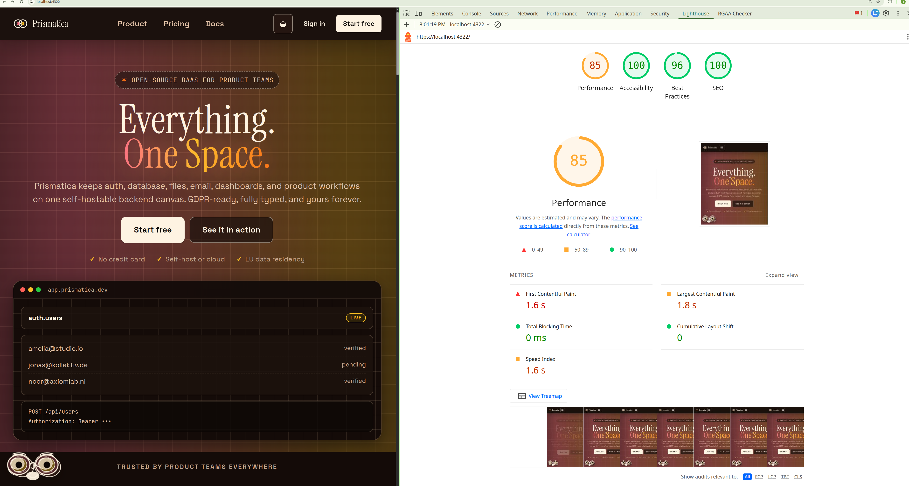

### Screenshots of user interfaces

**Calendar View** — integrated calendar for date/schedule type pages, with monthly navigation and management of content blocks linked to each entry.


**Home dashboard** — first thing you see when opening the app: a customizable dashboard with widgets created on the fly from the home page. This is where the user configures their workspace.
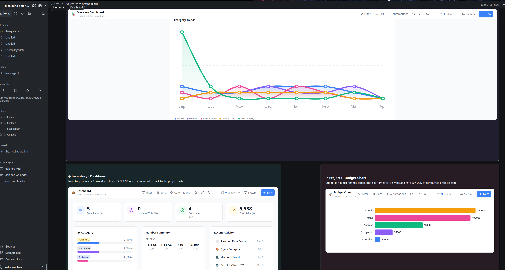

**Entity-relationship diagram** — database diagram designed on Miro prior to development. It served as a reference throughout the project to structure the relationships between pages, blocks, workspaces and users.
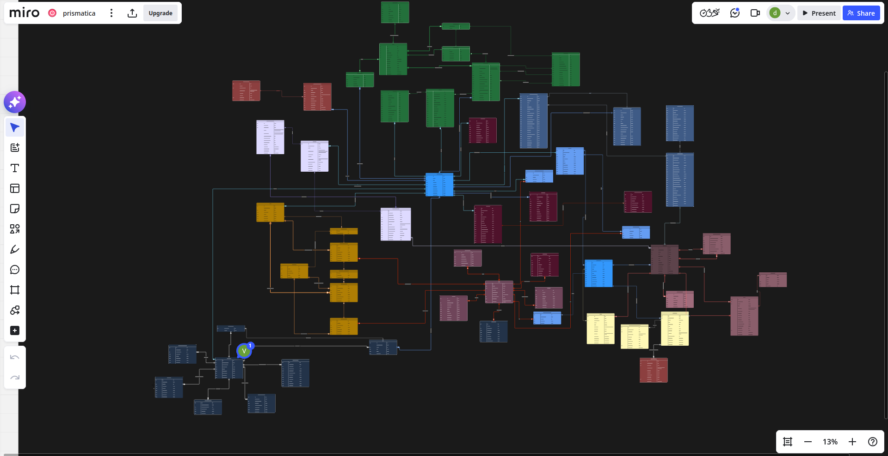

**Database rendering** — tabular view of an Osionos database, close to the Notion rendering. Each column is a configurable field, each row a record linked to a page.


**Project file translated into Japanese** — demonstration of the integrated translation functionality: this file has been automatically translated into Japanese from our internal grading system. A feature that we hadn't initially planned and that we slipped in because we could.


**Mail space** — messaging module integrated into the workspace, accessible directly from the sidebar. Allows you to manage communications without leaving the app.
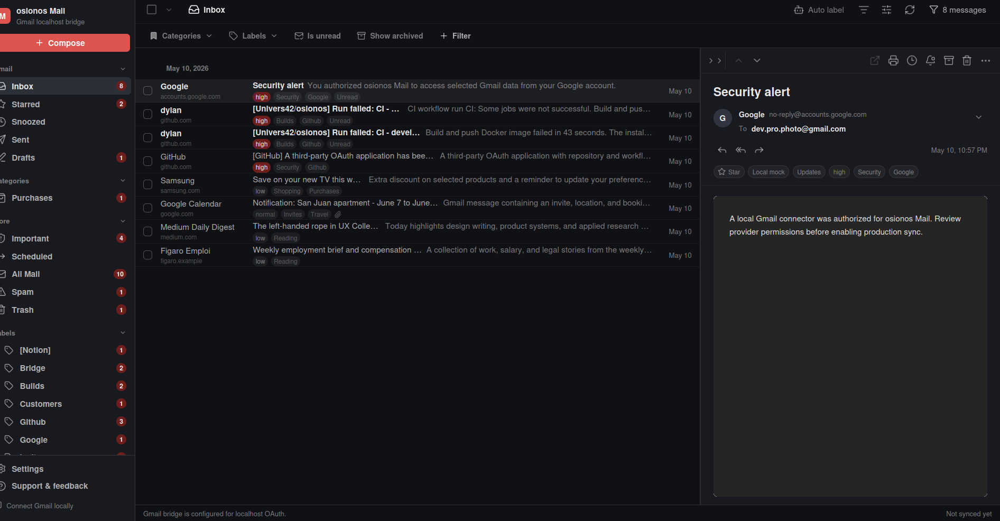

**Login portal** — authentication page with login 42 OAuth2. Access is secure, tokens are managed on the BaaS side via GoTrue, and the secrets necessary for runtime are generated or retrieved via Vault rather than versioned.


**Second Brain** — “free note” view inspired by the concept of the digital second brain. A space without imposed structure where the user can think and organize freely with Osionos blocks.
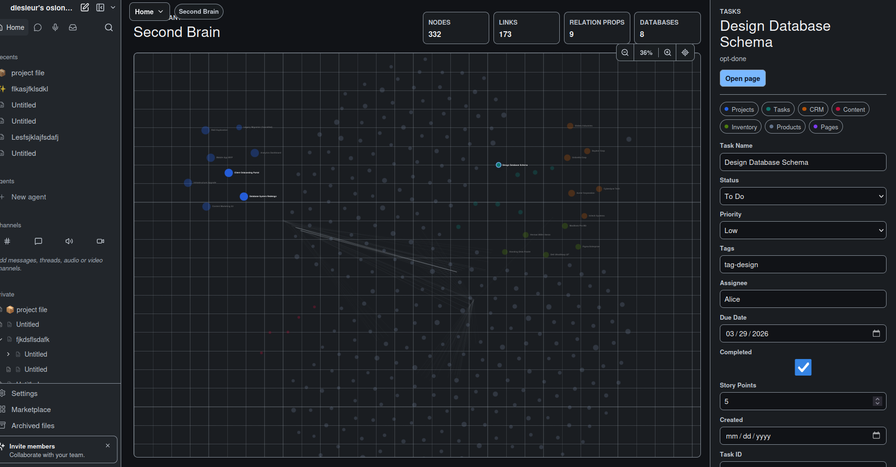

---

### Front-end optimizations and measured results

On Osionos, front-end performance is not a bonus: the application displays long pages, nested blocks, visual databases, a knowledge graph, context menus and settings panels. Without an explicit strategy, the interface would become slow before the user has even built a real workspace.

So I worked on four axes: **do not render what is not visible**, **do not recalculate what has not changed**, **do not write to the backend with each keystroke**, and **do not load heavy libraries until they are necessary**. The optimizations below are taken from current code, not from theoretical intent.

#### Virtualization of long blocks

The read-only renderer uses `@tanstack/react-virtual` in [apps/osionos/app/src/widgets/page-renderer/ui/PageBlocksRenderer.tsx](../apps/osionos/app/src/widgets/page-renderer/ui/PageBlocksRenderer.tsx). Virtualization is not activated immediately: it only starts above the threshold defined in [apps/osionos/app/src/entities/block/model/blockVirtualization.ts](../apps/osionos/app/src/entities/block/model/blockVirtualization.ts), to avoid making the rendering of small pages more complex.
```tsx
// apps/osionos/app/src/widgets/page-renderer/ui/PageBlocksRenderer.tsx
const renderMeta = useMemo(() => createRootBlockRenderMeta(blocks), [blocks]);
const shouldVirtualize = blocks.length >= ROOT_BLOCK_VIRTUALIZATION_THRESHOLD;
const virtualizer = useVirtualizer({
  count: shouldVirtualize ? renderMeta.length : 0,
  getScrollElement: () => scrollElement,
  estimateSize: (index) => estimateBlockHeight(renderMeta[index]?.block ?? blocks[0]),
  getItemKey: (index) => renderMeta[index]?.block.id ?? index,
  overscan: ROOT_BLOCK_VIRTUALIZATION_OVERSCAN,
  scrollMargin,
});
```
The same component measures the actual offset with a `ResizeObserver`, because an Osionos page does not have lines of fixed height: a block can be a paragraph, an image, an inline base or a table.

#### Caching and memoization of Markdown rendering

Rendering blocks is expensive because the same text goes through the internal Markdown engine (`markengine`). To avoid parsing the same content several times, [apps/osionos/app/src/entities/block/ui/ReadOnlyBlock.tsx](../apps/osionos/app/src/entities/block/ui/ReadOnlyBlock.tsx) uses a simple LRU cache, limited to 2000 entries.
```tsx
// apps/osionos/app/src/entities/block/ui/ReadOnlyBlock.tsx
const INLINE_MARKDOWN_CACHE_LIMIT = 2000;
const inlineMarkdownCache = new Map<string, React.ReactNode>();

function renderCachedInlineMarkdown(content: string): React.ReactNode {
  const cached = inlineMarkdownCache.get(content);
  if (cached !== undefined) {
    inlineMarkdownCache.delete(content);
    inlineMarkdownCache.set(content, cached);
    return cached;
  }

  const rendered = timed("renderInlineToReact", () => renderInlineToReact(content, {
    internalLinkRenderer: renderInternalPageLink,
  }));
  inlineMarkdownCache.set(content, rendered);

  if (inlineMarkdownCache.size > INLINE_MARKDOWN_CACHE_LIMIT) {
    const oldestKey = inlineMarkdownCache.keys().next().value;
    if (oldestKey !== undefined) inlineMarkdownCache.delete(oldestKey);
  }

  return rendered;
}
```
The final component is also protected by `React.memo`, with a comparison targeted to the block, its index and its depth. The objective is not to put `memo` everywhere, but to protect the very numerous nodes.
```tsx
// apps/osionos/app/src/entities/block/ui/ReadOnlyBlock.tsx
function areReadOnlyBlockPropsEqual(previous: BlockProps, next: BlockProps): boolean {
  return (
    previous.block === next.block &&
    previous.index === next.index &&
    (previous.bulletDepth ?? 0) === (next.bulletDepth ?? 0) &&
    (previous.numberedDepth ?? 0) === (next.numberedDepth ?? 0)
  );
}

export const ReadOnlyBlock = React.memo(ReadOnlyBlockImpl, areReadOnlyBlockPropsEqual);
```
#### Delayed backup and asynchronous calls

Each keystroke in the editor does not trigger a network request. Content persistence is debunked at 400 ms in [apps/osionos/app/src/store/pageStore.persistence.ts](../apps/osionos/app/src/store/pageStore.persistence.ts), and the settings use the same principle via [apps/osionos/app/src/store/settings/settingsStoreUtils.ts](../apps/osionos/app/src/store/settings/settingsStoreUtils.ts).
```ts
// apps/osionos/app/src/store/pageStore.persistence.ts
const _contentTimers = new Map<string, ReturnType<typeof setTimeout>>();

export function debouncePersistContent(pageId: string) {
  const existing = _contentTimers.get(pageId);
  if (existing) clearTimeout(existing);

  _contentTimers.set(pageId, setTimeout(() => {
    _contentTimers.delete(pageId);
    persistPageContent(pageId);
  }, 400));
}
```
Page translation also shows a performance practice: each block is translated asynchronously, with a promise cache to avoid translating the same text twice in the same operation. It's in [apps/osionos/app/src/services/page-actions/index.ts](../apps/osionos/app/src/services/page-actions/index.ts).
```ts
// apps/osionos/app/src/services/page-actions/index.ts
const cacheKey = `${targetLocale}\u0000${text}`;
const cached = cache.get(cacheKey);
if (cached) return cached;

const promise = (async () => {
  for (const translator of [
    () => translateWithConfiguredEndpoint(text, targetLocale, jwt),
    () => translateWithGooglePublicEndpoint(text, targetLocale),
    () => translateWithMyMemory(text, targetLocale),
  ]) {
    try {
      const translated = await translator();
      if (translated && !looksLikePrefixTranslation(translated, targetLocale)) {
        return translated;
      }
    } catch {
      // Try the next translation provider.
    }
  }

  return text;
})();
```
#### Targeted lazy loading

Lazy loading exists, but you have to be precise: **Mermaid** is loaded dynamically by [apps/osionos/app/src/shared/ui/molecules/MermaidDiagram/MermaidDiagram.tsx](../apps/osionos/app/src/shared/ui/molecules/MermaidDiagram/MermaidDiagram.tsx), and the database subsystem embedded (`notion-database-sys`) uses `React.lazy` in its `object_database.tsx` component for `DatabaseBlock`, `BlockHandle` and `PageModal`. On the other hand, **KaTeX** is imported statically into certain block components; I therefore do not present it as lazy-loaded in the current state of the code.
```tsx
// apps/osionos/app/src/shared/ui/molecules/MermaidDiagram/MermaidDiagram.tsx
let mermaidInitialized = false;
let mermaidPromise: Promise<typeof import("mermaid").default> | null = null;

function loadMermaid() {
  mermaidPromise ??= import("mermaid").then((module) => module.default);
  return mermaidPromise;
}

async function ensureMermaidInitialized() {
  const mermaid = await loadMermaid();
  if (mermaidInitialized) return mermaid;
  mermaid.initialize({
    startOnLoad: false,
    securityLevel: "strict",
    theme: "default",
  });
  mermaidInitialized = true;
  return mermaid;
}
```
#### Performance measurement in development

The performance is instrumented by [apps/osionos/app/src/shared/lib/perf/measure.ts](../apps/osionos/app/src/shared/lib/perf/measure.ts) and connected from the React root in [apps/osionos/app/src/app/main.tsx](../apps/osionos/app/src/app/main.tsx). In dev, any span greater than 4 ms emits a `[perf]` warning, which forces you to see the small costs that accumulate.
```tsx
// apps/osionos/app/src/app/main.tsx
createRoot(root).render(
  <StrictMode>
    <Profiler id="App" onRender={recordReactCommit}>
      <App />
    </Profiler>
  </StrictMode>,
);
```

```ts
// apps/osionos/app/src/shared/lib/perf/measure.ts
const WARN_THRESHOLD_MS = 4;

function warnIfSlow(name: string, durationMs: number) {
  if (durationMs > WARN_THRESHOLD_MS) {
    console.warn(`[perf] ${name}: ${durationMs.toFixed(1)}ms`);
  }
}
```
#### Build, bundle and SEO

The private application `osionos` is a Vite SPA: it is not designed for public referencing. Its [index.html](../apps/osionos/app/index.html) keeps the necessary bases (`lang`, `viewport`, `title`), but the product's SEO strategy is supported by the Astro site `opposite-osiris`, which renders static HTML and defines the `description`, `color-scheme`, favicon, CSP and preconnect tags in [apps/opposite-osiris/src/layouts/Layout.astro](../apps/opposite-osiris/src/layouts/Layout.astro).
```astro
<!-- apps/opposite-osiris/src/layouts/Layout.astro -->
<meta name="viewport" content="width=device-width, initial-scale=1.0" />
<meta name="color-scheme" content="light dark" />
<meta name="description" content={description} />
<meta http-equiv="Content-Security-Policy" content={activeCsp} />
<link rel="preconnect" href="https://fonts.googleapis.com" />
<link rel="preconnect" href="https://fonts.gstatic.com" crossorigin />
<title>{title}</title>
```
The Lighthouse capture available in the file was taken on `https://localhost:4322/`, therefore on the Prismatica marketing site, not on the private app. It shows: **Performance 85**, **Accessibility 100**, **Best Practices 96**, **SEO 100**, with **FCP 1.6 s**, **LCP 1.8 s**, **Total Blocking Time 0 ms** and **CLS 0**.


These results confirm two choices: marketing is of course Astro for SEO and perceived performance, while the private React/Vite application assumes a different logic, focused on rich interaction, local persistence and productivity.

### Code snippets, static user interfaces (React / SCSS)

#### a. Minimal organization of the front-end project

The Osionos front is not organized as a simple collection of React components. It follows an organization close to **Feature-Sliced ​​Design**: business elements live in `entities`, interactions in `features`, visible assemblies in `widgets`, orchestration in `app`, and reusable components in `shared`.

| File | Role in Osionos | Verified examples |
|---|---|---|
| [apps/osionos/app/src/app](../apps/osionos/app/src/app/) | Entry point, global styles, main shell | `main.tsx`, `App.tsx`, CSS tokens |
| [apps/osionos/app/src/entities](../apps/osionos/app/src/entities/) | Displayable business objects | `page`, `block`, `user` |
| [apps/osionos/app/src/features](../apps/osionos/app/src/features/) | User interactions | auth, block editor, page management, slash commands, settings |
| [apps/osionos/app/src/widgets](../apps/osionos/app/src/widgets/) | Compound UI Areas | sidebar, page renderer, database view, channel messages, graph home |
| [apps/osionos/app/src/shared](../apps/osionos/app/src/shared/) | Client API, hooks, UI primitives, config, perf | `api/client.ts`, `Modal.tsx`, `Dropdown.tsx`, `measure.ts` |
| [apps/osionos/app/src/store](../apps/osionos/app/src/store/) | Zustand and persistence blinds | pages, database, settings |
| [apps/osionos/app/src/services](../apps/osionos/app/src/services/) | Application actions outside components | actions page, realtime messages |

The entry point is deliberately very thin. It mounts React 19, enables `StrictMode`, plugs in the `Profiler`, then lets `App.tsx` assemble the shell.
```tsx
// apps/osionos/app/src/app/main.tsx
import { Profiler, StrictMode } from "react";
import { createRoot } from "react-dom/client";
import App from "./App.tsx";
import { recordReactCommit } from '@/shared/lib/perf/measure';
import './styles/global.css';

const root = document.getElementById("root");
if (root) {
  createRoot(root).render(
    <StrictMode>
      <Profiler id="App" onRender={recordReactCommit}>
        <App />
      </Profiler>
    </StrictMode>,
  );
}
```
`App.tsx` is the application shell: it initializes the session, applies the theme, chooses between debug mode, the Prismatica handoff screen, then the main layout with sidebar, content, settings and notifications.
```tsx
// apps/osionos/app/src/app/App.tsx
return (
  <div
    data-testid="app-shell"
    className="relative flex h-screen w-screen overflow-hidden bg-[var(--osio-bg-page)]"
  >
    <Sidebar
      onOpenSettings={() => setSettingsOpen(true)}
      onOpenHome={() =>
        usePageStore.setState({
          activePage: null,
          showTrash: false,
          navigationPath: [],
        })
      }
      onOpenTrash={() =>
        usePageStore.setState({
          activePage: null,
          showTrash: true,
          navigationPath: [],
        })
      }
    />

    <SidebarTrigger />
    <main className="flex-1 flex min-w-0 overflow-hidden relative">
      <MainContent />
    </main>

    <WorkspaceThemePanel />
    {settingsOpen && <SettingsCenter initialTab="general" onClose={() => setSettingsOpen(false)} />}
    <ToastViewport />
  </div>
);
```
The front stack is visible in [apps/osionos/app/package.json](../apps/osionos/app/package.json): React 19, Vite 6, TypeScript, Zustand, Playwright, lucide-react, `@tanstack/react-virtual`, Mermaid, KaTeX, Leaflet, Recharts. The scripts all go through `scripts/docker-run.sh`, which forces the same build and test environment for everyone.
```json
// apps/osionos/app/package.json
{
  "scripts": {
    "build": "bash scripts/docker-run.sh build",
    "typecheck": "bash scripts/docker-run.sh typecheck",
    "lint": "bash scripts/docker-run.sh lint",
    "test:e2e": "bash scripts/docker-run.sh test-e2e",
    "test:canvas": "bash scripts/docker-run.sh test-canvas",
    "test:bridge": "bash scripts/docker-run.sh test-bridge",
    "test:quality": "bash scripts/docker-run.sh quality"
  }
}
```
#### b. Code Snippet 1: Static and Accessible Login Portal

The connection portal visible in the captures does not live directly in the private SPA `osionos`. It is rendered on the **Astro** side in `opposite-osiris`, because this part must be fast, indexable and accessible before the user even opens their workspace. This is an important choice: the public page is static and SEO-friendly; Private React app starts after secure handoff.

The component [apps/opposite-osiris/src/components/ui/Portal.astro](../apps/opposite-osiris/src/components/ui/Portal.astro) shows this attention to accessibility: `dialog`, title linked by `aria-labelledby`, labels associated with fields, `aria-live` messages, named buttons, explicit consents and Turnstile anti-abuse zone.
```astro
<!-- apps/opposite-osiris/src/components/ui/Portal.astro -->
<dialog
  id="portal"
  class={`portal portal--${quick ? 'quick' : 'start'}`}
  aria-labelledby="portal-title"
  data-default-mode={quick ? 'connect' : 'start'}
>
  <h2 id="portal-title" class="visually-hidden">Prismatica workspace portal</h2>
  <button class="portal__close" type="button" aria-label="Close portal" data-close-portal>×</button>

  <section class="portal__panel portal__panel--login" aria-label="Secure connection panel">
    <form class="portal-login" novalidate>
      <label for="portal-email">Email <span aria-hidden="true">*</span></label>
      <input id="portal-email" name="email" type="email" autocomplete="email" inputmode="email" required />
      <p id="portal-email-inline-error" class="field-validation-message" aria-live="polite">
        We verify the email format before sending it.
      </p>

      <div class="turnstile-box" data-turnstile-widget aria-label="Anti-abuse verification"></div>
      <output id="portal-error-msg" class="portal-error" role="status" aria-live="polite" aria-atomic="true"></output>
    </form>
  </section>
</dialog>
```
Client-side validation is carried by [apps/opposite-osiris/src/hooks/useAuth.ts](../apps/opposite-osiris/src/hooks/useAuth.ts). It checks the email, password complexity, anti-abuse token, then calls the gateway with `credentials: 'include'` and a controlled retry on `429` responses.
```ts
// apps/opposite-osiris/src/hooks/useAuth.ts
export const RFC_5322_EMAIL_REGEX = new RegExp(String.raw`^${EMAIL_LOCAL_PART}@(?:${EMAIL_DOMAIN_LABEL}\.)+[A-Za-z]{2,63}$`);
export const STRONG_PASSWORD_REGEX = /^(?=.*[a-z])(?=.*[A-Z])(?=.*\d)(?=.*[^A-Za-z0-9]).{8,}$/;

function validationMessage(request: AuthRequest, mode: AuthMode): string | null {
  if (!validateEmail(request.email)) return 'Use a valid email address.';
  if (mode === 'register' && !validatePassword(request.password)) {
    return 'Password must be at least 8 characters and include uppercase, lowercase, number, and symbol.';
  }
  if (mode === 'login' && request.password.length === 0) return 'Enter your password.';
  if (!request.turnstileToken) return 'Complete the anti-abuse check.';
  return null;
}
```
Accessibility is not limited to the portal. In the React application, common primitives also carry keyboard behaviors: [apps/osionos/app/src/shared/ui/primitives/Modal.tsx](../apps/osionos/app/src/shared/ui/primitives/Modal.tsx) handles `role="dialog"`, `aria-modal`, `Escape`, initial focus, focus trap and focus restoration; [apps/osionos/app/src/shared/ui/primitives/Dropdown.tsx](../apps/osionos/app/src/shared/ui/primitives/Dropdown.tsx) implements `combobox` / `listbox` with keyboard navigation.
```tsx
// apps/osionos/app/src/shared/ui/primitives/Modal.tsx
<div
  ref={dialogRef}
  role="dialog"
  aria-modal="true"
  aria-labelledby={title ? titleId : undefined}
  aria-describedby={description ? descriptionId : undefined}
  tabIndex={-1}
>
  {title ? <h2 id={titleId} className="sr-only">{title}</h2> : null}
  {description ? <p id={descriptionId} className="sr-only">{description}</p> : null}
  {children}
</div>
```
Finally, responsive design relies on CSS tokens and fluid values ​​rather than a stack of breakpoints. [apps/osionos/app/src/pages/notion-page/ui/notionPage.css](../apps/osionos/app/src/pages/notion-page/ui/notionPage.css) uses `clamp()` to keep reading comfortable on small and large screens.
```css
/* apps/osionos/app/src/pages/notion-page/ui/notionPage.css */
.osionos-page-header,
.osionos-page-properties,
.osionos-page-body {
  max-width: var(--page-content-max-width, 900px);
  width: 100%;
  min-width: 0;
  margin-left: auto;
  margin-right: auto;
  padding-left: var(--page-content-padding-inline, clamp(16px, 11%, 96px));
  padding-right: var(--page-content-padding-inline, clamp(16px, 11%, 96px));
}
```
### Code snippets, dynamic part

#### a. Authentication: Prismatica session, secure bridge and offline fallback

Authentication on the Osionos side is not just a React form. The actual flow is in two stages: the Astro site (`opposite-osiris`) authenticates the user, then the `osionos` application consumes a signed bridge session. If no bridge is available and offline mode is authorized, the application starts with seeded data to allow local development.

In [apps/osionos/app/src/features/auth/model/userStore.helpers.ts](../apps/osionos/app/src/features/auth/model/userStore.helpers.ts), the bridge token is read from the URL, sent to the API, then immediately removed from the address bar to avoid remaining in visible history.
```ts
// apps/osionos/app/src/features/auth/model/userStore.helpers.ts
export async function consumeBridgeSessionFromLocation(): Promise<BridgeSessionImport | null> {
  const token = bridgeTokenFromLocation();
  if (!token || !API_BASE) return null;
  const response = await fetch(`${API_BASE}/api/auth/bridge/consume`, {
    method: 'POST',
    headers: { Accept: 'application/json', 'Content-Type': 'application/json' },
    credentials: 'include',
    body: JSON.stringify({ token }),
  });
  if (!response.ok) throw new Error('Bridge session could not be imported.');
  const payload = await response.json() as BridgeSessionImport;
  clearBridgeTokenFromLocation();
  return payload;
}
```
The Zustand store [apps/osionos/app/src/features/auth/model/useUserStore.ts](../apps/osionos/app/src/features/auth/model/useUserStore.ts) centralizes user state, sessions, active workspaces and offline fallback. It contains a guard against double calling `init()` in `StrictMode`, which is essential with React 19.
```ts
// apps/osionos/app/src/features/auth/model/useUserStore.ts
let _initInProgress = false;

export const useUserStore = create<UserStore>((set, get) => ({
  personas: uniquePersonas([...INITIAL_PERSONAS.map(p => ({ ...p })), ...readPersistedPersonas()]),
  sessions: {},
  activeUserId: '',
  initialized: false,
  loading: false,
  error: null,

  init: async () => {
    if (get().initialized || _initInProgress) return;
    _initInProgress = true;
    set({ loading: true, error: null });

    try {
      set(await resolveInitialState());
    } catch {
      set(bridgeOnlyMode() ? bridgeSessionRequiredState() : offlineState());
    } finally {
      _initInProgress = false;
    }
  },
}));
```
The common API client [apps/osionos/app/src/shared/api/client.ts](../apps/osionos/app/src/shared/api/client.ts) adds the JWT only when it exists and transforms HTTP errors into typed `ApiError`. It's a small layer, but it prevents each component from rebuilding its own `fetch` logic.
```ts
// apps/osionos/app/src/shared/api/client.ts
async function request<T>(method: string, path: string, body?: unknown, jwt?: string): Promise<T> {
  if (!API_BASE) throw new Error("VITE_API_URL is not configured.");

  const headers: Record<string, string> = { 'Content-Type': 'application/json' };
  if (jwt) headers['Authorization'] = `Bearer ${jwt}`;

  const res = await fetch(`${API_BASE}${path}`, {
    method,
    headers,
    body: body == null ? undefined : JSON.stringify(body),
  });

  if (!res.ok) {
    const errorBody = await res.json().catch(() => null) as ApiErrorBody | null;
    throw new ApiError(errorBody?.error ?? errorBody?.message ?? `${method} ${path} → ${res.status} ${res.statusText}`, res.status);
  }
  if (res.status === 204) return undefined as T;
  return res.json() as Promise<T>;
}
```
#### b. Data recovery: workspaces, pages and complete content

On the product side, dynamic retrieval concerns **workspaces**, **pages** and the **complete content of a page**. This is the central flow of Osionos: the user opens a space, chooses a page, then the application loads only what is necessary to display or edit this page.

In [apps/osionos/app/src/store/pageStore.actions.ts](../apps/osionos/app/src/store/pageStore.actions.ts), `fetchPages` first checks the JWT usable by the pages API, then the current access context. If the user does not belong to the requested workspace, the request does not even go through. This front-end verification is not the final security (it remains on the BaaS/RLS side), but it avoids bad UX and reduces unnecessary calls.
```ts
// apps/osionos/app/src/store/pageStore.actions.ts
export function createFetchPages(set: SetFn, get: GetFn) {
  return async (workspaceId: string, jwt: string) => {
    const pageJwt = pageApiJwtFromSessionToken(jwt);
    if (!pageJwt) return;
    const context = getCurrentPageAccessContext();
    if (context && !context.workspaceIds.includes(workspaceId)) return;
    if (get().loadingIds.has(workspaceId)) return;
    set((s) => ({ loadingIds: new Set([...s.loadingIds, workspaceId]) }));
    try {
      const data = await api.get<PageEntry[]>(
        `/api/pages/all?workspaceId=${workspaceId}`,
        pageJwt,
      );
      set((s) => ({
        ...derivePageState({
          ...s.pages,
          [workspaceId]: mergeWorkspacePages(s.pages[workspaceId], data),
        }, s.pageIdsByWorkspace),
        loadingIds: new Set([...s.loadingIds].filter((id) => id !== workspaceId)),
      }));
      savePagesCache(get().pages, workspaceId);
    } catch {
      set((s) => ({ loadingIds: new Set([...s.loadingIds].filter((id) => id !== workspaceId)) }));
    }
  };
}
```
The entire content of a page is loaded on demand. [apps/osionos/app/src/widgets/page-renderer/ui/MainContent.tsx](../apps/osionos/app/src/widgets/page-renderer/ui/MainContent.tsx) only fetches if the active page is a real page, the JWT exists and the content is not already in the store.
```tsx
// apps/osionos/app/src/widgets/page-renderer/ui/MainContent.tsx
useEffect(() => {
  if (!activePage || activePage?.kind !== "page" || !jwt) return;
  const page = pageById(activePage.id);
  if (!page) {
    fetchPageContent(activePage.id, jwt);
  }
}, [activePage, jwt, pageById, fetchPageContent]);
```
The function called store side then checks that the page exists, that the user can read it, and then merges the revenue fields from the API into local state.
```ts
// apps/osionos/app/src/store/pageStore.actions.ts
export function createFetchPageContent(set: SetFn, get: GetFn) {
  return async (pageId: string, jwt: string) => {
    const pageJwt = pageApiJwtFromSessionToken(jwt);
    if (!pageJwt || !isPersistedPageId(pageId)) return;
    const page = get().pageById(pageId);
    const context = getCurrentPageAccessContext();
    if (!page || !canReadPage(page, context)) return;
    try {
      const fullPage = await api.get<PageEntry>(`/api/pages/${pageId}`, pageJwt);
      if (!fullPage) return;
      set((s) => ({
        ...derivePageState(updatePageInState(s.pages, pageId, (p) => ({
          ...p,
          content: fullPage.content ?? p.content,
          title: fullPage.title ?? p.title,
          icon: fullPage.icon ?? p.icon,
          cover: fullPage.cover ?? p.cover,
          updatedAt: fullPage.updatedAt ?? p.updatedAt,
        })), s.pageIdsByWorkspace),
      }));
      savePagesCache(get().pages, page.workspaceId);
    } catch (err) {
      console.warn("[pageStore] fetchPageContent failed:", pageId, err);
    }
  };
}
```
#### c. Critical business actions: archive, delete, lock, translate, restore

In Osionos, critical business actions are: **archive a page**, **delete a page**, **duplicate a page**, **change its implicit permissions**, **lock the edition**, **translate its contents**, or **restore a version**. These are actions visible to the user, but they also modify the local state, persistence and sometimes the descendants of a page.

Before executing a dangerous action, [apps/osionos/app/src/features/page-management/ui/PageOptionsMenu.tsx](../apps/osionos/app/src/features/page-management/ui/PageOptionsMenu.tsx) checks the local access context via `canDeletePage` or `canDuplicatePage`, then calls the store. This check does not replace the backend; it protects the interface and avoids proposing inconsistent actions.
```tsx
// apps/osionos/app/src/features/page-management/ui/PageOptionsMenu.tsx
const handleDuplicateClick = async (e: React.MouseEvent) => {
  e.stopPropagation();
  setIsMenuOpen(false);
  if (!workspaceId) return;
  if (!currentPage || !canDuplicatePage(currentPage, getCurrentPageAccessContext())) return;

  try {
    await duplicatePage(pageId, workspaceId);
  } catch (err) {
    console.error("[PageOptionsMenu] Failed to duplicate page", err);
  }
};

const handleConfirmDelete = async () => {
  if (!workspaceId) return;
  if (!currentPage || !canDeletePage(currentPage, getCurrentPageAccessContext())) return;
  await deletePage(pageId, workspaceId, jwt ?? "");
  redirectIfAffectedPageChanged();
};
```
Front access rules are centralized in [apps/osionos/app/src/shared/lib/auth/pageAccess.ts](../apps/osionos/app/src/shared/lib/auth/pageAccess.ts), instead of being copied into each component.
```ts
// apps/osionos/app/src/shared/lib/auth/pageAccess.ts
export function canReadPage(page: PageEntry, context: PageAccessContext | null): boolean {
  if (!context || !hasWorkspaceAccess(page, context)) return false;

  const visibility = normalizePageVisibility(page.visibility);
  if (visibility === "public") return true;
  if (visibility === "shared") return true;
  if (page.ownerId && page.ownerId === context.userId) return true;
  if (isLegacyPage(page)) return true;

  return getCollaboratorRole(page, context.userId) !== null;
}

export function canEditPage(page: PageEntry, context: PageAccessContext | null): boolean {
  if (!context || !hasWorkspaceAccess(page, context)) return false;
  if (context.sharedWorkspaceIds.includes(page.workspaceId)) return true;
  if (page.ownerId && page.ownerId === context.userId) return true;
  if (isLegacyPage(page)) return true;
  const collaboratorRole = getCollaboratorRole(page, context.userId);
  return collaboratorRole === "editor" || collaboratorRole === "owner";
}
```
Archiving clearly shows the business logic: we patch the backend when a JWT exists, then we locally update the page and all its descendants, also cleaning recent pages. It's in [apps/osionos/app/src/store/pageStore.actions.ts](../apps/osionos/app/src/store/pageStore.actions.ts).
```ts
// apps/osionos/app/src/store/pageStore.actions.ts
export function createArchivePage(set: SetFn, get: GetFn) {
  return async (pageId: string, workspaceId: string, jwt: string) => {
    const page = get().pageById(pageId);
    const context = getCurrentPageAccessContext();
    if (!page || !canDeletePage(page, context)) return;

    const archivedAt = new Date().toISOString();
    const pageJwt = pageApiJwtFromSessionToken(jwt);

    if (pageJwt && isPersistedPageId(pageId)) {
      try {
        await api.patch(`/api/pages/${pageId}`, { archivedAt }, pageJwt);
      } catch {
        /* silent */
      }
    }

    set((s) => {
      const wsPages = s.pages[workspaceId] ?? [];
      const descendantIds = getAllDescendantIds(wsPages, pageId);
      const archivedIds = new Set([pageId, ...descendantIds]);
      const newRecents = s.recents.filter((r) => !archivedIds.has(r.id));
      const pages = {
        ...s.pages,
        [workspaceId]: wsPages.map((p) => archivedIds.has(p._id) ? { ...p, archivedAt } : p),
      };
      return { ...derivePageState(pages, s.pageIdsByWorkspace), recents: newRecents };
    });
    savePagesCache(get().pages, workspaceId);
  };
}
```
More advanced page actions are grouped in [apps/osionos/app/src/entities/page/model/usePageActions.ts](../apps/osionos/app/src/entities/page/model/usePageActions.ts). This hook manages the word counter, automatic versions, translation, import/export, notifications, presentation mode and page locking.
```tsx
// apps/osionos/app/src/entities/page/model/usePageActions.ts
const toggleLock = useCallback(
  () => updatePageSetting(
    { locked: !config.locked },
    'lock_page',
    config.locked ? 'Page unlocked' : 'Page locked',
  ),
  [config.locked, updatePageSetting],
);

const translate = useCallback(async (targetLocale = translateLocale) => {
  if (!page || !pageId) return;
  const label = translationLabel(targetLocale);
  await snapshot(`Before translation to ${label}`);
  const translated = await translatePage(page, jwt ?? undefined, targetLocale);
  if (translated.title) updatePageTitle(pageId, translated.title);
  if (translated.content) updatePageContent(pageId, translated.content);
  await logAction('translate', `Page translated to ${label}`, { targetLocale });
}, [jwt, logAction, page, pageId, snapshot, translateLocale, updatePageContent, updatePageTitle]);
```
### Accessibility, front-line security and measurable quality

#### Accessibility built into components

Accessibility is visible at several levels of the code: an avoidance link on the Astro page, named buttons, tabs with `aria-selected`, breadcrumbs with `aria-current`, a `contentEditable` editor announced as multiline textbox, and modals with focus trap.
```astro
<!-- apps/opposite-osiris/src/pages/index.astro -->
<a href="#main-content" class="skip-link">Skip to main content</a>
<div aria-live="polite" aria-atomic="true" class="visually-hidden" id="global-announcer"></div>
<main id="main-content" class="swipe-stack" data-swipe-stack>
  ...
</main>
```

```tsx
// apps/osionos/app/src/widgets/sidebar/ui/SidebarTopNav.tsx
<div role="tablist" aria-label="Sidebar navigation">
  {tabs.map((tab) => (
    <button
      key={tab.id}
      type="button"
      role="tab"
      aria-selected={tab.active}
      aria-label={tab.label}
      title={tab.label}
    >
      <span className="flex shrink-0 items-center opacity-80">{tab.icon}</span>
      <span className={tab.active ? 'ml-1.5 truncate' : 'sr-only'}>{tab.label}</span>
    </button>
  ))}
</div>
```

```tsx
// apps/osionos/app/src/components/blocks/EditableContent.tsx
<div
  ref={ref}
  role="textbox"
  aria-multiline="true"
  tabIndex={0}
  contentEditable
  suppressContentEditableWarning
  spellCheck
  data-placeholder={hasFocus ? placeholder : ""}
  onInput={handleInput}
  onKeyDown={handleKeyDown}
  onPaste={handlePaste}
/>
```
#### Rendering and navigation side security

The front should never be presented as the final layer of security: the real barrier remains on the BaaS side (Kong, JWT, PostgREST, RLS, `owner_id`). On the other hand, the front reduces the risk upon rendering. The Markdown engine escapes HTML text, filters dangerous URL schemes, and adds `rel="noopener noreferrer"` on external links.
```ts
// apps/osionos/app/src/shared/lib/markengine/renderCore.ts
export function escapeHtml(value: string): string {
  return value.replaceAll(HTML_ESCAPE_PATTERN, (char) => HTML_ESCAPE_MAP[char]);
}

export function sanitizeUrl(value: string): string {
  const normalized = stripUrlControlAndSpaceChars(value.trim());
  const schemeMatch = /^([a-z][a-z\d+.-]*):/i.exec(normalized);
  if (!schemeMatch) return value.trim();

  const scheme = schemeMatch[1].toLowerCase();
  if (scheme === "http" || scheme === "https" || scheme === "mailto" || scheme === "tel") {
    return value.trim();
  }

  return "";
}
```

```ts
// apps/osionos/app/src/shared/lib/markengine/markdown/renderers/inlineHtml.ts
function renderLink(node: Extract<InlineNode, { type: "link" }>, options: ResolvedInlineHtmlOptions): string {
  const href = sanitizeUrl(node.href);
  const attrs = [
    `href="${esc(href || "#")}"`,
    options.externalLinks && isExternalUrl(href) ? 'target="_blank" rel="noopener noreferrer"' : "",
  ].filter(Boolean).join(" ");
  return `<a ${attrs}>${renderChildren(node.children, options)}</a>`;
}
```
The syntax highlighting component [apps/osionos/app/src/shared/ui/molecules/CodeSyntaxHighlight/CodeSyntaxHighlight.tsx](../apps/osionos/app/src/shared/ui/molecules/CodeSyntaxHighlight/CodeSyntaxHighlight.tsx) uses `dangerouslySetInnerHTML`, but only after manual escaping for unknown languages and after `highlight.js` for registered languages.
```tsx
// apps/osionos/app/src/shared/ui/molecules/CodeSyntaxHighlight/CodeSyntaxHighlight.tsx
function escapeHtml(value: string) {
  return value
    .replaceAll("&", "&amp;")
    .replaceAll("<", "&lt;")
    .replaceAll(">", "&gt;")
    .replaceAll('"', "&quot;");
}

if (!hljs.getLanguage(normalized)) {
  return escapeHtml(code);
}
```
Finally, the Astro public site enforces strict CSP in production in [apps/opposite-osiris/src/layouts/Layout.astro](../apps/opposite-osiris/src/layouts/Layout.astro), with `object-src 'none'`, `base-uri 'self'`, Trusted Types and `require-trusted-types-for 'script'`.
```astro
<!-- apps/opposite-osiris/src/layouts/Layout.astro -->
const productionCsp = [
  "default-src 'self'",
  "base-uri 'self'",
  "object-src 'none'",
  "form-action 'self'",
  "script-src 'self' https://challenges.cloudflare.com",
  "trusted-types prismatica-static-markup",
  "require-trusted-types-for 'script'",
].join('; ');
```
#### Summary of what the front shows

This front chapter therefore shows several concrete things that I have achieved or integrated: a modular React architecture, a static access portal accessible on the Astro side, a secure bridge session between Prismatica and Osionos, Zustand stores with offline fallback, asynchronous page recovery, protected business actions, virtualization of long pages, persistence debounce, an instrumented Markdown engine, and a clear separation between **public SEO** (Astro) and **rich private application** (React/Vite).

## CHAPTER 4. Personal achievements, back-end
This chapter presents the server part that I actually built or integrated. The back-end is not a single monolithic server: it is a platform made up of specialized bricks. **Kong** plays the role of gateway, **GoTrue** manages the authentication, **PostgREST** exposes PostgreSQL in REST, **MongoDB** serves the documentary data, **MinIO** stores the files, **realtime-agnostic** broadcasts the changes, and the **NestJS** services carry the logic that we control directly: `mongo-api`, `query-router`, `adaptor-registry`, `schema-service`, `permission-engine`, `storage-router`, `session-service`, `gdpr-service`, `log-service`, `email-service`, `newsletter-service`, `analytics-service` and `ai-service`.

The general logic is simple: **the browser only knows HTTP APIs**, and the internal services do not talk to each other by importing code, but by **Docker network**, with service URLs (`http://adapter-registry:3020`, `http://permission-engine:3050`, `mongo:27017`, `postgres:5432`) and internal tokens when a trust limit must be crossed.

### API architecture and data model

#### a. RESTful API Architecture

A RESTful API exposes **resources** (`users`, `posts`, `databases`, `schemas`, `collections`, `pages`) and lets HTTP verbs express the intent: `GET` to read, `POST` to create or trigger an operation, `PATCH` to partially modify, `DELETE` to delete. It is also **stateless**: each request carries its identity in a JWT, an API key or a service token; the server does not need to keep an application session in memory to understand the request.

In our project, the API is RESTful in its concrete use: the routes are structured by resources, the NestJS services use HTTP controllers, PostgREST directly exposes the PostgreSQL tables under `/rest/v1`, and Kong applies the same transversal layers to the input. We remain pragmatic on one point: the entire API is not an "academic" REST implementation with a complete HTTP cache strategy; the verified caches are mainly application-related (`query-router` with local TTL/Redis, front cache, and local persistence on the Osionos side). But the client/server separation, the absence of server session state and the uniform use of HTTP resources are there.

| Public entrance | Internal service | Main resource | Role |
| --- | --- | --- | --- |
| `/auth/v1/*` | GoTrue | users, sessions, OAuth | registration, login, JWT |
| `/rest/v1/<table>` | PostgREST | PostgreSQL tables | CRUD REST protected by RLS |
| `/mongo/v1/collections/:name/documents` | `mongo-api` | MongoDB collections | CRUD document owner-scoped |
| `/admin/v1/databases` | `adaptor-registry` | registered databases | encrypted storage of connections |
| `/query/v1/query/:dbId/tables/:table` | `query-router` | remote table or collection | multi-engine standardized execution |
| `/schemas/v1/schemas` | `schema-service` | table or collection created | DDL checked and recorded |
| `/permissions/v1/permissions/check` | `permission-engine` | ABAC roles and policies | authorization decision |
| `/storage/v1/sign/:bucket/*` | `storage-router` | MinIO/S3 object | Presigned URL with user prefix |
| `/realtime/v1` | `realtime-agnostic` | DB events | WebSocket/CDC |

The flow of a query looks like this:
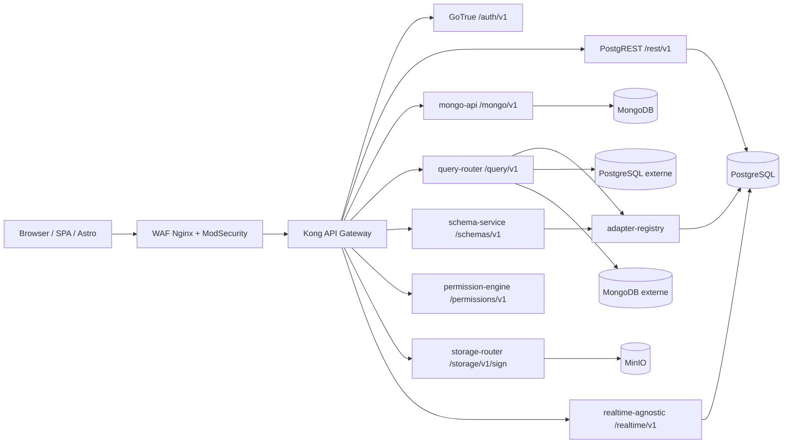
Kong is also the point where the identity becomes usable by internal services. The configuration [kong.yml](../apps/baas/mini-baas-infra/docker/services/kong/conf/kong.yml) checks the JWTs, applies `key-auth`, rate limiting, payload limits, CORS, security headers, then injects trust headers (`X-User-Id`, `X-User-Email`, `X-User-Role`). The NestJS services therefore do not each revalidate the JWT: they read the identity already validated by the gateway.
```yaml
# apps/baas/mini-baas-infra/docker/services/kong/conf/kong.yml
- name: rest
  url: http://postgrest:3000
  routes:
    - name: rest-routes
      paths: [/rest/v1]
      strip_path: true
      plugins:
        - name: key-auth
        - name: jwt
          config:
            header_names: [authorization]
            key_claim_name: iss
            claims_to_verify: [exp]
        - name: rate-limiting
          config:
            minute: 180
            hour: 5000
```
#### b. Conceptual data diagram

The difficulty of the project is that there is not a single database. There is a **relational foundation** for identity, roles, permissions, registries and structured data; there is an **Osionos model** oriented workspace/pages; and there is a **document / multi-engine plan** for dynamic collections and user-saved databases.

The first diagram represents the BaaS core: users, demo content, roles, policies, registered databases, created schemas and storage objects.
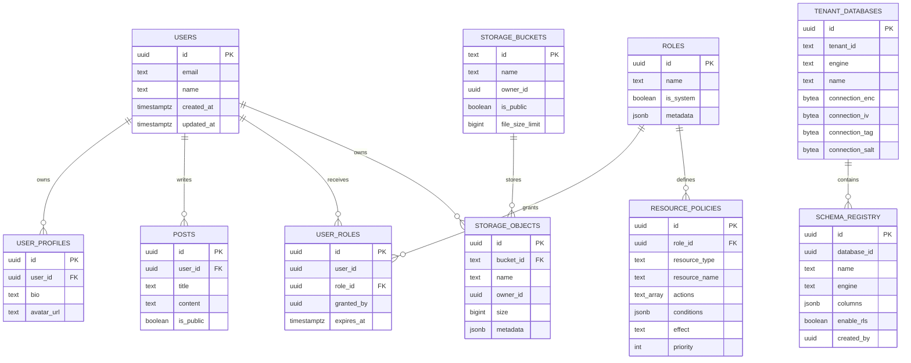
The second scheme is the one used by the `track-binocle` / Prismatica / opposite-osiris profile. It is intentionally relational: an account has temporary tokens, sessions, activities, consents and GDPR requests. The files that define this model are [models/user.sql](../models/user.sql), [models/auth-security-migration.sql](../models/auth-security-migration.sql), and [models/gdpr-migration.sql](../models/gdpr-migration.sql).
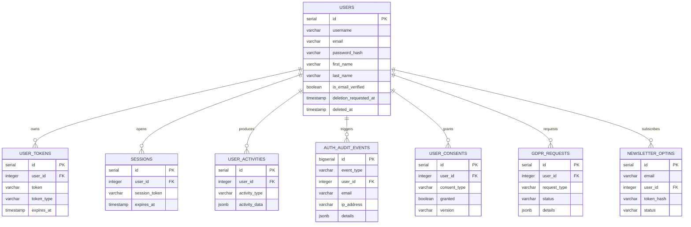
The third diagram describes the Osionos part. The browser manipulates pages and workspaces; the backend maintains the durable correspondence between the Prismatica identity, the private workspace, the pages, the configurations per user and the action events. This part is defined in [models/osionos-bridge-migration.sql](../models/osionos-bridge-migration.sql).
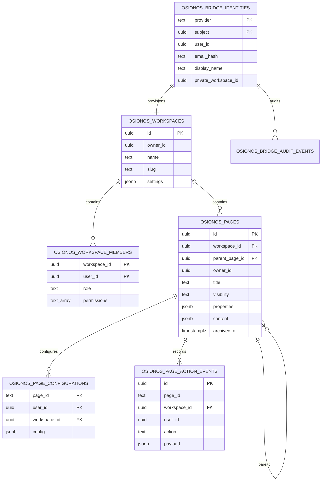
Finally, the MongoDB plan is more flexible: it does not seek to freeze all forms of documents in advance. Collections created by `schema-service` receive a JSON Schema validator, an index on `owner_id`, and operations from `mongo-api` or `query-router` systematically inject or filter by owner.
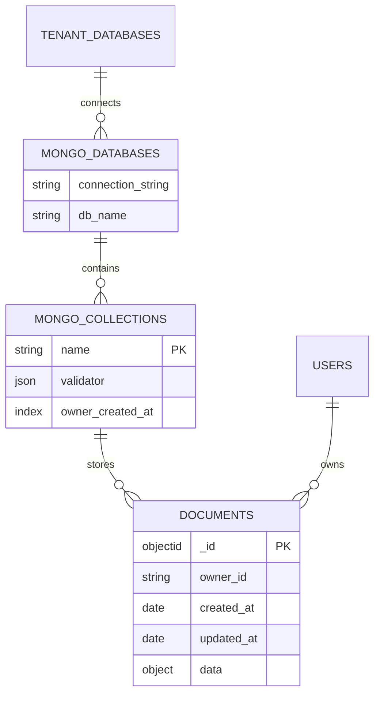
#### c. Physical Data Schema (SPD) and SQL Scripts

The physical model is materialized by two families of scripts.

The first family is the BaaS base in [apps/baas/mini-baas-infra/scripts/migrations/postgresql](../apps/baas/mini-baas-infra/scripts/migrations/postgresql): creation of `auth.uid()`, system tables, RLS, adapter register, ABAC, storage and realtime triggers.
```sql
-- apps/baas/mini-baas-infra/scripts/migrations/postgresql/001_initial_schema.sql
CREATE OR REPLACE FUNCTION auth.uid() RETURNS UUID AS $$
  SELECT (current_setting('request.jwt.claims', true)::jsonb->>'sub')::uuid;
$$ LANGUAGE SQL STABLE;

CREATE TABLE IF NOT EXISTS public.posts (
  id UUID PRIMARY KEY DEFAULT gen_random_uuid(),
  user_id UUID NOT NULL REFERENCES public.users(id) ON DELETE CASCADE,
  title TEXT NOT NULL,
  content TEXT,
  is_public BOOLEAN DEFAULT false,
  created_at TIMESTAMPTZ DEFAULT now(),
  updated_at TIMESTAMPTZ DEFAULT now()
);

ALTER TABLE public.posts ENABLE ROW LEVEL SECURITY;

CREATE POLICY posts_select ON public.posts
  FOR SELECT USING (is_public OR auth.uid()::text = user_id::text);
```
The external database register is a sensitive point: it contains the connection strings to user databases. Physical storage does not keep the channel in the clear; it preserves the ciphertext, the IV, the GCM tag and the salt.
```sql
-- apps/baas/mini-baas-infra/scripts/migrations/postgresql/004_add_adapter_registry.sql
CREATE TABLE IF NOT EXISTS public.tenant_databases (
  id               UUID PRIMARY KEY DEFAULT gen_random_uuid(),
  tenant_id        UUID NOT NULL,
  engine           TEXT NOT NULL CHECK (engine IN ('postgresql','mongodb','mysql','redis','sqlite')),
  name             TEXT NOT NULL,
  connection_enc   BYTEA NOT NULL,
  connection_iv    BYTEA NOT NULL,
  connection_tag   BYTEA NOT NULL,
  created_at       TIMESTAMPTZ DEFAULT now(),
  last_healthy_at  TIMESTAMPTZ,
  UNIQUE(tenant_id, name)
);

ALTER TABLE public.tenant_databases ENABLE ROW LEVEL SECURITY;

CREATE POLICY tenant_databases_owner_crud ON public.tenant_databases
  FOR ALL USING (auth.uid()::text = tenant_id::text)
  WITH CHECK (auth.uid()::text = tenant_id::text);
```
The permissions model is also physical. Roles and policies are basic, and `permission-engine` calls the SQL function `has_permission()` to make a reproducible decision.
```sql
-- apps/baas/mini-baas-infra/scripts/migrations/postgresql/007_permissions_system.sql
CREATE TABLE IF NOT EXISTS public.resource_policies (
  id             UUID PRIMARY KEY DEFAULT gen_random_uuid(),
  role_id        UUID NOT NULL REFERENCES public.roles(id) ON DELETE CASCADE,
  resource_type  TEXT NOT NULL,
  resource_name  TEXT NOT NULL,
  actions        TEXT[] NOT NULL DEFAULT ARRAY['select'],
  conditions     JSONB DEFAULT '{}'::jsonb,
  effect         TEXT NOT NULL DEFAULT 'allow' CHECK (effect IN ('allow', 'deny')),
  priority       INTEGER DEFAULT 0
);

CREATE OR REPLACE FUNCTION public.has_permission(
  p_user_id UUID,
  p_resource_type TEXT,
  p_resource_name TEXT,
  p_action TEXT
) RETURNS BOOLEAN AS $fn$
DECLARE
  pol RECORD;
  found BOOLEAN := false;
BEGIN
  FOR pol IN
    SELECT rp.effect, rp.conditions
    FROM public.resource_policies rp
    JOIN public.user_roles ur ON ur.role_id = rp.role_id
    WHERE ur.user_id = p_user_id
      AND (rp.resource_type = p_resource_type OR rp.resource_type = '*')
      AND (rp.resource_name = p_resource_name OR rp.resource_name = '*')
      AND p_action = ANY(rp.actions)
    ORDER BY rp.priority DESC, rp.effect ASC
  LOOP
    IF pol.effect = 'deny' THEN
      RETURN false;
    END IF;
    found := true;
  END LOOP;

  RETURN found;
END;
$fn$ LANGUAGE plpgsql STABLE SECURITY DEFINER;
```
The second family of scripts is specific to applications: [models/user.sql](../models/user.sql) for the relational user model, [models/auth-security-migration.sql](../models/auth-security-migration.sql) for authentication auditing, [models/gdpr-migration.sql](../models/gdpr-migration.sql) for consents and GDPR requests, and [models/osionos-bridge-migration.sql](../models/osionos-bridge-migration.sql) for Osionos workspaces/pages.
```sql
-- models/osionos-bridge-migration.sql
CREATE TABLE IF NOT EXISTS public.osionos_pages (
  id UUID PRIMARY KEY DEFAULT gen_random_uuid(),
  workspace_id UUID NOT NULL REFERENCES public.osionos_workspaces(id) ON DELETE CASCADE,
  parent_page_id UUID REFERENCES public.osionos_pages(id) ON DELETE SET NULL,
  owner_id UUID,
  title TEXT NOT NULL DEFAULT 'Untitled',
  visibility TEXT NOT NULL DEFAULT 'private' CHECK (visibility IN ('private', 'shared', 'public')),
  collaborators JSONB NOT NULL DEFAULT '[]'::jsonb,
  properties JSONB NOT NULL DEFAULT '[]'::jsonb,
  content JSONB NOT NULL DEFAULT '[]'::jsonb,
  archived_at TIMESTAMPTZ,
  created_at TIMESTAMPTZ NOT NULL DEFAULT now(),
  updated_at TIMESTAMPTZ NOT NULL DEFAULT now()
);

ALTER TABLE public.osionos_pages ENABLE ROW LEVEL SECURITY;

CREATE POLICY osionos_pages_update_member ON public.osionos_pages
  FOR UPDATE TO authenticated USING (
    EXISTS (
      SELECT 1 FROM public.osionos_workspace_members member
      WHERE member.workspace_id = public.osionos_pages.workspace_id
        AND member.user_id = auth.uid()
        AND member.permissions && ARRAY['update', 'admin']::TEXT[]
    )
  );
```
#### d. Extract from the creation and consistency SQL script

Data consistency is ensured at several levels, not just by application code.

1. Foreign keys avoid orphaned data (`ON DELETE CASCADE` for profiles, tokens, sessions, workspace child pages).
2. `CHECK` constraints limit the possible states (`visibility`, `role`, `engine`, `effect`).
3. Indexes materialize critical queries (`workspace_id`, `parent_page_id`, `updated_at`, `owner_id`).
4. RLS enforces isolation even if an application route goes wrong.
5. Globally installed realtime triggers allow changes to be propagated without writing a trigger by hand for each future table.

The following snippet shows this last point: the migration [012_realtime_triggers_all_tables.sql](../apps/baas/mini-baas-infra/scripts/migrations/postgresql/012_realtime_triggers_all_tables.sql) automatically installs an `AFTER INSERT OR UPDATE OR DELETE` trigger on existing and future tables.
```sql
CREATE OR REPLACE FUNCTION public.realtime_notify()
RETURNS TRIGGER AS $fn$
DECLARE
  payload JSON;
BEGIN
  payload := json_build_object(
    'table',     TG_TABLE_NAME,
    'schema',    TG_TABLE_SCHEMA,
    'operation', TG_OP,
    'data',      CASE WHEN TG_OP = 'DELETE' THEN row_to_json(OLD) ELSE row_to_json(NEW) END,
    'old_data',  CASE WHEN TG_OP = 'UPDATE' THEN row_to_json(OLD) ELSE NULL END
  );

  PERFORM pg_notify('realtime_events', payload::text);
  RETURN COALESCE(NEW, OLD);
END;
$fn$ LANGUAGE plpgsql SECURITY DEFINER;

CREATE EVENT TRIGGER realtime_auto_trigger_on_create
  ON ddl_command_end
  WHEN TAG IN ('CREATE TABLE')
  EXECUTE FUNCTION public.realtime_auto_trigger();
```
### API code snippet, structure and security

#### a. Technical choices, context and logic

NestJS was chosen for services that require clear application logic: DTO validation, dependency injection, REST controllers, guards, Swagger, structured logs and healthchecks. The services share internal libraries (`@mini-baas/common`, `@mini-baas/database`) but remain deployable separately thanks to the multi-app Dockerfile.

The bootstrap of a service like `query-router` shows the common structure: strict validation, homogeneous error filter, correlation-id, Swagger, clean shutdown.
```ts
// apps/baas/mini-baas-infra/src/apps/query-router/src/main.ts
async function bootstrap() {
  const app = await NestFactory.create(AppModule, { bufferLogs: true });

  app.useLogger(app.get(PinoLogger));
  app.useGlobalPipes(createValidationPipe());
  app.useGlobalFilters(new AllExceptionsFilter());
  app.useGlobalInterceptors(new CorrelationIdInterceptor());
  app.enableShutdownHooks();

  const swaggerConfig = new DocumentBuilder()
    .setTitle('Query Router')
    .setDescription('Universal data plane — routes queries to registered databases')
    .setVersion('2.0.0')
    .build();

  const config = app.get(ConfigService);
  const port = config.get<number>('PORT', 4001);

  await app.listen(port);
}
```
The validation is deliberately strict. An unexpected field in a DTO triggers a `400` error instead of being silently accepted.
```ts
// apps/baas/mini-baas-infra/src/libs/common/src/pipes/validation.pipe.ts
export function createValidationPipe(): NestValidationPipe {
  return new NestValidationPipe({
    whitelist: true,
    forbidNonWhitelisted: true,
    transform: true,
    transformOptions: { enableImplicitConversion: true },
  });
}
```
The user identity is provided by Kong then read by `AuthGuard`.
```ts
// apps/baas/mini-baas-infra/src/libs/common/src/guards/auth.guard.ts
@Injectable()
export class AuthGuard implements CanActivate {
  canActivate(context: ExecutionContext): boolean {
    const req = context.switchToHttp().getRequest<Request>();

    const userId = req.headers['x-user-id'] as string | undefined;
    const email = req.headers['x-user-email'] as string | undefined;
    const role = req.headers['x-user-role'] as string | undefined;

    if (!userId) {
      throw new UnauthorizedException('Missing authentication — X-User-Id header required');
    }

    req.user = {
      id: userId,
      email: email ?? '',
      role: role ?? 'authenticated',
    } satisfies UserContext;

    return true;
  }
}
```
Sensitive internal calls, for example `query-router` which asks `adaptor-registry` to decrypt a connection, do not go through a classic user JWT. They use a service token and an explicit `X-Tenant-Id`. The called service then reconstitutes a `service_role` context limited to the requested tenant.
```ts
// apps/baas/mini-baas-infra/src/libs/common/src/guards/service-token.guard.ts
if (serviceToken && expectedToken && serviceToken === expectedToken) {
  const tenantId = req.headers['x-tenant-id'] as string | undefined;
  if (!tenantId) {
    throw new UnauthorizedException('Service token requires X-Tenant-Id header');
  }
  req.user = {
    id: tenantId,
    email: 'service@internal',
    role: 'service_role',
  } satisfies UserContext;
  return true;
}
```
#### b. Extract 1: ownership control and critical authorization rule

The ownership check is deliberately doubled: **PostgreSQL does it with RLS**, and **MongoDB does it with an `owner_id` filter injected into the queries**. This dual model is necessary because PostgreSQL knows how to apply a policy at the row level, while MongoDB requires doing so at the application layer.

On the PostgreSQL side, tenant queries go through `tenantQuery()`. The method opens a transaction, sets the local variable `app.current_user_id`, executes the query, then commit or rollback. SQL policies can then compare `owner_id` or `tenant_id` to this value.
```ts
// apps/baas/mini-baas-infra/src/libs/database/src/postgres/postgres.service.ts
async tenantQuery<T extends QueryResultRow = Record<string, unknown>>(
  userId: string,
  text: string,
  params?: unknown[],
): Promise<T[]> {
  const client: PoolClient = await this.tenantPool.connect();
  try {
    await client.query('BEGIN');
    await client.query(`SET LOCAL app.current_user_id = $1`, [userId]);
    const result = await client.query<T>(text, params);
    await client.query('COMMIT');
    return result.rows;
  } catch (err) {
    await client.query('ROLLBACK');
    throw err;
  } finally {
    client.release();
  }
}
```
On the MongoDB side, the service removes prohibited fields (`_id`, `owner_id`) provided by the client, injects its own `owner_id`, and adds this owner in all `find`, `patch` and `delete`.
```ts
// apps/baas/mini-baas-infra/src/apps/mongo-api/src/collections/collections.service.ts
async create(collectionName: string, userId: string, data: Record<string, unknown>) {
  const { _id: _, owner_id: __, ...clean } = data;

  const doc = {
    ...clean,
    owner_id: userId,
    created_at: new Date(),
    updated_at: new Date(),
  };

  const col = this.getCollection(collectionName);
  const result = await col.insertOne(doc);

  return this.normalizeDoc({ _id: result.insertedId, ...doc });
}

async patch(collectionName: string, userId: string, docId: string, patch: Record<string, unknown>) {
  const { _id: _, owner_id: __, ...clean } = patch;

  const result = await col.findOneAndUpdate(
    { _id: new ObjectId(docId), owner_id: userId },
    { $set: { ...clean, updated_at: new Date() } },
    { returnDocument: 'after' },
  );
}
```
The same principle exists in Osionos, but at the workspace/page scale. Before reading or modifying a page, the bridge checks both the application token and workspace membership in PostgREST.
```js
// apps/osionos/app/scripts/bridge-api.mjs
export async function requireWorkspaceAccess(request, workspaceId, permission, config, fetchImpl = fetch) {
  const normalizedWorkspaceId = requireUuid(workspaceId, 'workspaceId');
  const authContext = verifyAppSessionToken(bearerToken(request), config);
  if (!authContext.workspaceIds.includes(normalizedWorkspaceId)) {
    throw Object.assign(new Error('App session is not scoped to this workspace.'), { status: 403 });
  }

  const query = postgrestQuery({
    workspace_id: `eq.${normalizedWorkspaceId}`,
    user_id: `eq.${authContext.userId}`,
    select: 'role,permissions',
    limit: '1',
  });
  const rows = await baasRest(config, fetchImpl, `osionos_workspace_members?${query}`);
  const member = Array.isArray(rows) ? rows[0] : null;

  if (!memberHasPermission(member, normalizePermission(permission))) {
    throw Object.assign(new Error('Workspace permission denied.'), { status: 403 });
  }
}
```
#### c. Extract 2: critical business action, connect a database and use it

A critical action of the backend is the connection of an external database. This action affects several risks: connection secret, ownership, base engine, schema validation, then query execution. This is why it goes through several services.
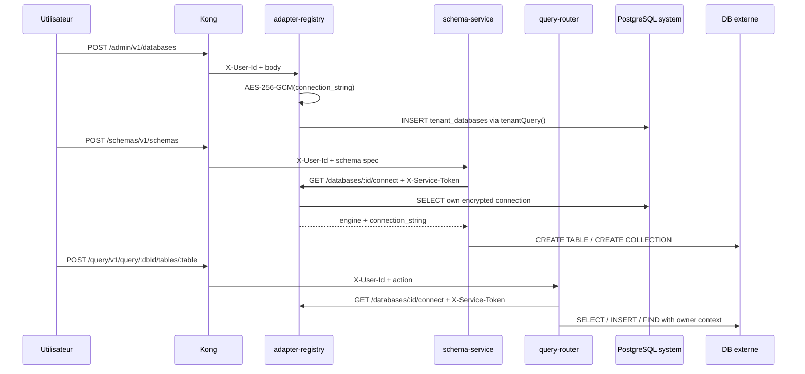
The `query-router` REST controller exposes only two families of actions: execute on a table/collection or list available tables/collections.
```ts
// apps/baas/mini-baas-infra/src/apps/query-router/src/query/query.controller.ts
@ApiTags('query')
@Controller('query')
@UseGuards(AuthGuard)
export class QueryController {
  @Post(':dbId/tables/:table')
  async execute(
    @CurrentUser() user: UserContext,
    @Param('dbId', ParseUUIDPipe) dbId: string,
    @Param('table') table: string,
    @Body() dto: ExecuteQueryDto,
  ) {
    return this.service.executeQuery(dbId, table, user.id, dto);
  }

  @Get(':dbId/tables')
  async listTables(@CurrentUser() user: UserContext, @Param('dbId', ParseUUIDPipe) dbId: string) {
    return this.service.listTables(dbId, user.id);
  }
}
```
The `query-router` never directly knows the stored connection secrets. It requests them from the registry via internal HTTP, with a service token.
```ts
// apps/baas/mini-baas-infra/src/apps/query-router/src/query/query.service.ts
private async fetchConnection(dbId: string, userId: string): Promise<AdapterResponse> {
  const url = `${this.registryUrl}/databases/${dbId}/connect`;
  const { data } = await firstValueFrom(
    this.http.get<AdapterResponse>(url, {
      headers: {
        'X-Service-Token': this.serviceToken,
        'X-Tenant-Id': userId,
      },
    }),
  );
  return data;
}
```
The registry encrypts at the time of recording, then decrypts only for authorized calls.
```ts
// apps/baas/mini-baas-infra/src/apps/adapter-registry/src/crypto/crypto.service.ts
encrypt(plaintext: string): EncryptedPayload {
  const salt = randomBytes(SALT_LENGTH);
  const key = scryptSync(this.masterKey, salt, KEY_LENGTH);
  const iv = randomBytes(IV_LENGTH);

  const cipher = createCipheriv(ALGORITHM, key, iv);
  const encrypted = Buffer.concat([cipher.update(plaintext, 'utf8'), cipher.final()]);
  const tag = cipher.getAuthTag();

  return { encrypted, iv, tag, salt };
}
```
For PostgreSQL, `query-router` validates table/column names, sets values, injects `owner_id` at the insert and sets the RLS context before executing.
```ts
// apps/baas/mini-baas-infra/src/apps/query-router/src/engines/postgresql.engine.ts
const TABLE_REGEX = /^[a-zA-Z_]\w{0,63}$/;
const COLUMN_REGEX = /^[a-zA-Z_]\w*$/;

if (opts.userId) {
  await client.query('BEGIN');
  await client.query(`SET LOCAL app.current_user_id = $1`, [opts.userId]);
}

const enriched = { ...data };
if (userId && !enriched['owner_id']) {
  enriched['owner_id'] = userId;
}
```
For MongoDB, the engine applies the proprietary filter, limits the results, and removes dangerous constructs like `$where`.
```ts
// apps/baas/mini-baas-infra/src/apps/query-router/src/engines/mongodb.engine.ts
private applyOwnerFilter(filter: Record<string, unknown>, userId?: string): Record<string, unknown> {
  if (userId) {
    filter['owner_id'] = userId;
  }
  return filter;
}

private async find(col: Collection, opts: MongoExecuteOptions): Promise<MongoQueryResult> {
  const filter = this.applyOwnerFilter(this.cloneFilter(opts.filter), opts.userId);
  delete filter['$where'];

  const limit = Math.min(opts.limit ?? 100, 100);
  let cursor = col.find(filter).skip(opts.offset ?? 0).limit(limit);
  const sort = this.buildSort(opts.sort);
  if (sort) {
    cursor = cursor.sort(sort);
  }

  const docs = await cursor.toArray();
  return {
    rows: docs.map((d) => this.normalizeDoc(d as Record<string, unknown>)),
    rowCount: docs.length,
  };
}
```
#### d. Extract 3: Osionos business action, create and modify a page

Osionos has a lighter backend, written in native Node in [bridge-api.mjs](../apps/osionos/app/scripts/bridge-api.mjs). Its role is to receive a signed assertion from Prismatica, create a short application session, then serve REST routes for the pages. This is where we see the real connection between the rich front and BaaS.

The first barrier is HMAC: Prismatica signs the payload with a shared secret, the bridge checks the timestamp, the signature and the `jti` to avoid replay.
```js
// apps/osionos/app/scripts/bridge-api.mjs
export function verifyBridgeRequest({ headers, payload, secret, now = Date.now(), replayStore = new Map() }) {
  const timestampHeader = headers['x-prismatica-bridge-timestamp'];
  const signatureHeader = headers['x-prismatica-bridge-signature'];
  const timestamp = Number(timestampHeader);
  if (!Number.isFinite(timestamp) || Math.abs(now - timestamp) > DEFAULT_TIMESTAMP_SKEW_MS) {
    throw Object.assign(new Error('Bridge assertion timestamp is outside the allowed window.'), { status: 401 });
  }

  const normalizedPayload = validateBridgePayload(payload);
  const expected = bridgeSignature(secret, String(timestampHeader), normalizedPayload);
  if (typeof signatureHeader !== 'string' || !safeCompareHex(expected, signatureHeader)) {
    throw Object.assign(new Error('Bridge signature is invalid.'), { status: 401 });
  }

  if (replayStore.has(normalizedPayload.jti)) {
    throw Object.assign(new Error('Bridge assertion replay rejected.'), { status: 409 });
  }
  replayStore.set(normalizedPayload.jti, { expiresAt: now + DEFAULT_TIMESTAMP_SKEW_MS });
  return normalizedPayload;
}
```
Then, the page routes remain REST: `GET /api/pages`, `POST /api/pages`, `PATCH /api/pages/:id`, `DELETE /api/pages/:id`. Each write goes through `requireWorkspaceAccess()` again.
```js
// apps/osionos/app/scripts/bridge-api.mjs
async function handlePageUpdate(url, request, response, config, fetchImpl) {
  const pageId = pageIdFromPath(url.pathname);
  if (!pageId) return false;
  const existing = await fetchPageRow(pageId, config, fetchImpl);
  if (!existing) throw Object.assign(new Error('Page not found.'), { status: 404 });
  await requireWorkspaceAccess(request, existing.workspace_id, 'update', config, fetchImpl);

  const payload = await readJson(request, PAGE_JSON_BODY_LIMIT_BYTES);
  const updateRow = pageUpdateRowFromPayload(payload);
  const rows = await baasRest(config, fetchImpl, `osionos_pages?id=eq.${pageId}`, {
    method: 'PATCH',
    body: updateRow,
    prefer: 'return=representation',
  });

  json(response, 200, pageRowToEntry(Array.isArray(rows) ? rows[0] : rows), config);
  return true;
}
```
### Data Access Component (DAO) Snippets

#### a. Technical choices, context and logic

In this project, I did not create a layer of frozen repositories like in a classic CRUD back-end. The need was broader: we had to talk to PostgreSQL, MongoDB, MinIO, PostgREST and dynamically recorded external databases. The DAO role is therefore carried by **data access services** and **engines**:

- `PostgresService`: admin pool + tenant pool with RLS context.
- `MongoService`: shared MongoDB client, pool, healthcheck.
- `DatabasesService`: database register and connection encryption.
- `QueryService`: orchestration between user, adapter-registry and engine.
- `PostgresqlEngine` / `MongodbEngine`: concrete execution of operations.
- `SchemasService`: creation of tables/collections from a unified schema.

This choice also explains why we did not choose Prisma as the main ORM. Prisma is excellent when the relational model is stable, known in advance and mostly PostgreSQL/MySQL. Here, part of the product relies on **user-created schemas**, **external databases registered at runtime**, **PostgreSQL + MongoDB** execution, and a strong dependence on **RLS** and SQL session variables (`SET LOCAL app.current_user_id`). A statically generated client would have been less suitable. The cost of this choice is that we lose part of the type-safe comfort of an ORM; we compensate with strict DTOs, identifier name regex, parameterized queries, SQL policies and targeted tests.

It is also necessary to be precise: the registry currently accepts the `postgresql`, `mongodb`, `mysql`, `redis`, `sqlite` engines, but the execution verified in `query-router` is implemented for **PostgreSQL** and **MongoDB**. The other engines are prepared on the model side, not yet full execution paths.

#### b. Snippet 1: owner-scoped data recovery

MongoDB document retrieval does not depend on a filter sent from the front. Even if the client sends a filter, the service adds `owner_id = userId` and removes fields that should not be controlled by the client.
```ts
// apps/baas/mini-baas-infra/src/apps/mongo-api/src/collections/collections.service.ts
async findAll(
  collectionName: string,
  userId: string,
  opts: { limit: number; offset: number; sort?: string; filter?: string },
) {
  const col = this.getCollection(collectionName);
  const query: Record<string, unknown> = { owner_id: userId };

  if (opts.filter) {
    const parsed = JSON.parse(opts.filter) as Record<string, unknown>;
    delete parsed['owner_id'];
    delete parsed['_id'];
    Object.assign(query, parsed);
  }

  let sort: Sort = { created_at: -1 };
  if (opts.sort) {
    const [field, dir] = opts.sort.split(':');
    if (field && dir) {
      sort = { [field]: dir.toLowerCase() === 'asc' ? 1 : -1 };
    }
  }

  const [data, total] = await Promise.all([
    col.find(query).sort(sort).skip(opts.offset).limit(opts.limit).toArray(),
    col.countDocuments(query),
  ]);

  return { data: data.map((d) => this.normalizeDoc(d as Record<string, unknown>)), meta: { total, limit: opts.limit, offset: opts.offset } };
}
```
#### c. Extract 2: creation of a diagram usable by several engines

`schema-service` is a good example of a backend business service: it does not just do a `CREATE TABLE`. It checks that the requested engine matches the registered base, creates the structure on the engine side, then writes a trace to `schema_registry`.
```ts
// apps/baas/mini-baas-infra/src/apps/schema-service/src/schemas/schemas.service.ts
async create(userId: string, dto: CreateSchemaDto) {
  const { engine, connection_string } = await this.fetchConnection(dto.database_id, userId);

  if (engine !== dto.engine) {
    throw new BadRequestException(
      `Engine mismatch — database is ${engine} but schema spec says ${dto.engine}`,
    );
  }

  if (engine === 'postgresql') {
    const result = await this.pgEngine.createTable(
      connection_string,
      dto.name,
      dto.columns,
      dto.enable_rls !== false,
    );

    await this.pg.adminQuery(
      `INSERT INTO schema_registry (database_id, name, engine, columns, enable_rls, created_by)
       VALUES ($1, $2, $3, $4::jsonb, $5, $6)
       ON CONFLICT (database_id, name) DO UPDATE SET columns = $4::jsonb, enable_rls = $5`,
      [dto.database_id, dto.name, engine, JSON.stringify(dto.columns), dto.enable_rls !== false, userId],
    );

    return result;
  }
}
```
The PostgreSQL part automatically adds `id`, `owner_id`, `created_at`, `updated_at`, then installs an `owner_isolation` policy if `enable_rls` is active.
```ts
// apps/baas/mini-baas-infra/src/apps/schema-service/src/engines/postgres-schema.engine.ts
const colDefs: string[] = [
  `id UUID PRIMARY KEY DEFAULT gen_random_uuid()`,
  `owner_id UUID NOT NULL`,
  `created_at TIMESTAMPTZ DEFAULT now()`,
  `updated_at TIMESTAMPTZ DEFAULT now()`,
];

await client.query(`ALTER TABLE public."${tableName}" ENABLE ROW LEVEL SECURITY`);
await client.query(
  `DO $$ BEGIN
     IF NOT EXISTS (SELECT 1 FROM pg_policies WHERE tablename = '${tableName}' AND policyname = 'owner_isolation') THEN
       CREATE POLICY owner_isolation ON public."${tableName}" FOR ALL
         USING (owner_id::text = current_user_id())
         WITH CHECK (owner_id::text = current_user_id());
     END IF;
   END $$`,
);
```
The MongoDB part creates or updates a JSON Schema validator and an index useful for owner-scoped queries.
```ts
// apps/baas/mini-baas-infra/src/apps/schema-service/src/engines/mongo-schema.engine.ts
const properties: Record<string, unknown> = {
  owner_id: { bsonType: 'string' },
  created_at: { bsonType: 'date' },
  updated_at: { bsonType: 'date' },
};

if (existing.length) {
  await db.command({ collMod: collectionName, validator, validationLevel: 'strict' });
} else {
  await db.createCollection(collectionName, { validator });
  await db.collection(collectionName).createIndex({ owner_id: 1, created_at: -1 });
}
```
#### d. Deployment preparation, orchestration and recovery

The deployment is prepared with Docker Compose and a multi-stage Dockerfile. The idea is not to build a different image by hand for each NestJS service: the same Dockerfile receives `ARG APP`, compiles only the requested application, removes development dependencies, then runs the service with a non-root user.
```dockerfile
# apps/baas/mini-baas-infra/src/Dockerfile
FROM public.ecr.aws/docker/library/node:${NODE_VERSION}-alpine AS deps
WORKDIR /app
COPY --link package.json package-lock.json ./
RUN --mount=type=cache,target=/root/.npm,sharing=locked \
  npm ci --ignore-scripts --prefer-offline --no-audit --no-fund

FROM deps AS build
ARG APP
COPY --link tsconfig.json tsconfig.build.json nest-cli.json ./
COPY --link libs/ ./libs/
COPY --link apps/${APP}/ ./apps/${APP}/
RUN npx nest build ${APP}

FROM public.ecr.aws/docker/library/node:${NODE_VERSION}-alpine AS runtime
ARG APP
ENV NODE_ENV=production APP_NAME=${APP}
RUN addgroup -S appgroup && adduser -S appuser -G appgroup
USER appuser
CMD ["sh", "-c", "node dist/apps/${APP_NAME}/apps/${APP_NAME}/src/main.js"]
```
Compose orchestrates dependencies with `depends_on`, `healthcheck`, `restart: unless-stopped`, persistent volumes, CPU/memory limits and profiles (`data-plane`, `control-plane`, `adaptor-plane`, `storage`, `observability`). Example with `query-router`: it only starts if `adapter-registry` and `permission-engine` are healthy, and it talks to other services via DNS Docker.
```yaml
# apps/baas/mini-baas-infra/docker-compose.yml
query-router:
  build:
    context: ./src
    dockerfile: Dockerfile
    args:
      APP: query-router
  environment:
    PORT: 4001
    ADAPTER_REGISTRY_URL: http://adapter-registry:3020
    PERMISSION_ENGINE_URL: http://permission-engine:3050
    QUERY_ROUTER_REDIS_URL: redis://redis:6379
    ADAPTER_REGISTRY_SERVICE_TOKEN: ${ADAPTER_REGISTRY_SERVICE_TOKEN}
  depends_on:
    adapter-registry:
      condition: service_healthy
    permission-engine:
      condition: service_healthy
    redis:
      condition: service_started
  networks:
    - mini-baas
  restart: unless-stopped
  healthcheck:
    test: ["CMD-SHELL", "wget -qO- http://localhost:4001/health/live || exit 1"]
```
The production overlay [docker-compose.prod.yml](../apps/baas/mini-baas-infra/docker-compose.prod.yml) removes the direct ports from the databases (`postgres`, `mongo`, `gotrue`, `postgrest`, `redis`) and keeps access via the planned services. This limits the exposure area: in production, the base is not supposed to be called directly from the outside.
```yaml
# apps/baas/mini-baas-infra/docker-compose.prod.yml
postgres:
  ports: []
  deploy:
    resources:
      limits:
        memory: 512m
        cpus: '0.50'
    restart_policy:
      condition: on-failure
      delay: 5s
      max_attempts: 3

mongo:
  ports: []
```
If an application server goes down, Compose can restart it using healthchecks and `restart` policies. If `mongo-api` falls, the documents do not disappear: they are in the `mongo-data` volume. If `query-router` crashes, it loses its memory caches, but the data remains in PostgreSQL, MongoDB or the external database. If `postgres` restarts, the `postgres-data` volume retains the data. If `realtime-agnostic` restarts, the next changes start from the base; the basis remains the source of truth.

However, we have to be honest: this Compose configuration is robust for a local environment, demo or a small deployment, but it is not yet multi-node high availability. There is no automatic multi-replica PostgreSQL failover in this file. For critical production, a planned backup strategy, external storage, replicas, alerting supervision and tested restoration procedures should be added.

Backup/restore scripts already exist for PostgreSQL and MongoDB. They show the operational direction: `pg_dump` in custom format for PostgreSQL, `mongodump` in archive for MongoDB, then explicit restoration.
```bash
# apps/baas/mini-baas-infra/docker/services/postgres/tools/backup.sh
BACKUP_FILE="backup_$(date +%Y%m%d).dump"
docker compose exec postgres pg_dump -U postgres -Fc > "${BACKUP_FILE}"

# apps/baas/mini-baas-infra/docker/services/postgres/tools/restore.sh
docker compose exec -T postgres pg_restore -U postgres -d postgres < "${BACKUP_FILE}"

# apps/baas/mini-baas-infra/docker/services/mongo/tools/backup.sh
BACKUP_FILE="mongo_backup_$(date +%Y%m%d).archive"
docker compose exec mongo mongodump --archive > "${BACKUP_FILE}"
```
The secrets are not integrated into the images. The `control-plane` profile contains Vault, and the environment scripts retrieve or generate the necessary values ​​without writing them in plaintext in the source code. The script [ensure-osionos-runtime-secrets.mjs](../apps/baas/scripts/ensure-osionos-runtime-secrets.mjs) for example generates the secrets of the Osionos bridge locally, while [vault-env.mjs](../apps/baas/scripts/vault-env.mjs) centralizes the variable families expected for the services.

In summary, the back-end was designed as a platform: REST on the front, specialized services behind Kong, persistent databases, RLS and ownership as close as possible to the data, encrypted secrets, reproducible deployment, and an assumed limit between what is already robust in Compose and what would require a complete high availability architecture.

## CHAPTER 5. Application security elements

Security is probably the part of the project where I learned the most to say “I don’t know, we’ll check”. Code that works is easy — secure code is verified.

The security architecture is based on two central services: **GoTrue** (authentication, bcrypt hashing, emission of JWTs) and **Kong** (API gateway, verification of JWTs, CORS control, injection of claims into internal headers). The planned public flow goes through WAF then Kong; in development, certain local ports voluntarily remain exposed for debugging, and the production overlay removes direct access to the databases. This chapter details how these two services come together with the application layers.

### Authentication and role management

**The authentication service — GoTrue**

We did not rewrite our own auth server. We chose **GoTrue v2.188.1**, the open-source service that Supabase uses in production. The logic: an auth service is something where a subtle error is costly (timing attacks, stolen sessions, etc.), so you might as well take a battle-tested project rather than being smart.

Configuration in [docker-compose.yml:199-240](../apps/baas/mini-baas-infra/docker-compose.yml#L199-L240):
- JWT signed in **HS256** (symmetric key shared between GoTrue and Kong)
- Expiry of **3600 seconds** (1 hour) for access tokens
- The `JWT_SECRET` is provided to GoTrue by the runtime environment, generated or retrieved via the Vault/Makefile workflow — not in the clear in the code, not committed. The script that describes these variable families is [vault-env.mjs](../apps/baas/scripts/vault-env.mjs).

**Password hashing — bcrypt**

GoTrue uses **bcrypt** by default to hash passwords before inserting them into `auth.users`. It is the industry standard, resistant to brute force thanks to the adaptive cost factor. We didn't touch that — this is exactly why we took GoTrue rather than coding our own `hashPassword()` with a poorly configured `crypto.pbkdf2()`.

**The login flow**

Concretely, when a user connects:

1. React front sends `email` + `password` to `/api/auth/login` ([useAuth.ts:221-226](../apps/opposite-osiris/src/hooks/useAuth.ts#L221-L226))
2. The intermediate gateway (`auth-gateway.mjs`) validates the fields, then calls the BaaS SDK ([auth-gateway.mjs:859-886](../apps/opposite-osiris/scripts/auth-gateway.mjs#L859-L886))
3. The SDK does a POST to GoTrue: `/auth/v1/token?grant_type=password` ([sdk/src/domains/auth.ts:41-50](../apps/baas/sdk/src/domains/auth.ts#L41-L50))
4. GoTrue checks the bcrypt, signs a JWT, returns `access_token` + `refresh_token`
5. The `refresh_token` is stored in cookie **HttpOnly + Secure + SameSite=Lax** ([auth-gateway.mjs:141-147](../apps/opposite-osiris/scripts/auth-gateway.mjs#L141-L147)) — this is important to resist theft by XSS

**Checking JWT — Kong in the middle**

Rather than each microservice verifying the JWT, it is **Kong** (the API gateway) which does it once and for all:
```yaml
# apps/baas/mini-baas-infra/docker/services/kong/conf/kong.yml:15-24
consumers:
  - username: authenticated
    jwt_secrets:
      - algorithm: HS256
        key: track-binocle-iss
        secret: ${JWT_SECRET}
```
Kong intercepts the request, validates the signature, checks `exp`, then **decodes the claims and re-injects them as headers** to the microservices ([kong.yml:69-101](../apps/baas/mini-baas-infra/docker/services/kong/conf/kong.yml#L69-L101)):
- `X-User-Id` ← claim `sub`
- `X-User-Email` ← claim `email`
- `X-User-Role` ← claim `role`

The microservices trust these headers in the normal flow because they are behind Kong on the Docker network. Concretely: an attacker cannot send `X-User-Id: 1` directly to `mongo-api` from the host, because this port is not mapped. For services and bases that expose a local port in development, the production overlay reduces this area and access control must remain carried by Kong, the guards and the base.

**Role management — RBAC + ABAC**

The permissions system goes further than a simple RBAC. We have an **ABAC** (Attribute-Based Access Control) which is superimposed on the roles.

**Roles** are defined in base in [007_permissions_system.sql:71-77](../apps/baas/mini-baas-infra/scripts/migrations/postgresql/007_permissions_system.sql#L71-L77):
- `admin` — complete platform
- `user` — standard user (CRUD only on what it has)
- `guest` — read-only
- `moderator` — content moderation
- `service_role` — internal service-to-service identity

**NestJS side**, we have a `RolesGuard` which is applied after the `AuthGuard`. Actual code ([roles.guard.ts:35-60](../apps/baas/mini-baas-infra/src/libs/common/src/guards/roles.guard.ts#L35-L60)):
```ts
@Injectable()
export class RolesGuard implements CanActivate {
  constructor(private readonly reflector: Reflector) {}

  canActivate(context: ExecutionContext): boolean {
    const requiredRoles = this.reflector.getAllAndOverride<string[]>(ROLES_KEY, [
      context.getHandler(),
      context.getClass(),
    ]);
    if (!requiredRoles?.length) return true;

    const req = context.switchToHttp().getRequest<Request>();
    const userRole = req.user?.role;

    if (!userRole || !requiredRoles.includes(userRole)) {
      throw new ForbiddenException(
        `Insufficient permissions — requires one of: ${requiredRoles.join(', ')}`,
      );
    }
    return true;
  }
}
```
Concrete usage ([permissions.controller.ts:39-66](../apps/baas/mini-baas-infra/src/apps/permission-engine/src/permissions/permissions.controller.ts#L39-L66)):
```ts
@Delete('roles/:userId/:roleName')
@UseGuards(RolesGuard)
@Roles('admin', 'service_role')
async revoke(...) { ... }
```
**The ABAC part — evaluation by attribute, not by raw role**

This is where it becomes interesting to explain. A classic RBAC says "you are `member`, you can `can_edit`". An ABAC says "for *this* *specific* resource, depending on *who* you are and *which attributes* apply, you have *such* permission level". The difference is that we can give `can_view` to a specific user on a page, even if their workspace role would normally give them `can_edit`.

**The access rule** is stored in the MongoDB `AccessRule` model ([accessRule.model.ts](../apps/osionos/app/src/shared/notion-database-sys/packages/core/src/models/accessRule.model.ts)). Each rule has a `target` which can be:
```ts
// target.type = 'user'     → règle sur une personne précise
// target.type = 'role'     → règle sur un rôle workspace
// target.type = 'workspace' → règle par défaut pour tout le workspace
// target.type = 'public'   → accès non-authentifié
target: {
  type: 'user' | 'role' | 'workspace' | 'public',
  userId?: ObjectId,   // si type = 'user'
  role?:   string,     // si type = 'role'
}
```
And the `explicit: boolean` flag which determines whether the rule **overrides** (true) or **inherits** (false) from more general rules.

**The resolution cascade** in [`engine.ts:86-134`](../apps/osionos/app/src/shared/notion-database-sys/packages/core/src/abac/engine.ts#L86-L134):
```ts
// Toutes les règles applicables : workspace global → page spécifique
const rules = await AccessRuleModel.find({
  workspaceId,
  $and: [
    { $or: [
      { resourceId: null, resourceType: 'workspace' }, // défaut workspace
      { resourceId },                                   // règle sur cette ressource
    ]},
    { $or: [
      { 'target.type': 'workspace' },                  // règle globale
      { 'target.type': 'role',   'target.role': member.role }, // par rôle
      { 'target.type': 'user',   'target.userId': userId },    // par user précis
      { 'target.type': 'public' },
    ]},
  ],
}).sort({ resourceType: 1 }) // workspace < page < database < block
```
Then in [`resolver.ts:45-63`](../apps/osionos/app/src/shared/notion-database-sys/packages/core/src/abac/resolver.ts#L45-L63), the conflict resolution:
```ts
export function resolvePermission(
  rules: Array<{ permission: PermissionLevel; explicit: boolean }>,
): PermissionLevel {
  let effective: PermissionLevel = 'no_access';
  for (const rule of rules) {
    if (rule.explicit) {
      effective = rule.permission;       // explicite → écrase tout
    } else {
      effective = maxPermission(effective, rule.permission); // hérité → prend le plus haut
    }
  }
  return effective;
}
```
**Concrete example:** a workspace gives `can_edit` to `member` (inherited rule, resourceType: `workspace`). We can then set a rule `explicit: true, can_view, target: {type: 'user', userId: X}` on a specific page. Result: this user X, even if he is `member`, sees the page in read-only mode. That's the attribute — the identity and target resource determine the right, not the role alone.

**JSONB conditions on the SQL side** add a third level of attribute: the policy can contain `{"owner_only": true}`, which means that the rule only applies if the user owns the resource. Seed in migration ([007_permissions_system.sql:234-258](../apps/baas/mini-baas-infra/scripts/migrations/postgresql/007_permissions_system.sql#L234-L258)):
```sql
-- Role 'user' : CRUD complet, mais seulement sur ses propres ressources
INSERT INTO public.resource_policies
  (role_id, resource_type, resource_name, actions, conditions, effect, priority)
SELECT r.id, '*', '*', ARRAY['select','insert','update','delete'],
  '{"owner_only": true}'::jsonb,   -- attribut : propriétaire uniquement
  'allow', 0
FROM public.roles r WHERE r.name = 'user';

-- Role 'admin' : même CRUD, sans restriction de propriété
INSERT INTO public.resource_policies (...)
SELECT r.id, '*', '*', ARRAY['select','insert','update','delete'],
  '{}'::jsonb,                      -- pas de condition = accès universel
  'allow', 100                      -- priorité 100 > 0 → gagne sur user
FROM public.roles r WHERE r.name = 'admin';
```
The SQL function `has_permission()` ([007_permissions_system.sql:192-222](../apps/baas/mini-baas-infra/scripts/migrations/postgresql/007_permissions_system.sql#L192-L222)) evaluates them with **deny-first**: an `effect = 'deny'` with equal priority always wins over an `allow`.

**Row Level Security (RLS)** is enabled on `roles`, `user_roles` and `resource_policies`. Even if an SQL query passes with a standard user identity, PostgreSQL filters at the engine level — double curtain behind the application.

**Front side**: the `AbacEngine.check()` does a `cache-first` with TTL 5 minutes ([engine.ts:30-40](../apps/osionos/app/src/shared/notion-database-sys/packages/core/src/abac/engine.ts#L30-L40)) — no need for a request on each render. When the rules change, `invalidate(resourceId)` purges the cache. The front only **hides or shows** elements — the final access decision is always server-side.

### Input validation and injection protection

**The principle:** we never trust the data that comes in. Even if it's our own frontend that sends them.

**Zod Schemas** — wherever possible, use `zod` to validate payloads. Example on account routes ([account.routes.ts:33-55](../apps/osionos/app/src/shared/notion-database-sys/packages/api/src/routes/settings/account.routes.ts#L33-L55)):
```ts
const passwordSchema = z.string().min(8);
const emailCreateSchema = z.object({
  email: z.string().regex(/^[^\s@]+@[^\s@]+\.[^\s@]+$/),
});
const twoFactorVerifySchema = z.object({
  token: z.string().regex(/^\d{6}$/),
});
```
And the helper that applies them uniformly, in [helpers.ts:70-81](../apps/osionos/app/src/shared/notion-database-sys/packages/api/src/routes/settings/helpers.ts#L70-L81):
```ts
export function parseBody<TSchema extends ZodType>(
  schema: TSchema, body: unknown, reply: FastifyReply,
): z.infer<TSchema> | undefined {
  const parsed = schema.safeParse(body ?? {});
  if (!parsed.success) {
    sendError(reply, 400, 'VALIDATION_FAILED', 'Invalid request body', parsed.error.issues);
    return undefined;
  }
  return parsed.data;
}
```
If a field is missing or incorrectly typed, we return a `400 VALIDATION_FAILED` with the details — the query **never** reaches the business layer.

**NestJS side** — same but with `class-validator`. We have a global validation pipeline with a strict config ([validation.pipe.ts:20-37](../apps/baas/mini-baas-infra/src/libs/common/src/pipes/validation.pipe.ts#L20-L37)):
- `whitelist: true` — any property not declared in the DTO is **removed**
- `forbidNonWhitelisted: true` — even worse, it returns a 400 if there are too many fields
- `transform: true` — self-coercion of types (a `"42"` becomes a `42` if the DTO requests it)

Which means that we cannot inject an `isAdmin: true` field and hope that it passes over the DTO. It is cleaned before even reaching the controller.

**Protection against SQL/NoSQL injections**

We mainly use **MongoDB** (via Mongoose and the native driver), so no SQL string concat to worry about. But NoSQL injection also exists. The `query-router` filters dangerous operators before executing ([mongodb.engine.ts:35-72](../apps/baas/mini-baas-infra/src/apps/query-router/src/engines/mongodb.engine.ts#L35-L72)):
```ts
if (!/^[\w-]{1,64}$/.test(collectionName)) throw new Error('Invalid collection name');
delete filter['$where']; // $where permet d'évaluer du JS — supprimé
```
And in the collections layer, we explicitly strip the sensitive fields before inserting ([collections.service.ts:24-63](../apps/baas/mini-baas-infra/src/apps/mongo-api/src/collections/collections.service.ts#L24-L63)):
```ts
const { _id: _, owner_id: __, ...clean } = data;
// on ne laisse jamais le client écrire _id ou owner_id directement
```
**For PostgreSQL queries** (GoTrue and permissions side), everything goes through parameterized queries — this is the default pattern of `pg` and PostgREST. No concatenation of strings.

On rate limiting: Kong applies it on critical public routes ([kong.yml:118-123](../apps/baas/mini-baas-infra/docker/services/kong/conf/kong.yml#L118-L123)) — `/auth/v1` is limited to 300 req/min per IP, `/rest/v1` to 180/min. This isn't fine application throttling, but it covers basic brute force.

### Front-end and API protections

**CORS — origin control**

CORS is configured at **Kong** level, not in each microservice (another advantage of the centralized gateway). Config in [kong.track-binocle.yml:24-35](../apps/baas/config/kong.track-binocle.yml#L24-L35):
```yaml
- name: cors
  config:
    origins:
      - __KONG_CORS_ORIGIN_APP__
      - __KONG_CORS_ORIGIN_PLAYGROUND__
      - __KONG_CORS_ORIGIN_STUDIO__
    methods: [GET, POST, PUT, PATCH, DELETE, OPTIONS]
    credentials: true
    max_age: 3600
```
The origins are **placeholders templated at startup** from the environment variables — so in dev we have `https://localhost:5173`, in prod this would be the real domain. No `*` in production.

**How we defend sensitive roads**

**Back-end** side: each protected controller pastes a `@UseGuards(AuthGuard)` (and `RolesGuard` if role required). The `AuthGuard` ([auth.guard.ts](../apps/baas/mini-baas-infra/src/libs/common/src/guards/auth.guard.ts)) reads `X-User-Id` injected by Kong and hydrates `req.user`. If the header is absent → 401. If Kong did not validate the JWT, he would not have added this header → it is a controlled chain of trust.

**Front-end** side: we use the Zustand store (`useUserStore`) which hydrates from the server to the `App` mount ([App.tsx:1-68](../apps/osionos/app/src/app/App.tsx)). Protected routes check the status before rendering the content, otherwise redirect to the login.

**Where we store the tokens — complete honesty**

Regarding the storage of tokens, it's not perfect:

- The **refresh token** is in **cookie HttpOnly + Secure + SameSite=Lax** ([auth-gateway.mjs:141-147](../apps/opposite-osiris/scripts/auth-gateway.mjs#L141-L147)). That's good: an XSS script can't read it, and it's only sent to the originating domain.
- The **access token** is manipulated on the client side to sign API requests using `Authorization: Bearer <jwt>` ([client.ts:68](../apps/osionos/app/src/shared/api/client.ts#L68)). In practice, we keep this in mind in the Zustand blind. What is **stored in localStorage** is context metadata (workspaces, active accounts) — not the JWT itself: see [useUserStore.ts:39-41](../apps/osionos/app/src/features/auth/model/useUserStore.ts#L39-L41).

The compromise: a short access token (1 hour) limits the risk window, and the refresh token in HttpOnly blocks the theft by XSS of the part that really matters (the ability to renew the session). This is a classic trade-off in the SPA ecosystem — there are stricter architectures (BFF with session cookie), but it is reasonable for the scope of the project.

### Protections against XSS and CSRF

**XSS — Cross-Site Scripting**

React, by default, **automatically escapes** everything rendered in JSX (`{userInput}`). It's the first line of defense, and it's free.

But we have a rich block editor that renders Markdown — so we generate HTML from user input. There, React can no longer do the job alone. We wrote our own engine `markengine` which does the escaping itself ([renderCore.ts:92-103](../apps/osionos/app/src/shared/lib/markengine/renderCore.ts#L92-L103)):
```ts
const HTML_ESCAPE_PATTERN = /[&<>"']/g;
const HTML_ESCAPE_MAP: Record<string, string> = {
  "&": "&amp;", "<": "&lt;", ">": "&gt;", '"': "&quot;", "'": "&#39;",
};
export function escapeHtml(value: string): string {
  return value.replaceAll(HTML_ESCAPE_PATTERN, (char) => HTML_ESCAPE_MAP[char]);
}
```
And — perhaps more importantly — we have a `sanitizeUrl()` which rejects dangerous schemes ([renderCore.ts:109-123](../apps/osionos/app/src/shared/lib/markengine/renderCore.ts#L109-L123)):
```ts
export function sanitizeUrl(value: string): string {
  const normalized = stripUrlControlAndSpaceChars(trimmed);
  const schemeMatch = /^([a-z][a-z\d+.-]*):/i.exec(normalized);
  if (!schemeMatch) return trimmed;
  const scheme = schemeMatch[1].toLowerCase();
  if (scheme === "http" || scheme === "https" || scheme === "mailto" || scheme === "tel") {
    return trimmed;
  }
  return ""; // tout le reste (javascript:, data:, etc.) est blanchi
}
```
We even have a test that checks that `[bad](javascript:alert(1))` transforms into `href="#"` without ever letting the `javascript:` ([markengine.test.js:85-90](../apps/osionos/app/src/shared/lib/markengine/tests/markengine.test.js#L85-L90)) pass through. This protects us against the most famous XSS payload on Markdown editors.

**Honest about the shortcomings:** we have **not** defined a `Content-Security-Policy` header on the Kong/BaaS side. The Astro site has a CSP declared in its layout, but the BaaS gateway does not yet impose it globally. This is in-depth protection to be added after auditing external origins (CDN of fonts, API endpoints, assets) to write a CSP that does not break production.

**CSRF — Cross-Site Request Forgery**

This is the part where the archi protects a little "naturally":

- All sensitive API requests use `Authorization: Bearer <jwt>` — a **custom** header that is never sent automatically by the browser. So a cross-origin CSRF request cannot include the token. This neutralizes the classic CSRF vector.
- The only cookie we use (the refresh token) is **`SameSite=Lax`**, which means that it is not sent on cross-origin POST requests (and only on top-level GET navigations).
- Strict CORS (whitelisted origins) adds an extra layer: even if someone tried, pre-flight CORS would block.

We did not implement explicit **CSRF tokens** (synchronize-token / double-submit-cookie style) because Bearer + SameSite auth already covers the need. This is the standard compromise of modern SPAs.

### GDPR compliance

Many projects say “we are GDPR-compliant” without being able to demonstrate it. Here's what is **really** implemented.

**A dedicated GDPR service** in BaaS: [`apps/baas/mini-baas-infra/src/apps/gdpr-service/`](../apps/baas/mini-baas-infra/src/apps/gdpr-service/). It exposes three families of endpoints which correspond to the main GDPR rights.

**Right to portability (Article 20)** — complete export of data:
- `GET /export` in [export.controller.ts:26-30](../apps/baas/mini-baas-infra/src/apps/gdpr-service/src/export/export.controller.ts) returns a structured dump (JSON) of all data associated with the user.

**Right to erasure (Article 17, "right to be forgotten")** — account deletion with **30-day grace period**:
- `POST /account/request-deletion` ([account.routes.ts](../apps/osionos/app/src/shared/notion-database-sys/packages/api/src/routes/settings/account.routes.ts)) marks `pendingDeletionAt = now + 30 days`. User can cancel for 30 days via `DELETE /account/request-deletion`. After this time, a job actually purges the data.
- This is important: immediate deletion is good for compliance, but it generates regrets and support tickets. 30 days is a standard at Google/GitHub too.

**Consent management (Articles 6-7)** — granular opt-in for non-essential processing:
- `/consents` endpoints in [consent.controller.ts](../apps/baas/mini-baas-infra/src/apps/gdpr-service/src/consent/consent.controller.ts) allow the user to accept/refuse separately:
  - Analytics cookies (by default **disabled**)
  - Personalization cookies (by default **disabled**)
  - Essential cookies (always active, justified by technical necessity)
- The corresponding UI is in `CookieSettingsModal` of [`SettingsCenter.tsx`](../apps/osionos/app/src/features/settings/SettingsCenter.tsx).

**Limitation of processing & privacy settings:**
- Toggle “discoverable profile” — a user can be invisible in the search
- Toggle “view history” — deactivation of reading tracking

**Honest about what's missing:**
- We do not have an intrusive cookie banner on first load. Preferences are changed in Settings. For real production, an explicit consent banner would probably be required at the first visit (depending on the jurisdiction).
- We have not formalized a textual “Privacy Policy” or “Cookie Notice” — we have the mechanisms, not yet the legal documents that accompany them.


---

**Review of the chapter:** we have solid auth (GoTrue + bcrypt + short JWT + refresh HttpOnly), two-level authorization (RBAC via guards + ABAC via SQL with deny-first), strict validation on the API side (Zod + class-validator with `whitelist`), active XSS protection in the Markdown engine, and real GDPR mechanisms (export, 30-day deletion, granular consent). What remains to be done: global CSP on the BaaS/Kong side and cookie banner on first load.

## CHAPTER 6. Technological monitoring and security

Web security is not a fixed state — it’s a flow. New vulnerabilities come out every week. Some affect libraries that we use directly. Others give patterns that we would reproduce without knowing it if we didn't read them. This chapter documents how we kept ourselves informed and what we actually learned from it for the project.

### Monitoring sources used

**Newsletters and specialized blogs**

The sources that really do the hard work:

- **[PortSwigger Web Security Research](https://portswigger.net/research)** — the team behind Burp Suite publishes web vulnerability scans. This is where I understood JWT algorithm confusion attacks (HS256 vs RS256), prototype pollution, SSRF. The content is technical, verified, with PoCs.
- **[Scott Helme](https://scotthelme.co.uk)** — CSP, HSTS, security headers specialist. Its site `securityheaders.com` allows you to test any domain. He was the one who pushed me the most to understand why the lack of CSP is a real problem and not just a box to check.
- **[Troy Hunt](https://www.troyhunt.com)** and [Have I Been Pwned](https://haveibeenpwned.com) — monitors credential leaks and hashing practices. Very useful to understand why bcrypt (and not SHA1, not MD5) is non-negotiable.
- **[Hacker News](https://news.ycombinator.com)** — not just security, but major incidents occur within a few hours. This is often where I saw the first discussions about npm/pnpm supply chain attacks, compromised GitHub Actions, etc.

**Social networks and communities**

- **Reddit** (`r/netsec`, `r/cybersecurity`) — technical discussions, post-incident feedback, CVE analyzes
- **X (Twitter)** — security researchers (PortSwigger team, people like `@_JohnHammond`, `@NahamSec`, etc.) post very quickly when something comes out. It's noisy, but useful for responsiveness
- **LinkedIn** — corporate incidents quickly surface in the feeds of security professionals

**Podcasts**

Some episodes listened to during switching or debugging:
- **Darknet Diaries** — real cases of security incidents told in detail. Narrative format, but technically sound.
- Some episodes of **Security Now** (Steve Gibson) for TLS/crypto foundations

**Official sources**

- **[CISA KEV Catalog](https://www.cisa.gov/known-exploited-vulnerabilities-catalog)** — list of actively exploited vulnerabilities, updated regularly
- **[NIST NVD](https://nvd.nist.gov)** — CVE database with CVSS scoring
- **[OWASP](https://owasp.org)** — Top 10, cheat sheets (CSRF, SQL injection, Access Control) used as a basic reference throughout the project

### Vulnerabilities identified in the ecosystem

These incidents were read in real time via the sources above and directly influenced technical decisions on the project.

**Supply chain npm — Shai-Hulud and the TanStack attack**

Recent npm supply chain attacks are a reminder that risk comes not only from the code we write, but also from the packages and build scripts we execute. This project uses in particular `@tanstack/react-virtual`, `vite`, `astro`, `playwright` and several heavy front dependencies: a frozen lockfile, installs without scripts when possible, and reviewable update PRs are therefore concrete protections, not comfort.

**GitHub Actions — stealing secrets via `pull_request_target`**

The "pwn request" pattern: an external PR triggers a `pull_request_target` workflow which has access to the secrets of the repo. The attacker exfiltrates via network calls in the logs. Documented by the GitHub Security Lab ([Preventing pwn requests](https://securitylab.github.com/resources/github-actions-preventing-pwn-requests/)) with real cases. It is this type of incident that reinforced the choice to keep application secrets outside of GitHub Actions when possible: the colleague workflow authenticates to Vault via OIDC, writes a temporary `.vault/track-binocle-reader.env` file, then `make all` retrieves the necessary `.env` without storing a static Vault token in the GitHub secrets.

**Claude Code — leak via `.map` npm file (2026)**

In March 2026, Anthropic accidentally released a 59.8 MB source map file (`.js.map`) in the `@anthropic-ai/claude-code` v2.1.88 package. The file, intended for internal debugging, exposed ~512,000 lines of TypeScript. Cause: The Bun build tool generates source maps by default, and `.map` was not in `.npmignore`. ([InfoQ](https://www.infoq.com/news/2026/04/claude-code-source-leak/), [Layer5 blog](https://layer5.io/blog/engineering/the-claude-code-source-leak-512000-lines-a-missing-npmignore-and-the-fastest-growing-repo-in-github-history/))

This was not a token leak — no sensitive user data was exposed. But it illustrates a classic vector: a build artifact that should not be public ends up in an npm package. On this project, [vite.config.ts](../apps/osionos/app/vite.config.ts) does not explicitly enable production source maps (`build.sourcemap` is absent, and Vite keeps them disabled by default in prod build).

**JWT algorithm confusion**

The family of attacks where we change the algorithm of a JWT from `RS256` to `HS256` and sign with the public key as the HMAC key. Documented in detail by PortSwigger ([algorithm-confusion](https://portswigger.net/web-security/jwt/algorithm-confusion)). We are not exposed since we use HS256 with a symmetric secret only, but understanding this vector confirmed that we should not leave the choice of the algorithm to the client side. In the Kong config, the algorithm is **forced to HS256** ([kong.yml:21](../apps/baas/mini-baas-infra/docker/services/kong/conf/kong.yml#L21)) — no negotiation.

**ReDoS via regex in validators**

Zod and other validation libraries have had issues with catastrophic regular expressions on malformed inputs ([OWASP ReDoS](https://owasp.org/www-community/attacks/ReDoS)). We have regex in Zod schemas ([account.routes.ts:45](../apps/osionos/app/src/shared/notion-database-sys/packages/api/src/routes/settings/account.routes.ts#L45)) — nothing complex, but it's a pattern to watch out for.

### Potential flaws and corrections to be made

What was identified on the project as security debt, in order of priority:

**Critical**

- **Rate limiting Kong** — configured on critical public routes via the `rate-limiting` plugin ([kong.yml:118-123](../apps/baas/mini-baas-infra/docker/services/kong/conf/kong.yml#L118-L123)): 300 req/min on `/auth/v1`, 180 on `/rest/v1`, 120 on WebSocket realtime. This is rate limiting per IP, which covers brute force. What is not covered: distributed multi-IP attacks (no rate limiting per user account, no CAPTCHA type progressive blocking after N failures).

**Important**

- **Content-Security-Policy absent on the Kong/BaaS side** — the Astro site defines a CSP, but the BaaS gateway does not yet set a global CSP header. An XSS that passes over an uncovered application surface could therefore benefit from insufficient defense in depth. Correction: define a strict CSP via Kong (`response-transformer` plugin) after auditing script/font origins.
- **No explicit cookie banner** — consent preferences exist in the Settings but there is no opt-in mechanism on first load. Required in some GDPR jurisdictions.

**To watch**

- **npm dependencies** — the CI checks frozen installs (`npm ci --ignore-scripts`, `pnpm install --frozen-lockfile`) and the repo contains Dependabot + Renovate, but it is still missing a blocking SCA gate like `npm audit --audit-level=high` or equivalent. On a project with this density of packages, this is a passive risk.
- **MFA not implemented** — TOTP endpoint returns `501 Not Implemented` ([auth-gateway.mjs:1076](../apps/opposite-osiris/scripts/auth-gateway.mjs#L1076)). For admin accounts, the absence of a second factor is an exposure.
- **Long-lived OAuth tokens** — Google Calendar/Gmail tokens have a long lifespan and are stored server-side. A storage compromise would expose them.

### Conclusion

Doing security monitoring means above all accepting that we code in an environment that changes quickly. The tools we use (npm, GoTrue, Kong, GitHub Actions) have all had documented incidents. Reading these incidents regularly helps us anticipate rather than react.

On this project, the monitoring had a concrete impact: the choice of Vault for secrets, the forcing of the JWT algorithm on the Kong side, and the deletion of `$where` in the MongoDB query-router are all decisions that come from patterns read in real vulnerability reports — not just generic best practices.
## CHAPTER 7. Conclusion

Before closing this file, I want to take a moment to thank the people who were important in this project, and more broadly in this year at 42. What we have built here is not just code. It's hours of debugging at 2 a.m., arch choices that we turned around in all directions, moments where we really didn't know if it was the right direction. And yet we have moved forward.

What this project taught me personally, beyond technology:

- the **design of distributed architectures**: assembling specialized services (Kong, GoTrue, PostgREST, NestJS, `realtime-agnostic`, Trino) so that it holds together, that it is coherent, secure and maintainable — it's a way of thinking that I didn't have at all before this project;
- **leadership**: managing four people, coordinating roles, arbitrating priorities when everyone is not available at the same time — it's much more complicated than writing code, and it's undoubtedly what trained me the most;
- **software quality**: I learned a lot about data modeling, about web security, and about what it really means to build something that lasts over time and not just something that runs.

A special thank you to Vadim, who never gave up. This project is hard. There are weeks when we don't see where we're going. Vadim was there with a consistency and rigor that really counted, and I am sincerely proud of what we built together.

Last thing, and I want to be honest about this: on the day of the exam, the project may still be under construction. We don't know if we will have released the MVP that we initially imagined. But what I know is that this path was worth it. It doesn't matter what the demo shows that day.

## Title of resources + references

| Category | Resource | What we learn there |
|---|---|---|
| **Web Standards** | [MDN Web Docs](https://developer.mozilla.org) | Reference on HTML, CSS, JS, Web APIs — used daily |
| **Web Standards** | [WebAssembly.org](https://webassembly.org/docs/use-cases/) | Use cases and spec WASM |
| **Web Standards** | [JSON Schema Specification](https://json-schema.org/specification) | JSON Schema Validation |
| **Web Standards** | [W3C ARIA Patterns – Dialog](https://www.w3.org/WAI/ARIA/apg/patterns/dialog-modal/) | Accessibility of modals |
| **Web Standards** | [WCAG 2.1 Quick Reference](https://www.w3.org/WAI/WCAG21/quickref/) | Web accessibility criteria |
| **Protocols & RFCs** | [RFC 6455 – WebSocket](https://datatracker.ietf.org/doc/html/rfc6455) | Official WebSocket protocol spec |
| **Protocols & RFCs** | [RFC 6749 – OAuth 2.0](https://datatracker.ietf.org/doc/html/rfc6749) | Official OAuth 2.0 spec |
| **Protocols & RFCs** | [RFC 8725 – JWT Best Practices](https://datatracker.ietf.org/doc/html/rfc8725) | JWT Best Practices |
| **Protocols & RFCs** | [OAuth.net](https://oauth.net/2/) | OAuth 2.0 Resources and Explanations |
| **Security** | [OWASP Top 10](https://owasp.org/Top10/) | The 10 most critical web vulnerabilities |
| **Security** | [OWASP – CSRF Prevention](https://cheatsheetseries.owasp.org/cheatsheets/Cross-Site_Request_Forgery_Prevention_Cheat_Sheet.html) | CSRF Attack Prevention |
| **Security** | [OWASP – SQL Injection](https://cheatsheetseries.owasp.org/cheatsheets/SQL_Injection_Prevention_Cheat_Sheet.html) | SQL injection prevention |
| **Security** | [OWASP – Access Control](https://cheatsheetseries.owasp.org/cheatsheets/Access_Control_Cheat_Sheet.html) | Access control and authorization |
| **Security** | [NIST NVD](https://nvd.nist.gov) | Database of known vulnerabilities |
| **Security** | [CISA KEV Catalog](https://www.cisa.gov/known-exploited-vulnerabilities-catalog) | Actively exploited vulnerabilities |
| **Security** | [CIS Benchmarks](https://www.cisecurity.org/cis-benchmarks) | System Hardening Repositories |
| **Security** | [NIST SP 800-162](https://csrc.nist.gov/publications/detail/sp/800-162/final) | ABAC Guide – attribute-based access control |
| **Security** | [JWT Handbook – Auth0](https://auth0.com/resources/ebooks/jwt-handbook) | Complete operation of JWTs |
| **Security** | [Firefox NSS Docs](https://firefox-source-docs.mozilla.org/security/nss/index.html) | Mozilla NSS crypto library |
| **Vault / Secrets** | [HashiCorp Vault Docs](https://developer.hashicorp.com/vault/docs) | Official Vault documentation |
| **Docker & Infra** | [Docker Docs](https://docs.docker.com/) | Official Docker documentation |
| **Docker & Infra** | [Docker Compose](https://docs.docker.com/compose/) | Multi-container orchestration |
| **Docker & Infra** | [Dockerfile Best Practices](https://docs.docker.com/develop/develop-images/dockerfile_best-practices/) | Write optimized images |
| **Docker & Infra** | [Docker Security](https://docs.docker.com/develop/security-best-practices/) | Secure your containers |
| **Docker & Infra** | [Docker Hub](https://hub.docker.com/) | Official Image Registry |
| **Kong API Gateway** | [Kong JWT Plugin](https://docs.konghq.com/gateway/latest/kong-plugins/authentication/jwt/) | Auth JWT in Kong Gateway |
| **Backend / NestJS** | [NestJS Docs](https://docs.nestjs.com/) | Official NestJS documentation |
| **Backend / NestJS** | [NestJS Testing](https://docs.nestjs.com/fundamentals/testing) | Unit testing and e2e with NestJS |
| **Backend / NestJS** | [NestJS Courses](https://courses.nestjs.com/) | Official NestJS courses |
| **Database** | [Prisma Docs](https://www.prisma.io/docs/) | ORM TypeScript – guides and API reference |
| **Database** | [PostgreSQL Security](https://www.postgresql.org/support/security/) | PostgreSQL Security Bulletins |
| **Database** | [MongoDB Security](https://www.mongodb.com/docs/manual/security/) | MongoDB Security Guide |
| **Frontend / React** | [React.dev](https://react.dev/) | Official React documentation |
| **Frontend / React** | [React – Context](https://react.dev/learn/passing-data-deeply-with-context) | Passing data with Context |
| **Frontend / React** | [React – createPortal](https://react.dev/reference/react-dom/createPortal) | Rendering out of main DOM tree |
| **Frontend / React**

| [React – useSyncExternalStore](https://react.dev/reference/react/useSyncExternalStore) | Synchronization with external blinds |
| **Frontend / React** | [Bulletproof React](https://github.com/alan2207/bulletproof-react) | Scalable and maintainable React architecture |
| **State / Zustand** | [Zustand Docs](https://zustand.docs.pmnd.rs/) | Lightweight state management for React |
| **TypeScript** | [TypeScript Handbook](https://www.typescriptlang.org/docs/handbook/) | Official TypeScript reference |
| **TypeScript** | [TypeScript – Narrowing](https://www.typescriptlang.org/docs/handbook/2/narrowing.html) | Type narrowing and discriminated unions |
| **TypeScript** | [TypeScript – Generics](https://www.typescriptlang.org/docs/handbook/2/generics.html) | Understanding Generics |
| **TypeScript** | [TypeScript – Utility Types](https://www.typescriptlang.org/docs/handbook/utility-types.html) | Record, Partial, Pick, etc.

|
| **TypeScript** | [Total TypeScript](https://www.totaltypescript.com/) | Advanced TypeScript Deep Dive |
| **TypeScript** | [Type Challenges](https://github.com/type-challenges/type-challenges) | Exercises to master the type system |
| **Tests** | [Testing Library](https://testing-library.com/docs/) | Testing the UI from the user's perspective |
| **Tests** | [Jest – Getting Started](https://jestjs.io/docs/getting-started) | JavaScript testing framework |
| **Tests** | [Playwright](https://playwright.dev/) | Cross-browser end-to-end testing |
| **Tests** | [Vitest](https://vitest.dev/) | Rapid testing framework for Vite |
| **Tests** | [Testing Trophy – Kent C. Dodds](https://kentcdodds.com/blog/the-testing-trophy-and-testing-classifications) | Testing strategy (unit/integration/e2e) |
| **CSS & Design** | [Tailwind CSS – Reusing Styles](https://tailwindcss.com/docs/reusing-styles) | Avoid repetition with Tailwind |
| **CSS & Design** | [Modern CSS](https://moderncss.dev/) | Modern and accessible CSS techniques |
| **CSS & Design** | [Every Layout](https://every-layout.dev/) | Robust CSS layouts without media queries |
| **CSS & Design** | [CSS Guidelines](https://cssguidelin.es/) | CSS Best Practices at Scale |
| **CSS & Design** | [CSS-in-JS Analysis](https://css-tricks.com/a-thorough-analysis-of-css-in-js/) | Comparison of CSS-in-JS approaches |
| **CSS & Design** | [ITCSS Architecture](https://www.xfive.co/blog/itcss-scalable-maintainable-css-architecture/) | Scalable CSS architecture |
| **Architecture** | [Refactoring Guru – Patterns](https://refactoring.guru/design-patterns/strategy) | Illustrated design patterns (Strategy, Command, Adapt…) |
| **Architecture** | [12 Factor App](https://12factor.net/) | Principles for cloud-native apps |
| **Architecture** | [Feature-Sliced ​​Design](https://feature-sliced.design/) | Frontend slicing methodology |
| **Architecture** | [Atomic Design](https://atomicdesign.bradfrost.com/) | Hierarchical UI component system |
| **Architecture** | [Google Eng Practices – Code Review](https://google.github.io/eng-practices/review/) | Code review guide at Google |
| **Architecture** | [Clean Architecture – O'Reilly](https://www.oreilly.com/library/view/clean-architecture-a/9780134494272/) | Robert C. Martin – Clean Architecture |
| **Architecture** | [Clean Code – O'Reilly](https://www.oreilly.com/library/view/clean-code-a/9780136083238/) | Robert C.

Martin – Clean Code |
| **Build & Monorepo** | [Turborepo Docs](https://turborepo.dev/docs) | Monorepo build system high performance |
| **Build & Monorepo** | [pnpm Workspaces](https://pnpm.io/workspaces) | Monorepo management with pnpm |
| **Build & Monorepo** | [Vite Guide](https://vitejs.dev/guide/) | Blazing-fast frontend bundler |
| **Build & Monorepo** | [Monorepo Tools](https://monorepo.tools/) | Comparison of monorepo tools |
| **CI/CD** | [GitHub Actions](https://docs.github.com/en/actions) | CI/CD Automation on GitHub |
| **Git** | [Pro Git Book](https://git-scm.com/book/en/v2) | Complete reference on Git |
| **Git** | [Conventional Commits](https://www.conventionalcommits.org/) | Commit message convention |
| **Git** | [Keep a Changelog](https://keepachangelog.com/en/1.1.0/) | Standard format for changelogs |
| **Git** | [Git Branching Model](https://nvie.com/posts/a-successful-git-branching-model/) | Gitflow – branches model |
| **AI & Prompt Engineering** | [Prompting Guide](https://www.promptingguide.ai/fr) | Complete guide to prompt engineering |
| **AI & Prompt Engineering** | [IBM – Prompt Engineering](https://www.ibm.com/fr-fr/think/prompt-engineering) | Introduction to prompt engineering |
| **AI & Prompt Engineering** | [IBM – Prompt Optimization](https://www.ibm.com/fr-fr/think/topics/prompt-optimization) | Optimization of prompts |
| **AI & Prompt Engineering** | [Artificial Analysis](https://artificialanalysis.ai/models) | Comparative benchmarks of AI models |
| **Books & Learning** | [The Pragmatic Programmer](https://pragprog.com/titles/tpp20/the-pragmatic-programmer-20th-anniversary-edition/) | Founding book on development practices |
| **Books & Learning** | [Crafting Interpreters](https://craftinginterpreters.com/) | Write an interpreter from A to Z |
| **Books & Learning** | [Grokking Algorithms – Manning](https://www.manning.com/books/grokking-algorithms) | Algorithms explained visually |
| **Books & Learning** | [TDD – O'Reilly](https://www.oreilly.com/library/view/test-driven-development/0321146530/) | Test-Driven Development by Kent Beck |
| **Books & Learning** | [Write a Shell in C](https://brennan.io/2015/01/16/write-a-shell-in-c/) | Implement a POSIX shell in C |
| **Books & Learning** | [Rust Book](https://doc.rust-lang.org/std/result/) | Stdlib Rust – error handling |
| **Bash & System** | [GNU Bash Manual](https://www.gnu.org/software/bash/manual/bash.html) | Official Bash reference |
| **Bash & System** | [Bash Strict Mode](https://redsymbol.net/articles/unofficial-bash-strict-mode/) | Write Robust Bash Scripts |
| **Bash & System** | [POSIX Shell Spec](https://pubs.opengroup.org/onlinepubs/9699919799/utilities/V3_chap02.html) | POSIX shell specification |
| **Videos / Channels** | [Fireship](https://www.youtube.com/@Fireship) | Tech explained in 100 seconds |
| **Videos / Channels** | [t3.gg – Theo](https://www.youtube.com/@t3dotgg) | React, TypeScript, frontend architecture |
| **Videos / Channels** | [WebDevSimplified](https://www.youtube.com/@WebDevSimplified) | Web concepts explained simply |
| **Videos / Channels** | [Kevin Powell – CSS](https://www.youtube.com/@KevinPowell) | Master CSS in depth |
| **Videos / Channels** | [David J. Malan – Vibe Coding Interview](https://www.youtube.com/watch?v=bB2o81DnKHk) | Harvard professor on the use of AI in learning |
